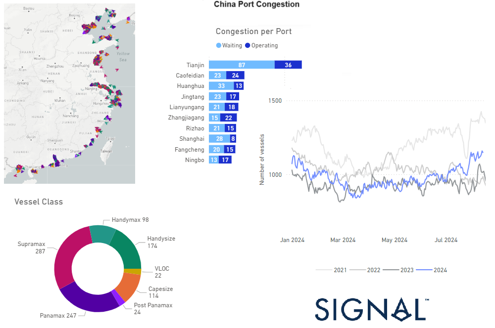

# Weekly Dry Market Monitor: Week 33, 2024

**Date**: August 15, 2024 | **Category**: Dry bulk | **Section**: Monitors | **Source**: [https://www.thesignalgroup.com/weekly-market-monitor/dry-week-33-2024](https://www.thesignalgroup.com/weekly-market-monitor/dry-week-33-2024)

---

## Chinese dry bulk port congestion is increasing at a faster pace than August of last year

*Signal Figure*

This week's charts highlight a recent surge in Chinese dry bulk port congestion across different vessel classes, with Tianjin port now ranking highest in congestion levels. Meanwhile, Capesize rates from Brazil to North China have begun to show a gradual improvement in freight market sentiment. However, iron ore prices are trending downward due to challenges in the Chinese economic environment.

Iron ore and coking coal pricesplummeted to their lowest levels in over a year on Wednesday, driven by slowing demand, persistent overproduction, and weak sales in the Chinese market. This decline compounded an already challenging day for commodities following stronger-than-expected U.S. consumer inflation data. The price of 62% Fe fines on Singapore’s SGX platform dropped to $96.20 per tonne, the second-lowest this year, after reaching $96.03 per tonne in early April, and down significantly from the $143 per tonne peak in early January. This downward trend is likely to lead to another tough day for mining giants like BHP, Rio Tinto, and Fortescue, whose shares already suffered on Wednesday. BHP shares fell 2.77%, Rio Tinto declined 2.6%, and Fortescue dropped over 4.5%. The price of prime Australian coking coal also tumbled, reaching $200 per tonne on the SGX platform, a 6% drop from Tuesday and the lowest in years, further impacting BHP’s prospects.

For the latest updates and insights, make sure to visit theSignal Ocean Newsroomwebsite page. Clickhere to request a demo.

For subscription to our FREE weekly market trends email, please contact us: research@thesignalgroup.com

-Republishing is allowed with an active link to the source
