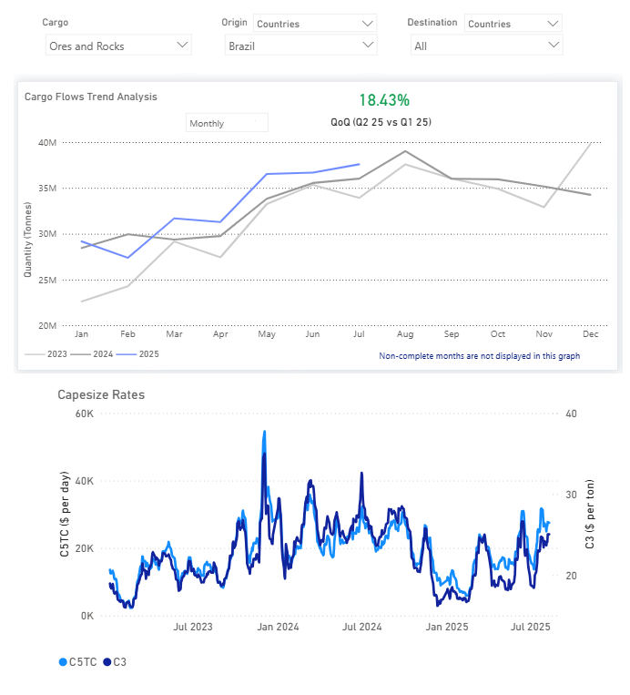
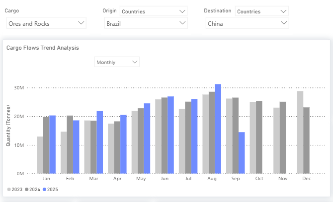

# Weekly Dry Market Monitor: Week 33, 2025

**Date**: August 14, 2025 | **Category**: Dry bulk | **Section**: Monitors | **Source**: [https://www.thesignalgroup.com/weekly-market-monitor/dry-week-33-2025](https://www.thesignalgroup.com/weekly-market-monitor/dry-week-33-2025)

---

## Chart of the Week:Spotlight on Brazilian Iron Ore Shipments and C3 Market Rates

*https://app.signalocean.com/dry/dynamic/drybulkflows*

‍

This week’sChart Monitorhighlights a significant increase in Brazilian iron ore shipments, up 18% in Q2 compared to Q1, with July volumes reaching nearly 38 million tonnes (from about 29 million tonnes at the start of 2025). This marks the strongest monthly level since the beginning of the year and outpaces the same period over the past two years. While this rise aligns with typical seasonal momentum, July has now set a new high for the period, closely trailing last August’s record of 39 Mt.

Vale’s production performance helps explain this momentum. Q2 output rose to 83.6 Mt, a 3.7% year-on-year increase, driven by elevated performance at its S11D and Brucutu mines. The company remains firmly on track toward its 2025 production goal of 325–335 million tonnes. This rebound follows seasonal disruptions in Q1, when heavy rains caused production to decrease to 67.7 million tonnes. Historically, Vale’s output has dipped early in the year due to weather before rebounding in Q2 and Q3 as operational conditions improve.

On the demand side, a Reuters survey indicates that Chinese iron ore imports are expected to remain strong in 2025 despite weakness in the domestic steel sector. This is being driven by traders building stockpiles at favorable prices and steady supply flows from Brazil and Australia. The combination of sustained Chinese demand and increased Brazilian export volumes has strengthened Capesize freight market dynamics. C3 Tubarao–Qingdao rates are holding near $25/ton, while 5TC average earnings have risen to $30,000/day, a $7,600 increase over the past month.‍

*Signal Figure*

A new factor is also emerging in the trade flow: India has begun importing Brazilian iron ore. This diversification of end-market demand adds another layer of support to the already bullish Capesize freight sentiment, alongside the additional tonnage movements from projects such as Simandou’s newbauxiteactivity.‍

For the latest updates and insights, make sure to visit theSignal Ocean Newsroompage & subscribe to weekly reports. Clickhere to request a demo. Click here to see theprevious dry bulk weeklyreport.

For subscription to our FREE weekly market trends email, please contact us: research@thesignalgroup.com

-Republishing is allowed with an active link to the source
