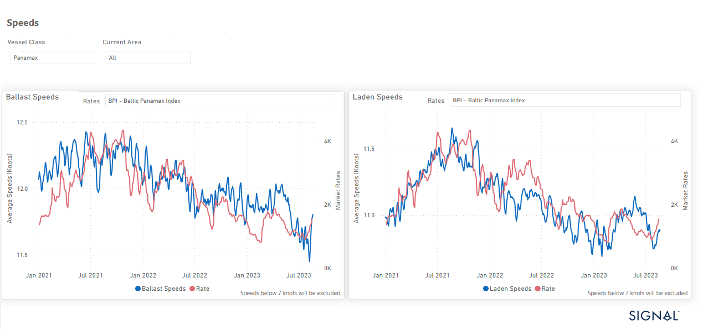

# Weekly Dry Market Monitor - Week 34, 2023

**Date**: May 18, 2024 | **Category**: Dry bulk | **Section**: Monitors | **Source**: [https://www.thesignalgroup.com/weekly-market-monitor/dry-week-34-2023](https://www.thesignalgroup.com/weekly-market-monitor/dry-week-34-2023)

---

## Upward revision to Panamax ship speed in August as freight market signals recover

*Data Source: TheSignal OceanPlatform Data*

The third week of August began with more robust sentiment, which countered fears about a possible downward trend in the Capesize segment. This change in sentiment is particularly evident as the Baltic Dry Index gains momentum, driven by Panamax and smaller ship categories. The upward trend in Panamax freight prices has led to a corresponding acceleration in vessel speeds, both ballasted and loaded.

A closer look at the Baltic Panamax Index and vessel speeds, as seen in the visual representation, shows a discernible upward trend. This trend signifies an increase in average vessel speed and reflects the rise in the Baltic Panamax Index to a higher performance level throughout the month of August.

There is some uncertainty in the grain market regarding Ukrainian grain supplies. However, earlier this week there was a glimmer of clarity when it was reported that Ukraine is actively considering the use of its recently war-tested Black Sea export corridor for grain shipments. This consideration follows the successful completion of the first naval evacuation along this corridor last week.

However, the way forward is far from certain, raising the question of whether a seamless transition to new methods of Ukrainian grain export by sea is possible. There is hope that such a transition could mitigate the escalating rise in commodity prices.

For the latest updates and insights, make sure to visit theSignal Ocean Newsroomwebsite page. Clickhere to request a demo.

For subscription to our FREE weekly market trends email, please contact us: research@thesignalgroup.com

-Republishing is allowed with an active link to the source
