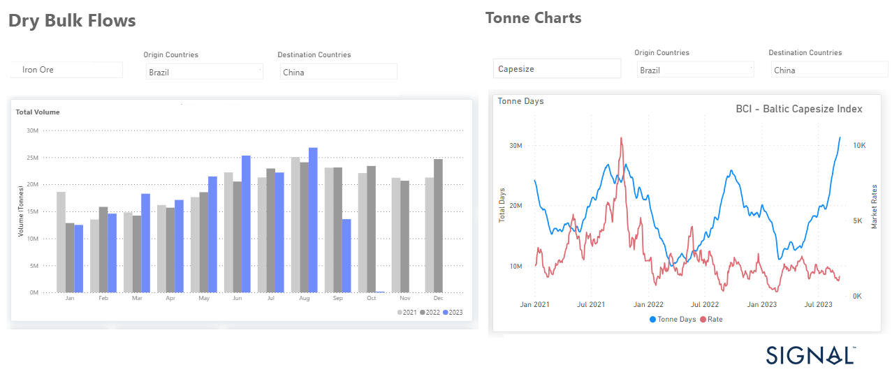

# Weekly Dry Market Monitor - Week 37, 2023

**Date**: May 18, 2024 | **Category**: Dry bulk | **Section**: Monitors | **Source**: [https://www.thesignalgroup.com/weekly-market-monitor/dry-week-37-2023](https://www.thesignalgroup.com/weekly-market-monitor/dry-week-37-2023)

---

## Brazilian iron ore export volumes increased in August, leading to a boost in Capesize tonne days

*Data Source: TheSignal OceanPlatform Data*

In the second week of September, despite the ongoing challenges surrounding China's economic recovery and uncertainties regarding grain trade negotiations between Ukraine and Russia, we observed a continued firm momentum of freight rates. It is uncertain if the current situation will continue, as there has been a decline in the growth rate of tonne days demand and an increase in the number of ballast vessels. Based on recent supply and demand figures, there may be a decrease in freight rates towards the end of the third quarter this year.

It is worth noting that Brazilian iron ore exports have increased in volume in August, leading to a rise in Capesize tonne days, resulting in a gradual rise in freight rates ($/tonne) in the Brazil to China route. However, when comparing the growth rate of tonne days to the performance of the Baltic Capesize Index, we do not yet see significant spikes as we did in the summer of 2021 (refer to the image above).

On Monday, iron ore futures prices staged a recovery, as the risk-averse sentiment triggered by Beijing's recent market regulation measures began to subside, thanks to encouraging economic indicators emerging from the world's second-largest economy. The January iron ore contract, the most actively traded on China's Dalian Commodity Exchange (DCE), surged by 1.86%, reaching 847 yuan ($115.68) per metric ton as of 0232 GMT.

For the latest updates and insights, make sure to visit theSignal Ocean Newsroomwebsite page. Clickhere to request a demo.

For subscription to our FREE weekly market trends email, please contact us: research@thesignalgroup.com

-Republishing is allowed with an active link to the source
