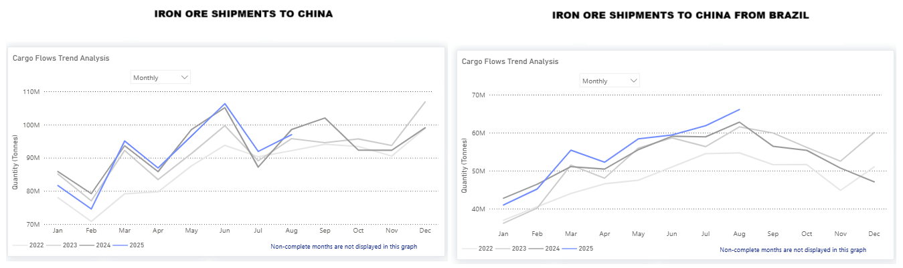

# Weekly Dry Market Monitor: Week 37, 2025

**Date**: September 11, 2025 | **Category**: Dry bulk | **Section**: Monitors | **Source**: [https://www.thesignalgroup.com/weekly-market-monitor/dry-week-37-2025](https://www.thesignalgroup.com/weekly-market-monitor/dry-week-37-2025)

---

## Chart of the Week: Iron Ore Shipments to China are gaining stronger momentum

‍

*https://app.signalocean.com/dry/dynamic/drybulkflows*

‍

Iron ore shipments to China surprisingly strengthened in August, seemingly driven by the drop in iron ore prices and preparations from Chinese mills for a traditional summer pickup.Brazilian exports, in particular, stood out: shipments increased by7% month-over-month, exceedingAugust 2024 levels by roughly 3 million tons, marking the highest monthly total for 2025 as shown in the chart. The recent upward trend in iron ore imports has already started to be reflected in the growth of Capesize iron ore days, while whether Chinese iron ore imports will sustain excess levels of 100 Mt will be highly dependent on prices and port inventories.‍

For the latest updates and insights, make sure to visit theSignal Ocean Newsroompage & subscribe to weekly reports. Clickhere to request a demo. Click here to see theprevious dry bulk weeklyreport.

For subscription to our FREE weekly market trends email, please contact us: research@thesignalgroup.com

-Republishing is allowed with an active link to the source

‍
