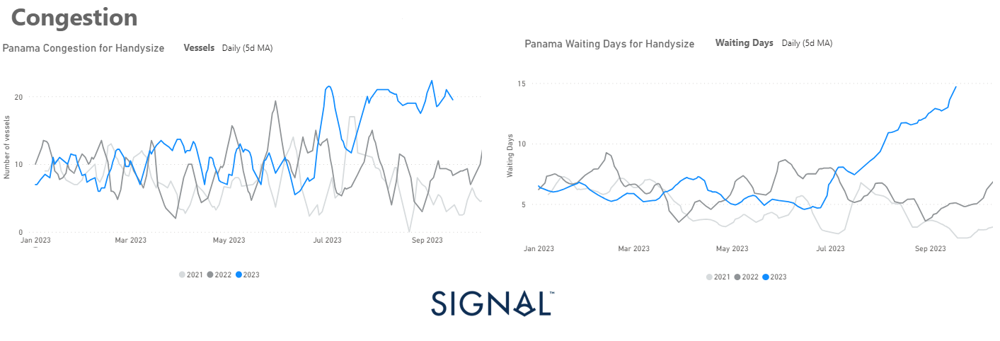

# Weekly Dry Market Monitor - Week 38, 2023

**Date**: May 18, 2024 | **Category**: Dry bulk | **Section**: Monitors | **Source**: [https://www.thesignalgroup.com/weekly-market-monitor/dry-week-38-2023](https://www.thesignalgroup.com/weekly-market-monitor/dry-week-38-2023)

---

## Brazilian iron ore export volumes increased in August, leading to a boost in Capesize tonne days

*Data Source: TheSignal OceanPlatform Data*

In the third week of September, freight rates in the various ship categories increased significantly, indicating a robust upward trend. At the same time, there is a noticeable optimism in Chinese economic activity, supported by a number of strategic stimulus measures by policy makers. In recent weeks, policymakers in China have introduced a comprehensive package of measures to boost economic growth and support the real estate market and the national currency. Most notably, the People's Bank of China took decisive action on Thursday, cutting the reserve requirement ratio for banks by 0.25 percentage points to 7.4 percent. This effectively injected liquidity into the financial system, further underscoring the determination to maintain economic momentum.

The recent upswing has been greatly aided by increased congestion in the Panama Canal since late August. Levels have remained high for all vessel size categories, but the increase in the Handysize segment (pictured above) is surprising, where the daily (5-D moving average) has exceeded any high since the summer season, while last week appears to have reached the upper limit of the increase.

For the latest updates and insights, make sure to visit theSignal Ocean Newsroomwebsite page. Clickhere to request a demo.

For subscription to our FREE weekly market trends email, please contact us: research@thesignalgroup.com

-Republishing is allowed with an active link to the source
