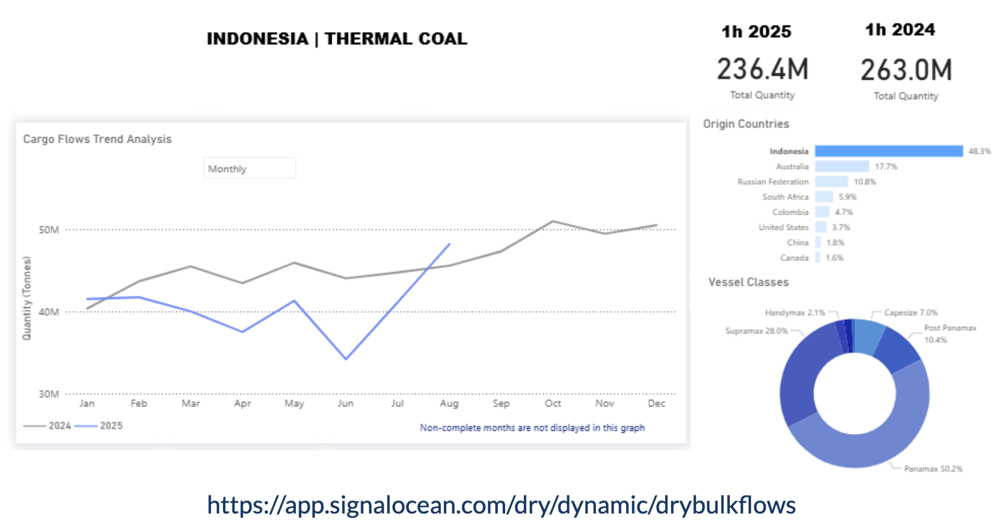

# Weekly Dry Market Monitor: Week 38, 2025

**Date**: September 17, 2025 | **Category**: Dry bulk | **Section**: Monitors | **Source**: [https://www.thesignalgroup.com/weekly-market-monitor/dry-week-38-2025](https://www.thesignalgroup.com/weekly-market-monitor/dry-week-38-2025)

---

## Chart of the Week: Indonesian Coal Flows Gradually Rebound

*Signal Figure*

‍

Following a weak start to 2025, Indonesian thermal coal shipments are showing signs of recovery. June marked the lowest monthly volume of the year at around 35 million tonnes, but by August exports had rebounded to nearly 48 million tonnes, surpassing year-ago levels. While first-half flows totaled 236.4 million tonnes, down from 263.0 million tonnes in 1H 2024, the strong August performance suggests some of the earlier contraction may be offset in the second half.

Policy shifts are expected to support this turnaround. In late August, Indonesia removed the obligation for coal and mineral sales to use government benchmark prices as a floor, giving exporters greater flexibility to align with market indices. Taxes and royalties remain benchmark-linked, while September benchmark prices are expected to help Indonesian coal remain competitive against Australian and Russian cargoes.

On the trade policy front, the EU–Indonesia Comprehensive Economic Partnership Agreement (CEPA) is due to be signed in Bali on September 23, a key step in strengthening Indonesia’s trade profile. At the same time, voyage data shows diversification beyond China and India, with the Philippines maintaining steady imports of Indonesian coal. In August, Panamax and Supramax shipments departed from Balikpapan, Taboneo, Tanjung Pemancingan, and Muara Berau, discharging at Sual, Limay, Pagbilao, Mariveles, and Davao. This underscores the Philippines’ role as a consistent outlet, even as its power mix gradually shifts toward LNG.‍

For the latest updates and insights, make sure to visit theSignal Ocean Newsroompage & subscribe to weekly reports. Clickhere to request a demo. Click here to see theprevious dry bulk weeklyreport.

For subscription to our FREE weekly market trends email, please contact us: research@thesignalgroup.com

-Republishing is allowed with an active link to the source

‍
