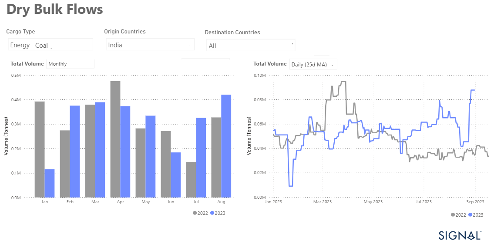

# Weekly Dry Market Monitor - Week 39, 2023

**Date**: May 18, 2024 | **Category**: Dry bulk | **Section**: Monitors | **Source**: [https://www.thesignalgroup.com/weekly-market-monitor/dry-week-39-2023](https://www.thesignalgroup.com/weekly-market-monitor/dry-week-39-2023)

---

## Throughout the last week of September, freight rates maintaining the strength observed in previous day

*Data Source: TheSignal OceanPlatform Data*

Throughout the last week of September, freight rates maintaining the strength observed in previous days. It appears that the third quarter will conclude with higher freight rates than those witnessed in the preceding two months. Notable increases were seen on a monthly basis in the freight market for large vessel sizes, particularly in the Capesize West Australia to China route and the Panamax Far East RV. There was also a robust sentiment in the Supramax category for the Continent-USG route, while the Handysize segment saw positive developments in the Continent-Brazil route.

Moreover, a boost in the freight market sentiment was received from increased coal volumes originating from Indian exporters, reaching various global destinations (see image above). However, it is anticipated that September will conclude at a slower pace compared to the peak levels of August. An intriguing prospect lies in the evolution of freight rates for October, as the onset of the winter season may affect the energy demands for coal in Asian markets. This could potentially prolong the firmness of freight rates in the Panamax and Supramax vessel size categories.

In the Capesize segment, September witnessed a gradual rise in rates, primarily driven by higher volumes of iron ore shipments from both Australia and Brazil. However, there are still challenges in the market due to an excess of ballast vessels. The decrease in pace that occurred in the final days of September showed some improvement compared to the beginning of the month.

For the latest updates and insights, make sure to visit theSignal Ocean Newsroomwebsite page. Clickhere to request a demo.

For subscription to our FREE weekly market trends email, please contact us: research@thesignalgroup.com

-Republishing is allowed with an active link to the source
