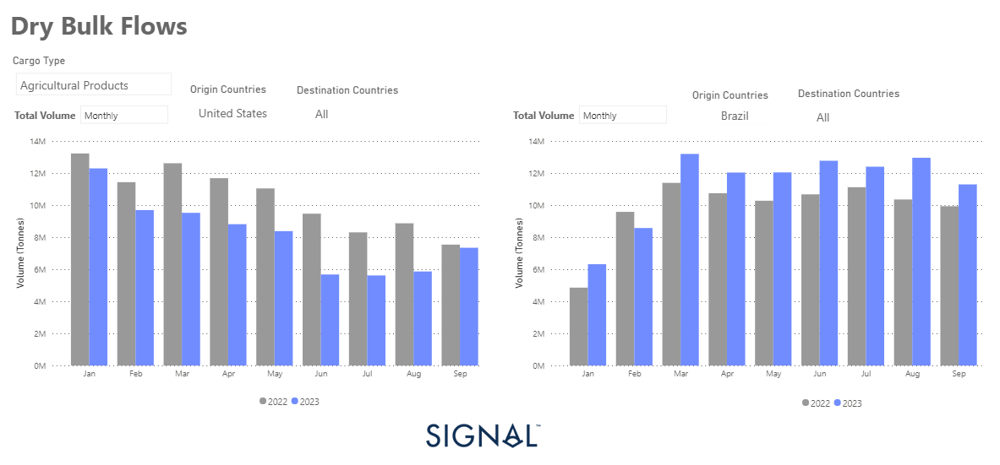

# Weekly Dry Market Monitor - Week 40, 2023

**Date**: May 18, 2024 | **Category**: Dry bulk | **Section**: Monitors | **Source**: [https://www.thesignalgroup.com/weekly-market-monitor/dry-week-40-2023](https://www.thesignalgroup.com/weekly-market-monitor/dry-week-40-2023)

---

## Brazilian grain exports broke records this year, outpacing weak US exports

*Signal Figure*

As we enter the fourth quarter of this year, the market is showing a strong resurgence with rates increasing year-over-year. Notably, Capesize Brazil to North China rates have exceeded $20 per tonne. This significant upswing in the freight market's momentum is evident not only in the large vessel size segment but also in the Supramax and Handysize categories.

This recent surge in rates has coincided with the initial signs of a manufacturing activity rebound in China during the annual Golden Week. According to the National Bureau of Statistics, China's official Manufacturing Purchasing Managers' Index (PMI) rose to 50.2 from 49.7 in August, indicating expansion for the first time since March. A PMI reading above 50 indicates growth or expansion, while anything below indicates contraction. Moreover, there was an acceleration in activity in the services and construction sectors last month, as evidenced by a separate index that reached 51.7, reflecting its strongest performance in three months.

Brazilian grain exporters are experiencing a significant increase in shipments to different countries, while the United States is facing challenges in exporting due to the unfavourable harvest season. This year's Brazilian grain exports have surpassed the levels witnessed in previous years, and the uncertainty around Ukraine's grain exports has further fueled the demand. The disrupted Black Sea deal on July 17 has added to this uncertainty.

For more information on this week's trends or if you wish to subscribe to our FREE weekly market trends email, please contact us: research@thesignalgroup.com

-Republishing is allowed with an active link to the source
