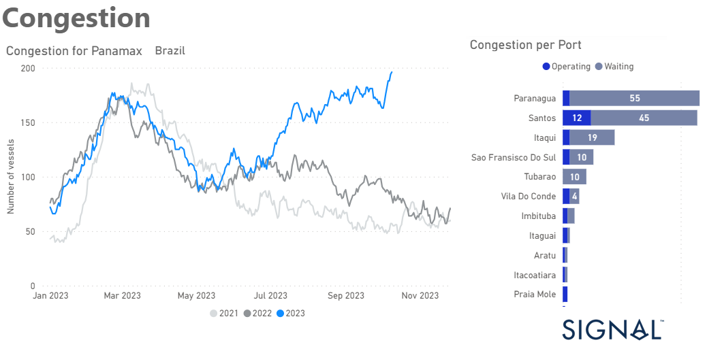

# Weekly Dry Market Monitor - Week 41, 2023

**Date**: May 18, 2024 | **Category**: Dry bulk | **Section**: Monitors | **Source**: [https://www.thesignalgroup.com/weekly-market-monitor/dry-week-41-2023](https://www.thesignalgroup.com/weekly-market-monitor/dry-week-41-2023)

---

## Congestion at Brazilian ports for Panamax bulkers increases significantly from summer season onwards

*Data Source: TheSignal OceanPlatform Data*

The second week of October brought both promising and concerning developments in the shipping industry. In the Capesize Brazil to North China route, freight rates continued to exhibit strength, reaffirming their resilience in the face of various market dynamics. However, amidst these encouraging signs, a significant shift has occurred in the number of ballasters since the end of September. The decrease in ballasters could indicate a change in market dynamics or a response to the evolving conditions in the shipping industry. In contrast to the Capesize sector, the Panamax segment is experiencing a noticeable downward trend in freight rates.

Interestingly, the increase in Brazilian port congestion, as visually represented in the provided image, could potentially serve as a significant driver for an upturn in rates. The congestion in Brazilian ports may disrupt shipping schedules and increase demand for available vessels, thereby exerting upward pressure on freight rates.

For the latest updates and insights, make sure to visit theSignal Ocean Newsroomwebsite page. Clickhere to request a demo.

For subscription to our FREE weekly market trends email, please contact us: research@thesignalgroup.com

-Republishing is allowed with an active link to the source
