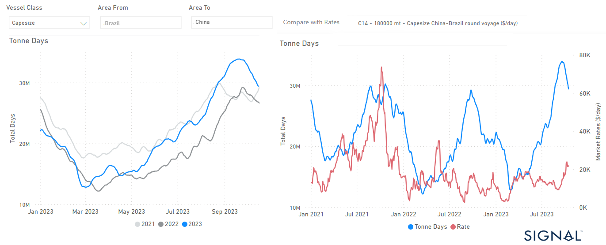

# Weekly Dry Market Monitor - Week 42, 2023

**Date**: May 18, 2024 | **Category**: Dry bulk | **Section**: Monitors | **Source**: [https://www.thesignalgroup.com/weekly-market-monitor/dry-week-42-2023](https://www.thesignalgroup.com/weekly-market-monitor/dry-week-42-2023)

---

## Capesize tonne days growth from Brazil to China reaches new high, surpassing last year's growth

*Data Source: TheSignal OceanPlatform Data*

The third week of October witnessed robust Capesize Brazil to China freight rates, as indicated in the chart above. Furthermore, the demand in tonne days exhibited a noteworthy surge in recent days. Nevertheless, the recent uptick in the number of ballasters presents a downward pressure to the latest recovery signs.

On Monday, the price of iron ore saw an upswing following China's recent stimulus measures. China's central bank stepped up liquidity support for the banking sector by establishing medium-term lending facilities (MLF) of 789 billion yuan. In response to maturing MLF loans worth 500 billion yuan, the bank is injecting fresh liquidity into the banking system. According to Fastmarkets, the price of 62% Fe imported into northern China rose 1.84% on Monday to reach $120.20 per ton.

For the latest updates and insights, make sure to visit theSignal Ocean Newsroomwebsite page. Clickhere to request a demo.

For subscription to our FREE weekly market trends email, please contact us: research@thesignalgroup.com

-Republishing is allowed with an active link to the source
