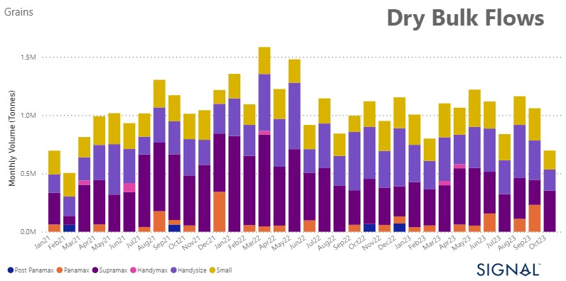

# Weekly Dry Market Monitor - Week 44, 2023

**Date**: May 18, 2024 | **Category**: Dry bulk | **Section**: Monitors | **Source**: [https://www.thesignalgroup.com/weekly-market-monitor/dry-week-44-2023](https://www.thesignalgroup.com/weekly-market-monitor/dry-week-44-2023)

---

## Increase in the percentage share of Supramax vessel size for October

*Signal Figure*

As November starts, there is uncertainty about how dry bulk freight rates will perform in the future. Optimism in earlier days has faded due to recent weekly declines, and the market's strength in the final quarter of the year is now in question. On the supply side, there has been an increase in the number of ballasters for Capesize vessels, while in the Panamax category, there is still a decrease, indicating the possibility of a more robust rate environment.

In the grain sector, it is worth noting that the percentage share of Supramax vessels in Middle East grain exports to various destinations has been increasing. Although there was a significant downward revision in the total monthly volume of Middle East grain exports in October, the Supramax vessel size has shown increased activity compared to previous months.

For more information on this week's trends or if you wish to subscribe to our FREE weekly market trends email, please contact us: research@thesignalgroup.com

-Republishing is allowed with an active link to the source
