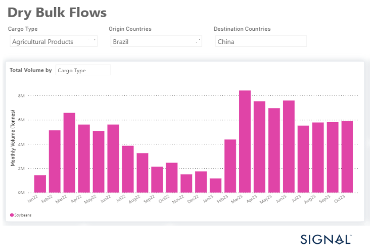

# Weekly Dry Market Monitor - Week 45, 2023

**Date**: May 18, 2024 | **Category**: Dry bulk | **Section**: Monitors | **Source**: [https://www.thesignalgroup.com/weekly-market-monitor/dry-week-45-2023](https://www.thesignalgroup.com/weekly-market-monitor/dry-week-45-2023)

---

## Higher monthly Brazilian soybean volumes to China for 2023

*Data Source: TheSignal OceanPlatform Data*

During the second week of November, freight rates showed a weaker outlook due to the lack of adequate support from demand growth rates. Additionally, the number of ballasters for Capesize vessels in Southeast Africa has notably increased over the past three weeks, further fueled by uncertainty surrounding Chinese economic activity. However, there is a glimmer of hope for the market as iron ore prices have recently been boosted by Beijing's efforts to stimulate and stabilise its economy.

In the grain segment, it should be emphasised that Brazilian soybean exports to China have reached monthly volumes (see image above) that exceed those of the previous year. At the same time, China has significantly increased its soybean purchases from Brazil, while the USA has lost its prominent role in supplying the world's second-largest economy with grain feed.

For the latest updates and insights, make sure to visit theSignal Ocean Newsroomwebsite page. Clickhere to request a demo.

For subscription to our FREE weekly market trends email, please contact us: research@thesignalgroup.com

-Republishing is allowed with an active link to the source
