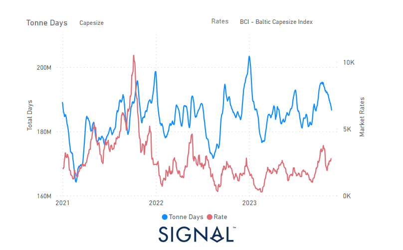

# Weekly Dry Market Monitor - Week 47, 2023

**Date**: May 18, 2024 | **Category**: Dry bulk | **Section**: Monitors | **Source**: [https://www.thesignalgroup.com/weekly-market-monitor/dry-week-47-2023](https://www.thesignalgroup.com/weekly-market-monitor/dry-week-47-2023)

---

## The last spike in tonne days growth in mid October triggered the recent upturn in the BCI

*Data Source: TheSignal OceanPlatform Data*

During the fourth week of November, larger ship categories maintained their stability from preceding days. Notably, the Panamax vessel size exhibited noteworthy gains. Meanwhile, the uncertainty surrounding a stronger momentum for the Capesize segment appeared to have diminished, showing signs of an upturn. Of particular interest is the observation that the surge in demand tonne days for Capesize vessels, noted since mid-October, played a pivotal role in creating a more robust freight environment. This, in turn, contributes to a more optimistic outlook as we approach the end of the month.

Meanwhile, iron ore prices have started to find a firmer environment with positive news on the Chinese economic stimulus drive. According to mining. Com news, iron ore experienced a remarkable rally, reaching its highest intraday price since February, driven by growing optimism about demand. The key steelmaking commodity rose by up to 2.3% in Singapore, after gaining 2% the previous day. This momentum was fueled by an editorial in the state media on Tuesday, which emphasised that the funds from the one trillion yuan ($140 billion) bond issue recently announced by Beijing should be used immediately for construction projects.

For the latest updates and insights, make sure to visit theSignal Ocean Newsroomwebsite page. Clickhere to request a demo.

For subscription to our FREE weekly market trends email, please contact us: research@thesignalgroup.com

-Republishing is allowed with an active link to the source
