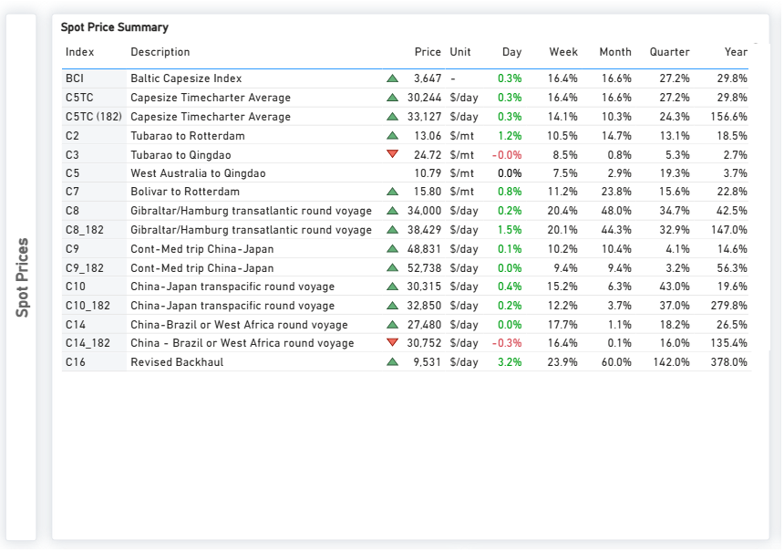
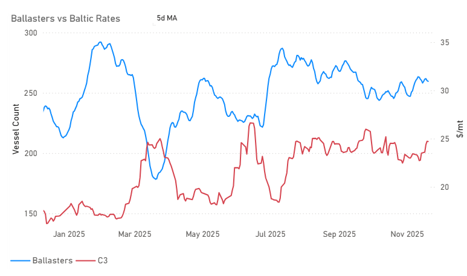
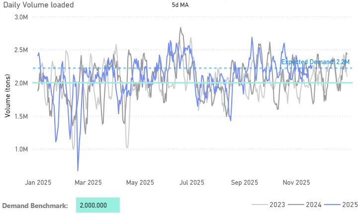

# Weekly Dry Market Monitor: Week 47, 2025

**Date**: November 21, 2025 | **Category**: Dry bulk | **Section**: Monitors | **Source**: [https://www.thesignalgroup.com/weekly-market-monitor/dry-week-47-2025](https://www.thesignalgroup.com/weekly-market-monitor/dry-week-47-2025)

---

## Chart of the Week: Iron ore Freight Market Trends‍

## This week’s analysis examines iron ore freight market trends with a special focus on the emerging iron ore supply powerplay: Simandou’s Rise, Vale’s Moves, and BHP’s Growing Risk

- The Simandou project is advancing through key development milestones and is set to introduce a significant new stream of high-grade iron ore into the global market.
- Vale S.A. is intensifying its strategic engagement with India as it seeks long-term growth opportunities beyond its traditional customer base.
- BHP Group remains heavily exposed to China’s iron-ore demand; with new supply entering the market and trade dynamics shifting, its strategic risk is increasing.
- China’s steel demand has entered a near-plateau phase — growth has largely stalled and may now be moving into gentle decline, as structural headwinds accumulate.

## Spotlight of the Week: Market Pulse | Capesize Freight Market Overview

*Signal Figure*

https://app.signalocean.com/dry/dynamic/market-prices-dry

‍

Atlantic Capesize sentiment has strengthened despite high ballast supply, while the Pacific C5 route has softened as November shipments from West Australia decline. At the same time, Brazil’s iron-ore share in China faces its first serious competitive threat in years with the long-anticipated emergence of Simandou. These market shifts are occurring alongside important changes in China’s procurement strategy. The state-backed China Mineral Resources Group has expanded its ban on select BHP iron-ore products as contract negotiations stall, signaling that Beijing is asserting greater procurement leverage.

## Capesize Ballasters Vs Baltic Rates

Over the past month, Atlantic Capesize sentiment has firmed as the ballaster supply picture has tightened. The decline in available ballasters, after the late-summer peak, has helped stabilize freight levels despite ongoing volatility. At the same time, Brazilian iron ore’s position in the Chinese market is facing growing competitive pressure from Simandou’s gradual ramp-up, adding a new layer of uncertainty to C3 flows and rate performance.

‍

*https://app.signalocean.com/dry/dynamic/capes_insights_downloadable*

‍

‍

## West Australia Capesize Daily Volume Loaded

In the Pacific, C5 sentiment has softened as November’s West Australian daily volumes dipped below the 2.1–2.2 Mt demand range, putting renewed downward pressure on rates.

‍

*https://app.signalocean.com/dry/dynamic/capes_insights_downloadable*

‍

The key question is no longer whether Simandou will matter, but how quickly new supply corridors will alter medium and long-term capesize freight demand and vessel utilisation.

‍

## Simandou & Vale’s India Pivot

Two developments are reshaping iron-ore trade patterns: the launch of commercial operations at Simandou in Guinea and Vale’s growing focus on supplying high-grade ore to India. Taken together, these shifts point to a scenario in which 2025–26 could see the first meaningful expansion of long-haul iron-ore routes beyond the dominant Australia–China and Brazil–China corridors. In such a scenario, tonne-mile demand would likely increase, though this would not necessarily alter the central role of today’s major high-volume routes.

## Simandou’s Breakout Moment

Simandou has entered its export phase: the first ore shipment departed on 18 November 2025. The development, which includes a 650 km railway and deep-sea port, is designed for full capacity of up to ~120 million tonnes per year of ~65 % Fe ore. The southern block JV (Rio Tinto/Chalco) has a ~30-month ramp-up plan, and the West Africa-China haul is significantly longer than the Australia-China route, enhancing tonne-mile demand.

## Vale’s India Pivot

Vale is increasingly positioning India as a crucial, long-term growth market for its high-grade Brazilian iron ore, viewing the Brazil–India route as a potentially significant second structural tonne-mile driver for the seaborne trade. This new pillar is expected to supplement, rather than replace, the established Australia–China (C3) and Brazil–China (C5) trade lanes.

This strategic pivot is driven by India's rapid expansion of steelmaking capacity and its aggressive infrastructure agenda. Vale highlights that its premium ore is an excellent complement to India's lower-grade domestic supply, enabling Indian mills to boost productivity and lower emissions.

While China remains the primary destination for Vale's shipments, India presents a distinctly upward trajectory. Vale projects that Indian steelmakers will lift their capacity toward the 300 Mt level over the next five to seven years, thereby opening a new, durable demand channel for long-haul Brazilian ore.

## But Substitution Remains Premature

Australia’s Pilbara region maintains a clear advantage in export scale, unit costs, and supply reliability. With annual exports consistently in the 750–800 million-tonne range, Pilbara capacity remains far larger than any emerging supply source.

## Australia’s South Flank: The Quiet Counterweight

BHP’s South Flank continues to reinforce Pilbara’s structural edge: scale, reliability, and highly integrated mine-rail-port infrastructure. This remains the benchmark system against which all new entrants must compete. Even with pressure from Simandou, Australia’s cost-efficient export platform remains deeply entrenched.

## Risks from the New Iron Ore Supply

The Simandou high-grade iron-ore deposit requires the construction of a heavy-haul railway of roughly 600–650 km from the mine site to the Atlantic coast of Guinea, together with a newly built export port. The combination of long distance, challenging terrain, and substantial up-front infrastructure is expected to create significant operational constraints for the project. This logistics chain has not yet been tested at full export capacity. Major West African mining developments, including Simandou, have historically faced delays and cost increases, indicating that the risk of a slower-than-planned ramp-up remains substantial.

## What’s Next: Shifting the Balance, Not the Center of Gravity

Simandou brings diversification, not displacement. Vale’s India push adds route expansion, not substitution. Together, they redraw trade lanes, boost tonne-miles and strengthen Capesize utilisation, all while the Pilbara stays at the core of global iron-ore flows.

For the latest updates and insights, make sure to visit theSignal Ocean Newsroompage &subscribe to weekly reports. Clickhere to request a demo. Click here to see theprevious dry bulk weeklyreport.

For subscription to our FREE weekly market trends email, please contact us: research@thesignalgroup.com

-Republishing is allowed with an active link to the source
