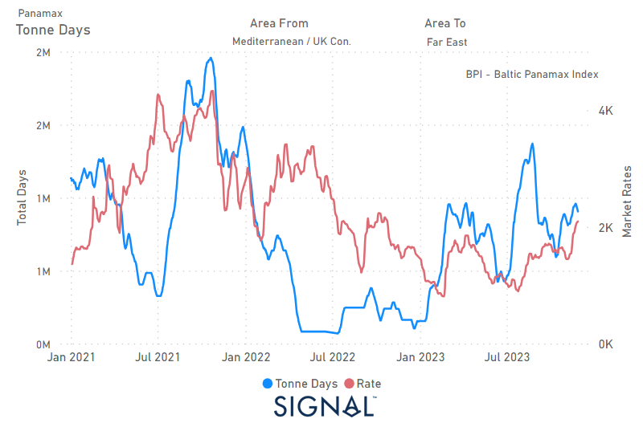

# Weekly Dry Market Monitor - Week 48, 2023

**Date**: May 18, 2024 | **Category**: Dry bulk | **Section**: Monitors | **Source**: [https://www.thesignalgroup.com/weekly-market-monitor/dry-week-48-2023](https://www.thesignalgroup.com/weekly-market-monitor/dry-week-48-2023)

---

## Remarkable upturn in the BPI end of November with an increase in tonne days from the Cont to the Far East

*Data Source: TheSignal OceanPlatform Data*

The dynamics of the freight market at the end of November fueled market participants' expectations of an upturn in the final month of the year, with the Panamax ship size continuing to gain significant strength compared to the smaller vessel categories. In addition, rates for Capesize vessels from Brazil to North China saw renewed gains, the stability of which is yet to be confirmed as iron ore prices have recently gained momentum, providing positive momentum for the end of the final quarter of this year. In the Panamax vessel segment, the increase in tonne days between the Continent and the Far East after a slump at the end of October is interesting to observe. This recent upward trend appears to have supported the rise in the Baltic Panamax Index, which points to a late recovery also aided by an increase in Chinese coal imports.

While the rise in iron ore prices was triggered by a Chinese stimulus programme, there was eventually a downward correction in price momentum as the Chinese government warned of tighter market surveillance. According to data from Fastmarkets, the price of 62% iron ore imported into northern China fell 0.94% to $133.48 per tonne.China’s state planner said on Monday it had conducted a survey of the price indexes of several commodities, including steel, iron ore and lithium, to maintain a healthy market.

For the latest updates and insights, make sure to visit theSignal Ocean Newsroomwebsite page. Clickhere to request a demo.

For subscription to our FREE weekly market trends email, please contact us: research@thesignalgroup.com

-Republishing is allowed with an active link to the source
