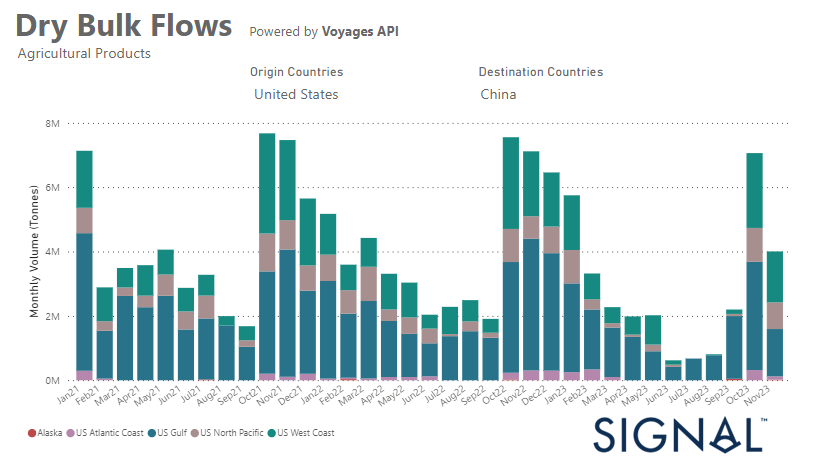

# Weekly Dry Market Monitor - Week 50, 2023

**Date**: May 18, 2024 | **Category**: Dry bulk | **Section**: Monitors | **Source**: [https://www.thesignalgroup.com/weekly-market-monitor/dry-week-50-2023](https://www.thesignalgroup.com/weekly-market-monitor/dry-week-50-2023)

---

## A significant decrease in the U.S. grain exports to China following the spike in October

*Data Source: TheSignal OceanPlatform Data*

In the second week of December, the mood on the dry bulk market was mixed. Prices for Capesize vessels between Brazil and North China were down after the surprising upturn at the beginning of the month. In the smaller ship segments, however, the mood was optimistic, pointing to possible improvements in performance.

In particular, the number of ballast shipments in the smaller vessel segments increased, although this trend remained below the annual average for Capesize and Panamax vessels. In the grain segment, there was a significant decline in the monthly volume of shipments from the United States to China in November, although there was a record increase in October. Grain exports from the US to China fell by 45% in November, both compared to October and compared to shipments recorded in November last year.

For the latest updates and insights, make sure to visit theSignal Ocean Newsroomwebsite page. Clickhere to request a demo.

For subscription to our FREE weekly market trends email, please contact us: research@thesignalgroup.com
