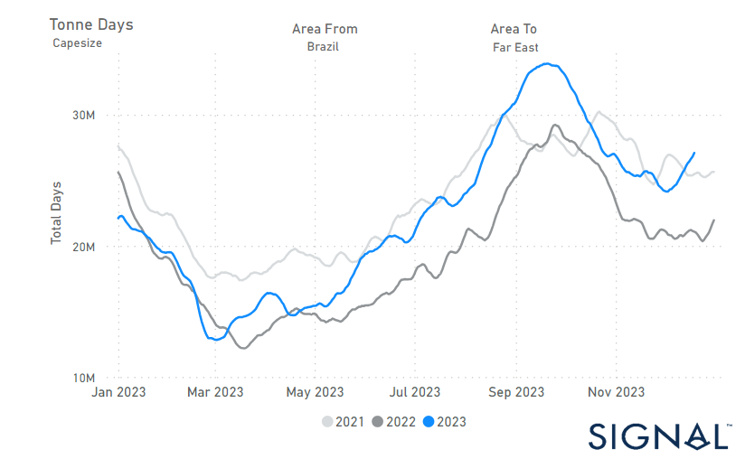

# Weekly Dry Market Monitor - Week 51, 2023

**Date**: May 18, 2024 | **Category**: Dry bulk | **Section**: Monitors | **Source**: [https://www.thesignalgroup.com/weekly-market-monitor/dry-week-51-2023](https://www.thesignalgroup.com/weekly-market-monitor/dry-week-51-2023)

---

## Significant increase in Capesize tonne days from Brazil to China since the beginning of December

*Data Source: TheSignal OceanPlatform Data*

In the third week of December, sentiment in the freight market for large vessel sizes has shown signs of weakening. However, optimism grows for a robust month-end, given the declining number of ballasters in the Panamax Continent Far East. Within the Capesize segment, there's been a notable increase in tonne days from Brazil to China, contrasting with the market price decline. Despite a rise in ballasters for Capesize vessels in SE Asia compared to recent lows, activity remains subdued, suggesting potential rate stabilisation through the month's end.

A positive factor for the next year is recent news suggesting that Chinese economic conditions will improve in 2024. According to state media, officials from the Chinese Communist Party's finance and economy office anticipate that China's economy will encounter more opportunities than challenges in 2024. The official Xinhua highlighted that macroeconomic policies will persistently bolster economic recovery. This insight was provided in a comprehensive report on the annual Central Economic Work Conference held from December 11-12, where top leaders delineated economic objectives for the upcoming year.

For the latest updates and insights, make sure to visit theSignal Ocean Newsroomwebsite page. Clickhere to request a demo.

For subscription to our FREE weekly market trends email, please contact us: research@thesignalgroup.com

-Republishing is allowed with an active link to the source
