# Monthly Minor Bulk Radar - July 2025

**Date**: July 16, 2025 | **Category**: Minor Bulk | **Section**: Monitors | **Source**: [https://www.thesignalgroup.com/weekly-market-monitor/minor-bulk-radar-july-2025](https://www.thesignalgroup.com/weekly-market-monitor/minor-bulk-radar-july-2025)

---

## Minor dry bulks performed in line with historical trends in June 2025, although the m/m fall was slightly ahead of recent years.

On a y/y basis, June exports performed well, up 5% from June 2024. In fact, the first two quarters of 2025 have seen positive growth in terms of export tonnage, leading to greater shipping demand as evidenced by the strong tonne-mile performance of the minor bulk market so far in 2025.

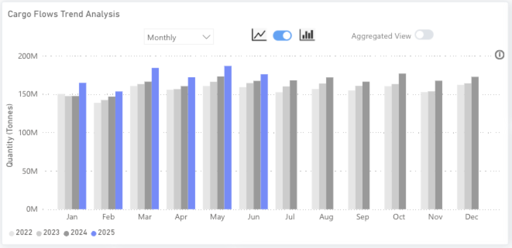
*Source:Total minor bulk* export performance from Signal Ocean.*Minor bulk is all dry bulk that isn’t categorised as iron ore, coal, or grains and includes the likes of bauxite, cement, steel etc*

## Recent Insights & weekly reports

Philippine nickel ore ban reversed, what are the impacts?

How will the wet season affect capesize demand from West Africa?

Geopolitical Spillover: Assessing the Impact of Iran-Israel Tensions on the Dry Bulk Shipping Industry

Weekly Dry Market Monitor: Week 28, 2025

## Contents

- Economics EnvironmentManufacturing PMIsExchange RatesBaltic Indexes
- Manufacturing PMIs
- Exchange Rates
- Baltic Indexes
- Minor BulkBauxiteNickel OreSugar
- Bauxite
- Nickel Ore
- Sugar

- Manufacturing PMIs
- Exchange Rates
- Baltic Indexes

- Bauxite
- Nickel Ore
- Sugar

## Economic Environment

Manufacturing PMI’s

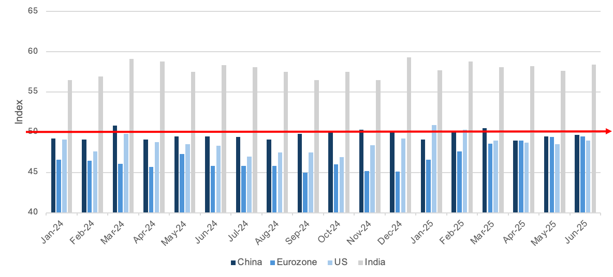
*Source:National Bureau of Statistics of China, Institute for Supply Management,  HCOB, HBSC India Manufacturing PMI*

### Exchange RatesUSD vs:

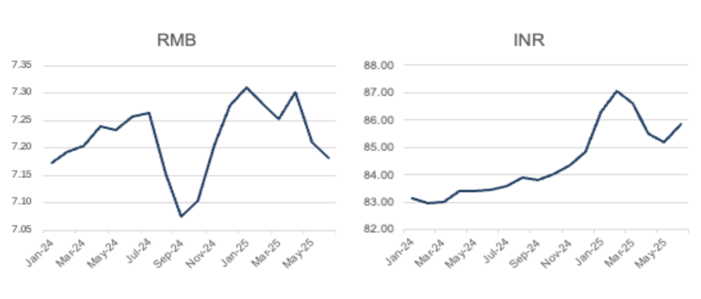
*Signal Figure*

### RMB vs:

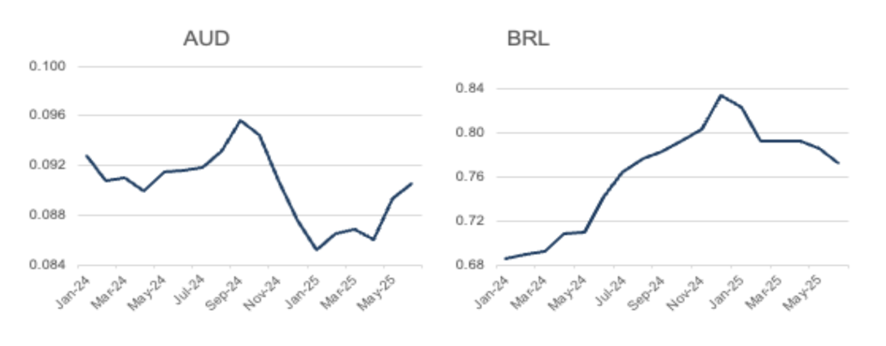
*Signal Figure*

## ‍Baltic Indexes

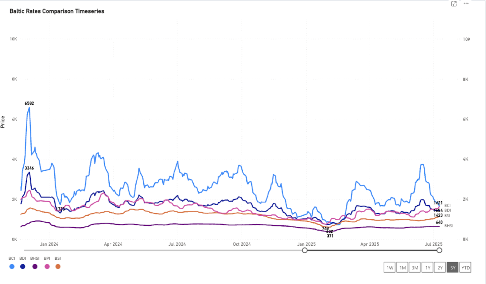
*Source:The Baltic Exchange*

## Minor bulk

## Bauxite

TSOP saw global bauxite exports in June 2025 broadly in line with expectations. A 20% fall in exports m/m highlights the common seasonal decline that typically begins towards the end of Q2. Looking at the y/y year number, we see strong growth of 9% in June 2025, highlighting that bauxite demand remains positive. This has been driven by exports from Guinea and Australia, which have seen y/y growth of 16% and 7% respectively.

How exports from Guinea fare in 2025 Q3 is the most interesting aspect of bauxite for the maritime industry, as the aluminum raw material is driving capesize demand from the West Coast of Africa. As mentioned above, bauxite exports from Guinea face a notable seasonality. The West African Monsoon season starts in May through to October, and the heavy rains impact the full supply chain from mines to ports. 2023 and 2024 were notably wet monsoon seasons, and exports during Q3 of both years reduced outside of normal ranges, 14% and 17% respectively. The guidance so far for 2025 is that the rains will be middling, offering the hope that export softening will be more in line with the 12% reduction seen between 2022 Q2 and Q3.

Chinese bauxite demand also offers support to Guinea’s bauxite export potential through Q3. China has not slowed in its aluminum production in 2025, despite an ongoing 45mt annual cap implemented by the government. The latest available data from China’s National Bureau of Statistics shows that May production of Electrolyzed aluminum was 44% higher than that of the previous year. Production in May 2024 was impeded due to several smelter bottlenecks caused by issues like the availability of inputs such as hydropower. In May 2025, these issues have not been present.

A more long-term strategic proposition is whether Guinea imposes a more targeted revocation of bauxite mining licenses in an attempt to tighten control over the mineral and move Guinea’s export up the value chain by increasing domestic processing capacity. The most recent round of revocation has aimed mostly at underperforming mines and those that have not committed to the 2022 Mining Code (Article 15), which mandates that firms must plan to or build local processing facilities by 2027. If the country were able to convert all the domestic bauxite it currently exports into alumina, the next stage on the ore’s journey to becoming aluminum, this would have a heavy impact on shipping demand, weighing heavily on tonne-miles. The current guidance is that between 4 and 5 tonnes of bauxite can produce around 2 tonnes of alumina. With all else staying equal, this would effectively halve the tonne-miles and tonne-days of West Africa to China, impacting freight rates negatively. However, the full realization of the scenario is unlikely, and bauxite vs alumina exports would likely gradually adjust, giving time for the supply chain to adjust.

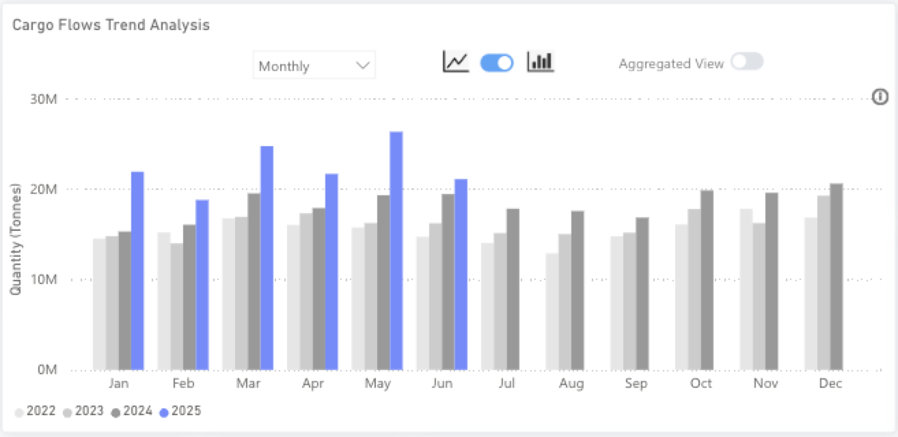
*Source:Bauxite exports from Signal Ocean*

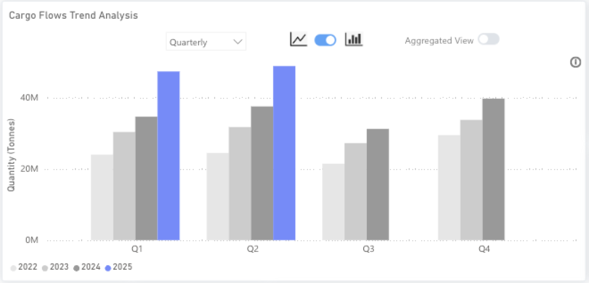
*Source:Guinea seasonality in Bauxite exports from Signal Ocean*

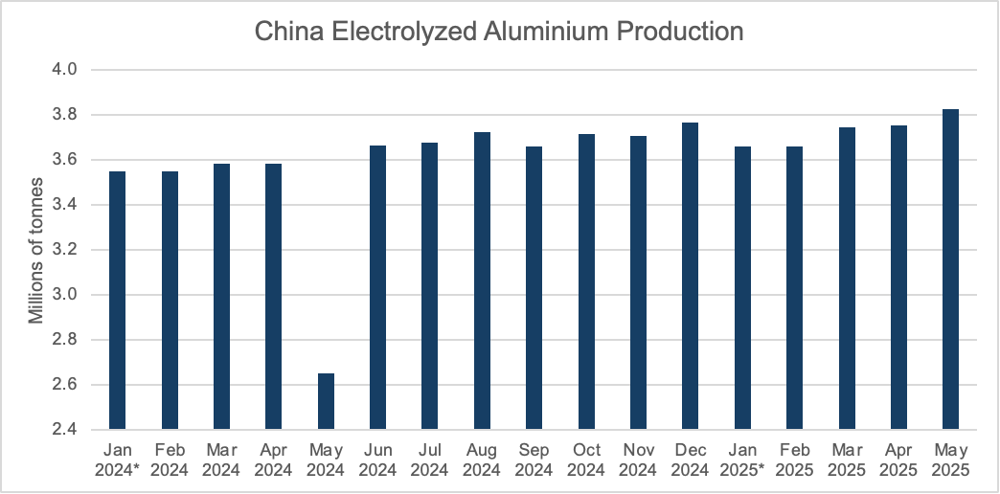
*Source:National Bureau of Statistics of China, *The value for January and February is the average of the annual total cumulative output listed in February.*

## Nickel Ore

TSOP recorded growth in nickel ore exports in June, both on a m/m and a y/y basis. This was driven by the strong performance of nickel ore exports from the Philippines, which recorded growth of 12% m/m and 10% y/y. Unsurprisingly, demand is driven by China, who account for 72% of all nickel imports on TSOP, and has seen imports rise by 8% m/m and 7% y/y in June 2025. China relies on nickel ore from the Philippines for its processing industry, mostly turning the ore into NPI, nickel-pig iron, for use later in the production of stainless steel. NPI is a much lower-cost material to use in the production of nickel-containing stainless steel than other, more refined nickel sources and has been the bedrock for China, and more recently, Indonesia, to produce stainless steel at a much lower cost than other regions globally.

Demand from China has been driven by strong and consistent growth in stainless steel production since the end of COVID-19 restrictions in the country. While crude steel has seen annual declines since 2020, stainless steel production continues to trend upwards. This is mostly due to the use of stainless steel in the upgrading of Chinese infrastructure, which has become a key government target. Beyond infrastructure, Chinese manufacturing, particularly of white goods for export, has seen stainless steel consumption growth, but it has started to decline this year. This is likely a result of a combination of slowing domestic demand and export headwinds and wider uncertainties around key export markets.

Strong YTD production growth and some softening in downstream manufacturing have led to large inventories of stainless steel. Some of this would have been earmarked for export in recent years, but tariffs and the wider uncertainty have curtailed a proportion of this. Inventories of nickel-containing stainless steel, 300-series, in China have been higher than the pre-Covid averages since 2023, but without such an obvious or clear export strategy, some stainless mills have started to cut back production over recent weeks. This has led to consecutive falls in 300-series inventories in China, boosting prices. This may see demand for nickel ore in the coming weeks soften, but given that the Chinese government is working to boost industrial activity and trade tensions with the US are cooler than they have been this year, nickel ore demand from China will remain well-supported.

Stainless steel production discipline will keep stainless prices supported, but as prices rise, more players will look to produce, and this will keep nickel ore demand robust. Therefore, we expect that vessel demand driven by nickel ore will remain consistent. China will be unable to change its reliance on nickel ore from the Philippines without implementing structural changes, which would take a considerable amount of time.

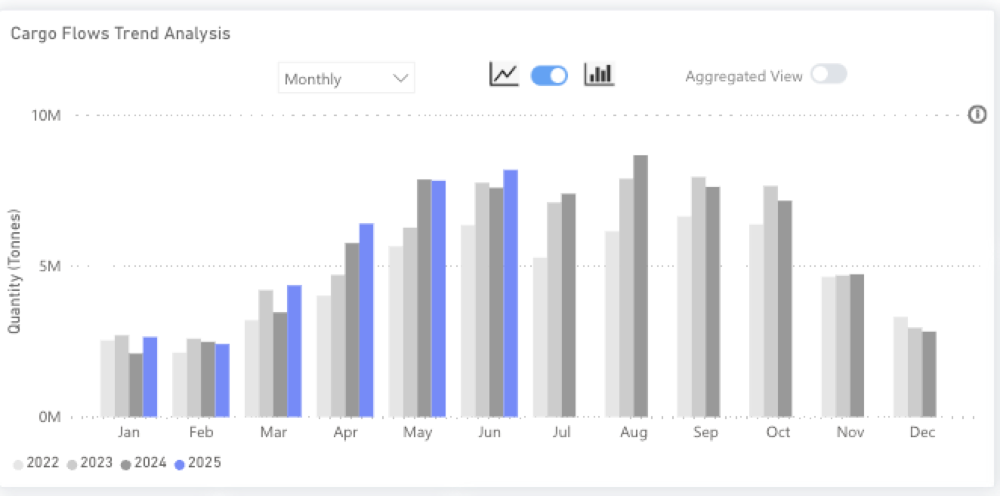
*Source:Nickel ore exports from Signal Ocean*

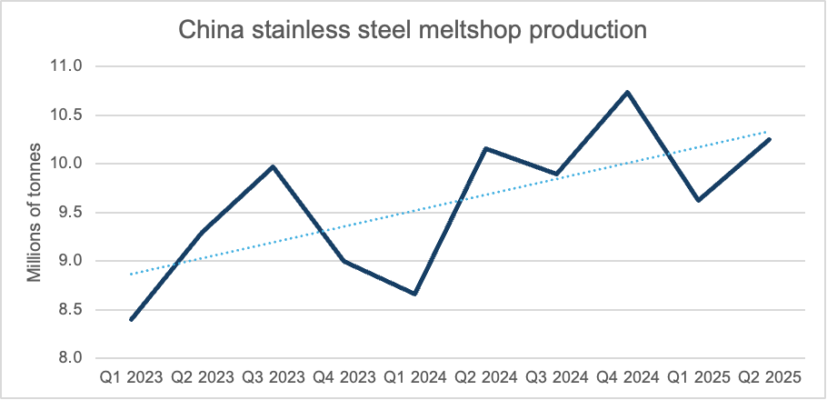
*Source:World Stainless Association*

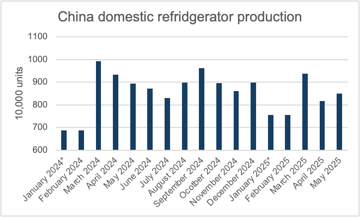
*Source:National Bureau of Statistics of China, *The value for January and February is the average of the annual total cumulative output listed in February.*

## Sugar

TSOP observed a notable month-over-month (m/m) and year-over-year (y/y) increase in global seaborne sugar exports in June 2025, by 19% and 17%, respectively. This increase has been driven by positive growth in the three largest exporters, Brazil, Thailand, and India. These three countries account for 76% of the global market. Seasonality in the sugar market has an interesting dimension with different but overlapping marketing years in these producers. The first quarter typically experiences a lull in global exports. This is because Brazil, which is accountable for 56% of global sugar exports, has an ‘off-season’ during the first three months of the year. Given the volume of sugar originating in Brazil, other exporters are unable to fill the gap; thus, global exports typically drop in Q1 compared with the previous quarter. From July, however, all three of the listed countries reach a peak in terms of export ability, with Q3 the peak of sugar exports globally.

Although India is the second-largest producer of sugar, it trails behind Thailand in terms of sugar exports. This is mostly driven by the domestic demand for sugar in India. Furthermore, India controls sugar exports, restricting them to stabilise domestic sugar prices and availability. Currently, the Indian government has set a limit of 1mt of sugar to be exported in the current marketing year. Increasingly, Indian sugar consumption is also coming in the form of ethanol production, used in the ethanol blending program, which aims for a 20% ethanol blend in gasoline by 2026.

Looking ahead, market expectations are for sugar production in all three countries to increase from the 2024/25 marketing year to the 2025/26 marketing year, providing strong opportunities for greater sugar exports. Since the beginning of 2024, 25% of all dry bulk cargo leaving Santos in Brazil and Sri Racha in Thailand has been sugar, providing a strong and consistent source of demand for supramax vessels. With expectations that sugar production will grow in the coming marketing year, demand for vessels from the sugar industry will also likely increase, boosting opportunities for supramaxes.

Compounding the positive outlook is an expected increase in sugar demand, with some market participants forecasting a 1.2% CAGR out to 2033, with more accelerated growth in economies with growing spending power, such as Indonesia and the wider South East Asia region. Indonesia and China lead the market in terms of import volumes, both with around 10%, well ahead of third-placed Bangladesh with 6%. Indonesia is a major industrial consumer of sugar for its domestic food processing industry, but requires large amounts of imports due to weak domestic production. With a rising middle class, sugar consumption will likely continue to increase in the country. This will continue to provide strong support for sugar exports from Brazil and Thailand, leading to consistent and robust demand for vessels in the coming years.

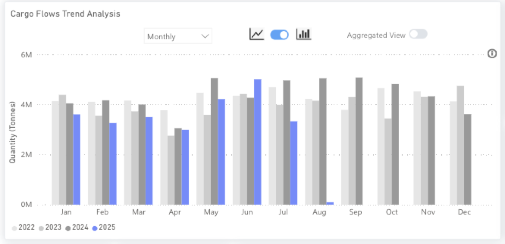
*Source:Sugar exports from Signal Ocean*

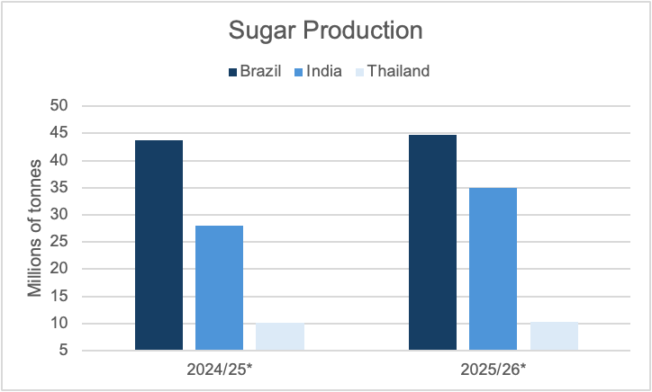
*Source:Ministry of Agriculture; Chart Post Brazilia, FAS New Delhi Research, Office of Cane and Sugar Board, * Indian MY is from October to November, Brazilian MY is from March to April, and Thai MY is from December to November*

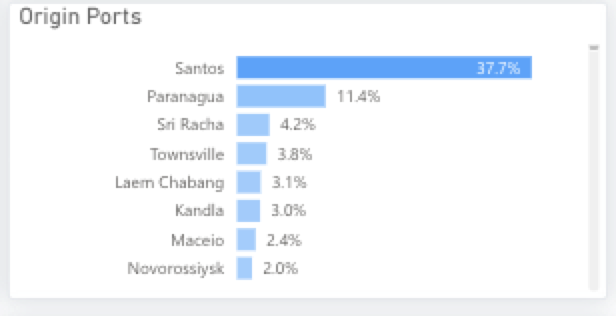
*Source:Origin ports of global sugar exports from Signal Ocean*

For the latest updates and insights, make sure to visit theSignal Ocean Newsroomwebsite page. Clickhere to request a demo.

For subscription to our FREE weekly market trends email,please click here, or contact us at: research@thesignalgroup.com

- Republishing is allowed with an active link to the source
