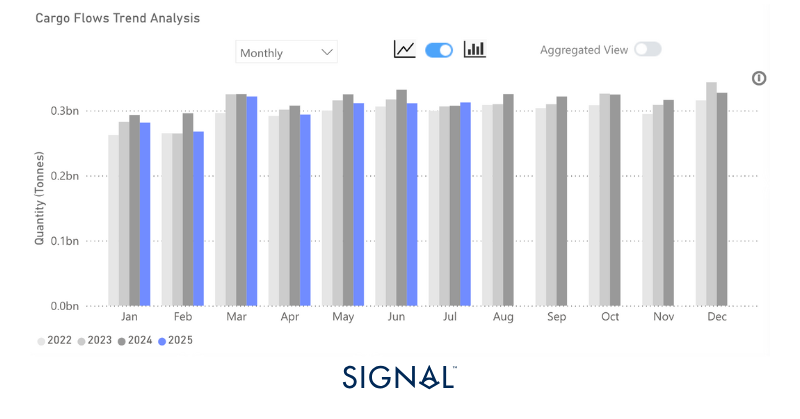
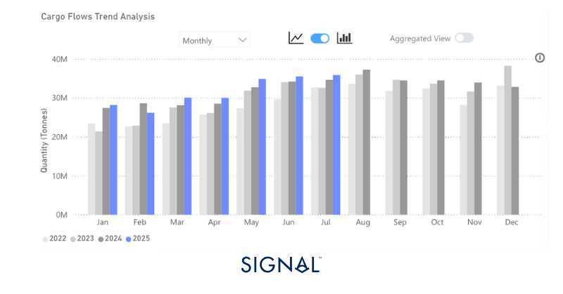
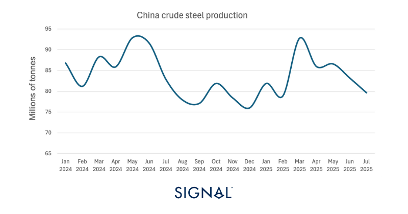
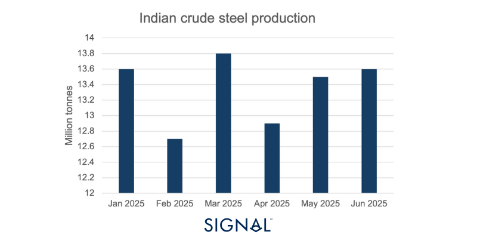
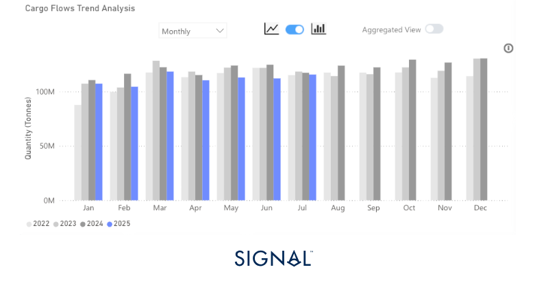
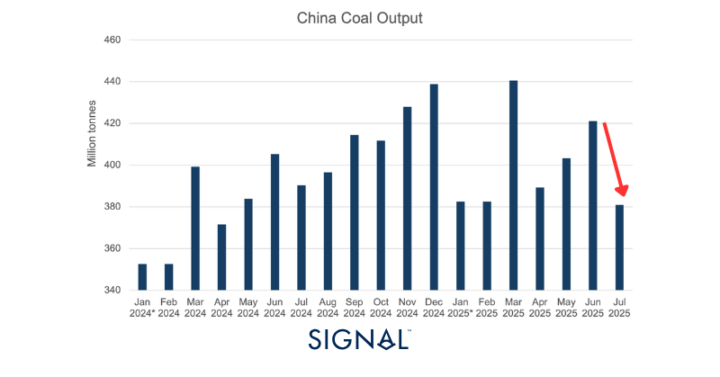
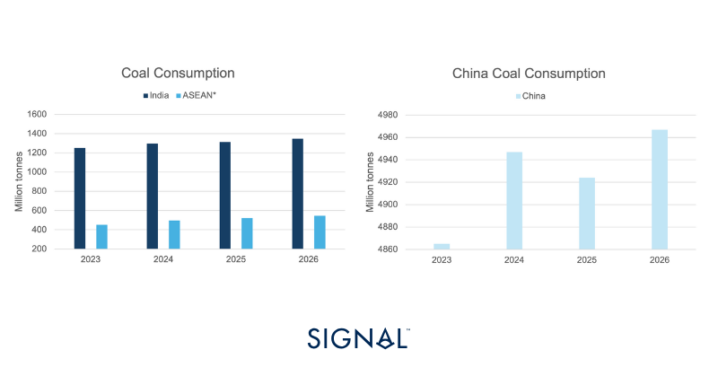
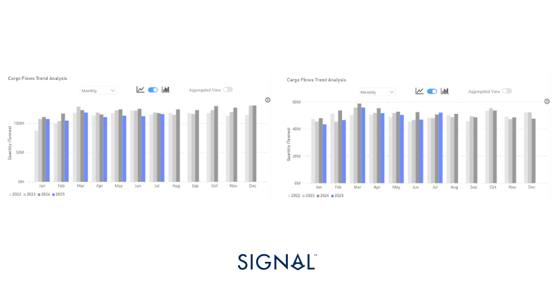
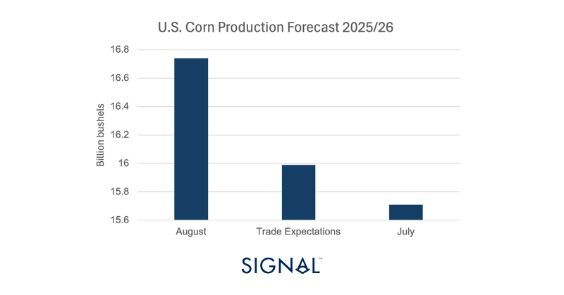
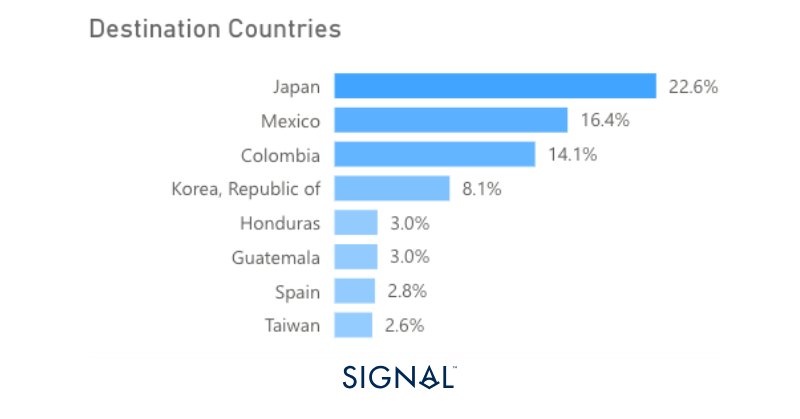

# Monthly Major Bulk Radar - August 2025

**Date**: August 28, 2025 | **Category**: Major Bulk | **Section**: Monitors | **Source**: [https://www.thesignalgroup.com/weekly-market-monitor/monthly-major-bulk-radar-august-2025](https://www.thesignalgroup.com/weekly-market-monitor/monthly-major-bulk-radar-august-2025)

---

## Iron ore, coal, and grains: Limited growth as China slows

‍

Exports volumes of major bulk, made up of iron ore, coal, or grains, remained flat m/m in July but edged 2% higher than the same period last year. Iron ore and grain exports drove this, as coal exports fell in July, continuing the weak performance of the commodity for much of 2025 so far. A slower Chinese growth forecast in 2025 Q3 and Q4 could prompt the government to introduce greater stimulus measures, which would help boost demand across commodities, most notably the major bulk commodities.‍

*‍Source:Total major bulk* export performance from Signal Ocean.*Major bulk is made up of iron ore, coal, and grains.*

‍

‍

## Economic Environment

## Manufacturing PMI’s‍

*Source:National Bureau of Statistics of China, Institute for Supply Management,  HCOB, HBSC India Manufacturing PMI*

‍

## Exchange Rates

## USD vs:‍

*Signal Figure*

## RMB vs:

*Source:IMF*

‍

‍

## Baltic Indexes

‍

*Signal Figure*

‍

## Major bulk

## Iron ore

Global exports of iron ore increased by 4% year-over-year (y/y) in July, driven by strong output growth from Australia and Brazil, both of which saw exports rise 4% y/y. This was driven by the greater availability of iron ore in both regions, as key producers saw production levels rise in the latter stages of 2025 Q2. Rio Tinto announced 2025 Q2 iron ore production was up 5% y/y, but shipments have been slightly lower due to the effects of the four cyclones in 2025 Q1.

Aside from this, market sentiment was lifted following the Mega-dam announcement in China, as discussedhere. The project has been seen as a positive sign that construction demand for steel in China will continue to be supported despite weakening over recent years. This will also help to alleviate some market fears that domestic Chinese steelmaking will decline too sharply, giving more confidence to importers of iron ore. Chinese steel production will fall this year, but this project provides a solid floor for domestic steel demand, which will keep steel production from collapsing. It is likely to see a further drop in steel production through August and September as authorities tell steel mills in Tangshan to halt operations from August 25th to help improve air pollution levels before a military parade on September 3rd.

In theprevious major bulk radar, Signal Ocean shared an expectation that India would likely see greater iron ore exports to China in the short term. While this is yet to materialize, likely a result of greater domestic demand, stronger restocking demand in China will push iron prices higher and encourage some buyers to look to the lower price iron ore fines that India typically exports. Relations between India and China are improving as well, following the visit of the Chinese Foreign Minister to India, the first since the border clashes in 2020.

‍

*Source:Global monthly iron ore exports from Signal Ocean*

‍

*Source:World Steel Association*

‍

‍

*Source:World Steel Association*

‍

## Coal

Signal Ocean recorded global exports up 3% m/m but down 1% y/y in July. The market breakdown was typical, with Indonesia dominating the origin of the coal, at 36%, and China, India, and Japan receiving over 55% of all coal exports in terms of tonnage.

The fall in coal exports may have been more pronounced if not for market developments in China. The first was mentioned in last month'smajor bulk radar. Signal Ocean commented on how upcoming mine inspections may lead to reduced coal output in China, increasing the need for coal imports. These inspections did cause a drop in domestic coal production of 10% m/m in July. The second was an increase in fuel demand for cooling as cities in China experienced high temperatures, pushing power demand to record highs during mid-July. As a result, Signal Ocean recorded that Chinese imports of coal increased by 20% m/m in July. The typical decrease in Chinese coal imports in July would have dragged the global m/m figure lower.

Looking ahead, the IEA expects coal demand for the remainder of 2025 to be on par with that of 2024. IEA expects Chinese coal consumption to soften slightly, but by less than 1%, with domestic coal production up currently by 5% ytd; this will put pressure on Chinese demand for coal imports, which are down 15% ytd. India, the second largest importer of coal, is forecast to see coal consumption rise modestly by 1% in 2025. Current domestic coal production is flat on last year, and coal imports are down 6%, which means that at some points imports or domestic production will need to rise to rebalance inventory levels.

The largest growth area for coal comes from the ASEAN, the Association of Southeast Asian Nations. From 2024 to 2026, the region is expected to increase coal consumption at an annualized growth rate of 7%, far outpacing any other nation. Despite containing Indonesia, the ASEAN relies on imports of coal and offers an interesting growth opportunity, although in terms of absolute tonnage is still quite small.

‍

*Source:Total coal export volumes from Signal Ocean*

‍

*Source:National Bureau of Statistics of China, *January and February figures are the monthly average of cumulative production posted in February*

*Signal Figure*

*Source:IEA mid-year Coal update, *ASEAN is the Association of South East Asian Nations*

‍

‍

## Grains- Corn

The overall grains market performed well through July, with overall tonnage up on both a m/m and a y/y measure, 10% and 3% respectively. Despite this, the YTD figure for total grain exports to the end of July trails the same period in 2024 by almost 6%. In this edition of the Major Bulk Radar, Signal Ocean has taken a more detailed look at the corn market.

The corn market presented some interesting moves during July, with striking differences between performance based on a monthly or annual comparison. According to Signal Ocean, global corn exports increased 31% m/m and 1% y/y, driven by a huge surge in shipments from Brazil, which more than compensated for a 12% m/m drop in shipments from the U.S. Yet, U.S. corn shipments increased by 8% y/y while Brazilian shipments decreased by 15%.

There were also more interesting developments in terms of shipment destinations. From 2022 to now, 10% of all corn shipments have been shipped to China; however, this figure drops to below 4% if we look at all corn shipments since 2024. In July 2025, only 3% of corn shipments were shipped to China.

China has been importing less corn since 2024 as the nation produces more domestically. The China Agriculture Outlook Committee has forecast corn production in the 2025/26 year to be 3% higher than the 5-year average, while domestic growth slows and drags on demand, both factors weighing on the need for imports. However, the U.S. and Brazil are both set for bumper corn harvests in 2025/26. The USDA August report raises the U.S. corn production forecast to 425.3mt, up 7% from the July forecast, and Brazilian production is set to reach 131mt in the same period, the third highest yield on record. In theory, this should be positive for corn shipments, as ample production should lead to greater availability for export.

However, there are a number of factors that may limit the upside. Brazil is planning to use more corn for the production of ethanol. Historically, around 90% of ethanol production in Brazil came from sugar-cane, but given the lower cost and higher abundance, the use of corn in ethanol production is rising rapidly. Petrobras has recently announced it will be ‘leaning towards corn’ for its foray back into ethanol production. As a result, the increase in corn production will not transfer directly into more corn for export, and exports could fall back if ethanol production becomes a higher value proposition. In this instance, ethanol exports from Brazil would increase while corn exports remain stable or soften.

The U.S., however, already diverts around 40% of corn production into ethanol, and with a higher corn crop this year, there still remains a large surplus of corn to export. The increased supply of corn will likely weigh on corn prices, with the December 2025 futures contract already the lowest it has been in five years. This will make U.S. corn more attractive for importers, and particularly the large Asian or Central American buyer like Japan or Mexico. China has been diverting from U.S. agricultural products in recent years, but if prices are low enough, China would likely take advantage and use it as a way to stocks full and secure. There is a 7.2mt quota on imported corn in China, with imports over that facing a much higher tariff. Corn prices would need to be low enough to make importing still financially viable if the quota were reached.

*Source:Global grain exports vs Corn exports from Signal Ocean*

‍

*Source:USDA August Corn Report*

‍

‍

*Source:Destinations of U.S. corn shipments  from 2024- now from Signal Ocean*

‍

‍

## Recent Insights & weekly reports

Monthly Minor Bulk Radar- August 2025

Weekly Dry Market Monitor: Week 33, 2025

Weekly Dry Monitor: Week 31, 2025

‍For the latest updates and insights, make sure to visit theSignal Ocean Newsroomwebsite page. Clickhere to request a demo.

For subscription to our FREE weekly market trends email,please click here, or contact us at: research@thesignalgroup.com

- Republishing is allowed with an active link to the source
