# Monthly Major Bulk Radar - July 2025

**Date**: July 29, 2025 | **Category**: Major Bulk | **Section**: Monitors | **Source**: [https://www.thesignalgroup.com/weekly-market-monitor/monthly-major-bulk-radar-july-2025](https://www.thesignalgroup.com/weekly-market-monitor/monthly-major-bulk-radar-july-2025)

---

## Steel, Crops & Coal: The Global Tug-of-War

Major bulk, made up of iron ore, coal, and grains, export volumes through the first half of the year have consistently fallen below that of 2024, but still sit within normal ranges. The global geopolitical landscape has been marked by uncertainty, rising tensions, and greater protectionist policies. In particular, China and the US have continued to apply and then adjust tariff measures on goods from the other. This has driven the lower dry bulk volumes seen so far in 2025 and will continue to be a heavy drag on trade for some time.

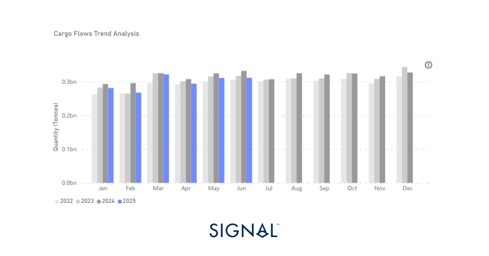
*Source:Total major bulk* export performance from Signal Ocean. *Major bulk is made up of iron ore, coal, and grains*

‍

## Economic Environment

‍

### Manufacturing PMI’s

‍

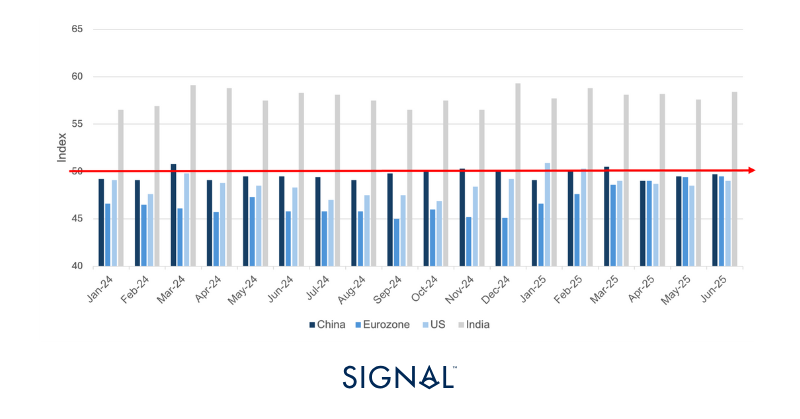
*Source:National Bureau of Statistics of China, Institute for Supply Management,  HCOB, HBSC India Manufacturing PMI*

‍

‍

## Exchange Rates

### USD vs:

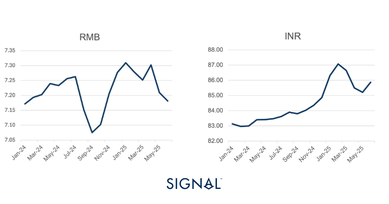
*Signal Figure*

### RMB vs:

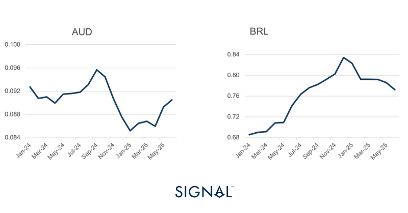
*Source:IMF*

‍

### Baltic Indexes‍

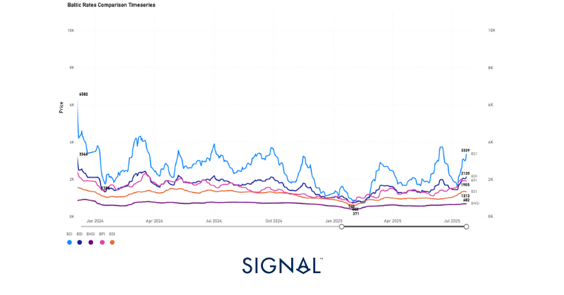
*Source:The Baltic Exchange*

‍

‍

## Major bulk

‍

### Iron Ore

Signal Ocean recorded global iron ore export volumes up m/m and y/y in June 2025 by 4.5% and 0.1% respectively. The rise in June is consistent with historical trends of restocking in China and better operating conditions in key exporting regions like Brazil and Australia. The y/y growth in June 2025 is much slower than that of previous years, indicating a more cautious sentiment around the entire steel industry, but particularly in China. Many market commentators expect the decrease in Chinese crude steel production to continue into the next decade and beyond, as the overcapacity in the industry closes. This will ripple back through to reduce iron ore demand in the longer term.

‍

Contrary to this view is the latest announcement made by the Chinese government that construction has started on a mega-dam project in Tibet. This will be the world’s largest hydro dam, requiring a reported 3 to 4 times more steel in its construction than the current largest capacity hydroelectric dam. This has sent iron ore prices to five-month highs on the expectation that Chinese steel production will increase to supply the project. The project will not be completed until sometime in the 2030s, meaning steel demand in China could stay elevated for a considerable period. As a result of the iron ore price spike, iron ore traders will look to take full advantage, with more tonnage of iron ore coming to market.

‍

Aside from the obvious producers such as Australia and Brazil, India is a region where additional iron ore tonnages are likely to come from. India typically exports lower-grade iron ore fines, which are not consumed domestically. These product exports have tracked global iron ore prices tightly in recent years. In April, we wrote how we expectIndian iron ore exports to softenas the country produces more steel domestically, as India continues to outpace the global trend of softer crude steel production. Now, we expect Chinese demand to provide a higher floor for Indian iron ore exports, which we forecast to show some y/y growth in the rest of 2025 Q3 at least.

‍

Yet the biggest winner in the medium term will likely be Guinea. The Simandou mine project is Africa’s largest mine and infrastructure project, and will start shipments of ore by the end of 2025. The project is backed by a large Chinese consortium and will bring up to 12 million tonnes of iron ore to market annually once fully ramped up. Given the ownership structure, it is likely that the vast majority of high-grade ore will find its way to China for use in steel production.

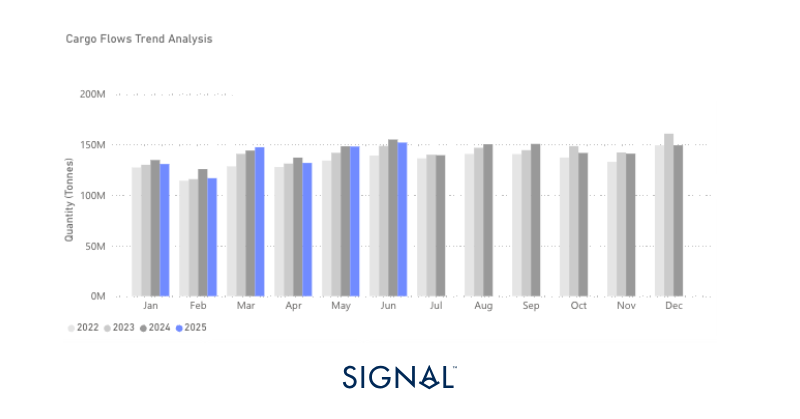
*Source:Iron ore exports from Signal Ocean*

‍

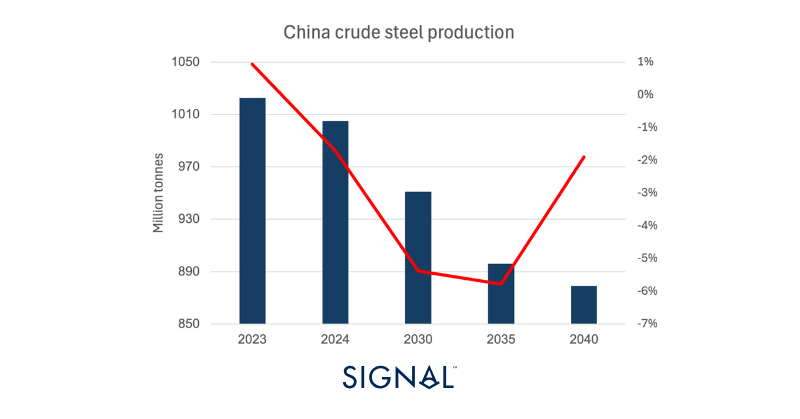
*Source:Association of Iron and Steel Technology*

‍

‍

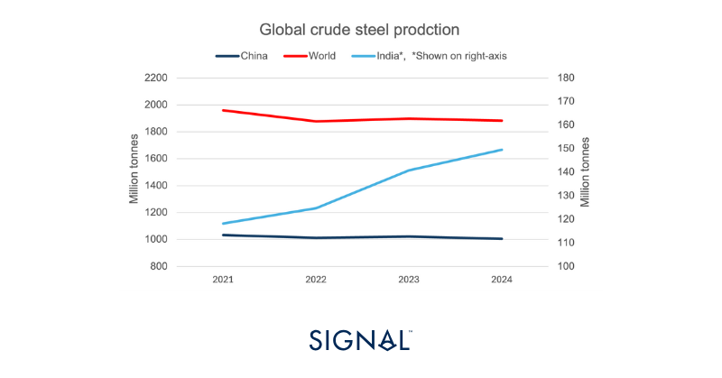
*Source:World Steel Association*

‍

### Coal

Signal Ocean coal export volumes in June 2025 were flat m/m but 9.5% down y/y. A 10.3% drop y/y in thermal coal exports was the biggest driver for this. Metallurgical coal volumes fell 5.2% y/y but were up 9.3% m/m. The three largest coal importers, China, India, and Japan, have all imported less coal so far in 2025.

‍

The reasons for lower coal imports in China and India are a result of rising domestic production. China recorded coal production growth of 7% for the first 6 months in 2025, while Indian coal production increased 3.4% for the year ending May 2025. Japan’s lower coal imports have been the result of a structural shift and have been declining year-over-year for several years. Japan imports a greater proportion of met coal, with over 31% of coal imports being this type. Lower imports of met coal follow the decreasing steel production in Japan, with annual production falling each year since 2021.

‍

However, the outlook for seaborne met coal demand, especially from China, has shifted into a more positive tone. The announcement of the megadam project in Tibet is expected to boost China’s steel consumption. This has pushed iron ore prices and met coal prices higher. While this alone may have been enough to encourage greater imports, recent market chatter around a government document calling for inspections at several coal mines in eight provinces for exceeding licensed production has led to concerns that domestic supply may become tight. In this scenario, China is likely to increase its imports of met coal from Russia, its largest met coal trading partner.

‍

In contrast, China’s seaborne thermal coal demand outlook is muted. Power generation attributed to thermal sources in China is down 4% so far in 2025, with around 80-90% of this coming from coal burning. Yet, overall power generation in China is up 2% from the previous year, highlighting the growing reliance on renewable sources. The megadam in Tibet is another step to a greater share of the Chinese power generation being from renewable sources and strengthens China’s energy security.

‍

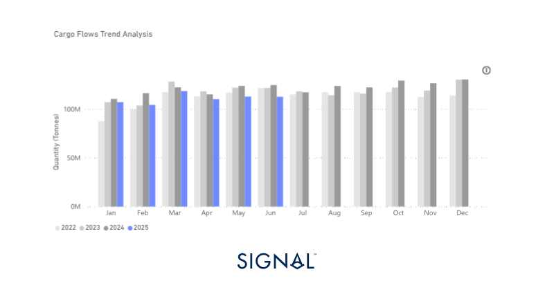
*Source:Total coal export volumes from Signal Ocean*

‍

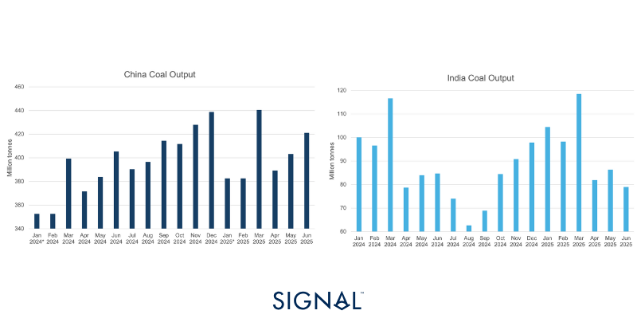
*Source:National Bureau of Statistics of China, The Ministry of Coal- India*

‍

‍

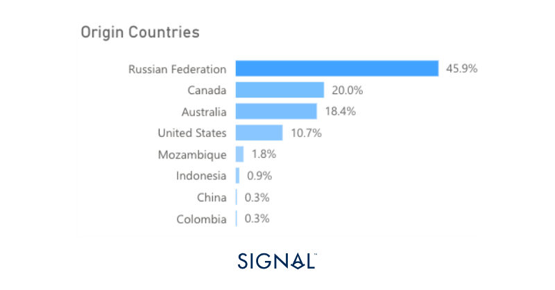
*Source:China Metallurgical coal import sources, 2022-June 2025 from Signal Ocean*

‍

### Grains- Soybean

Signal Ocean recorded soybean exports up 1% m/m but down 3.4% y/y in June 2025. On the whole, though, global soybean exports in 2025 are on par with those of 2024, only 0.7% lower. This fails to tell the full story of how the soybean trade has developed, however, as the entire supply chain from farmers to end-users has grappled with an ever-changing geopolitical landscape and unpredictable tariff measures.

‍

U.S. farmers were first burned by tariff implications during President Trump’s first term, as China placed a 25% tariff on U.S. soybeans, which rose to 35% as the trade war intensified. This led to a surge in US farmer bankruptcies and is something we have explored in a previoussoybean insight. The current impact of tensions between the US and China has resulted in US soybeans being placed under a 15% tariff since March 2025.

‍

China vastly outpaces all other regions in terms of soybean imports, thus drives the market. Demand in China is forecast to grow by 2% in the next marketing year. Given the recurring trading tensions with the U.S., it makes strategic sense that China has looked to reduce its reliance on the U.S. as a source of soybeans. It appears that this shift has been working as the U.S. has lost a considerable share of the source of total Chinese soybean imports since 2022. Given the latest USDA report on U.S. soybean planting and production for the coming harvest year, it seems that U.S. farmers also feel that they won't regain any of the lost share as planting areas of soybeans in the U.S have fallen by 4% for the next harvesting cycle. Domestic demand for soybeans in the form of crushing for biofuel use does offer some positive light for U.S. farmers, though.

‍

Therefore, the market paints a positive picture for Brazilian and other South American nations' soybean export opportunities to China. Brazilian farmers also appear keen to take advantage of this opportunity, with the USDA forecasting Brazilian soybean production to increase by 16% in the 2025/26 marketing year. We expect to see stronger soybean exports from Latin America in the coming months, compared to previous years, but given the seasonality of the market, m/m changes may be negative.

‍

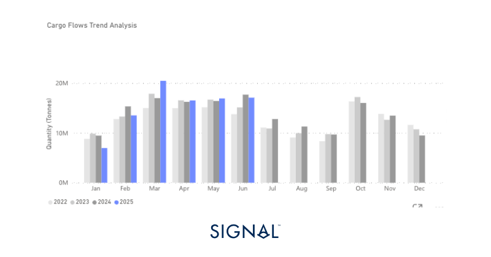
*Source:Soybean exports from Signal Ocean*

‍

‍

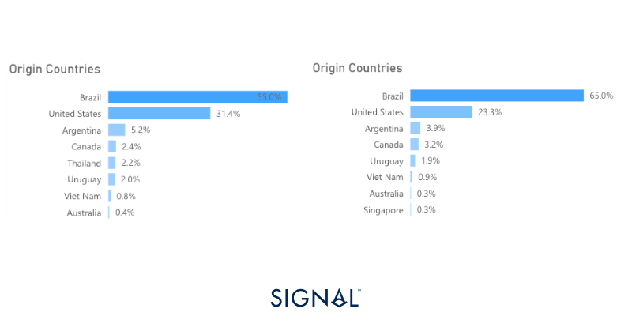
*Source:Origins of Chinese soybean imports 2022 vs 2024*

‍

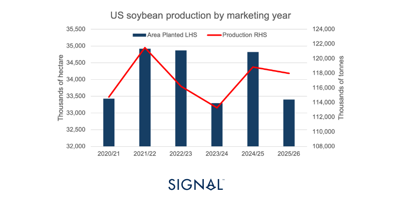
*Source:USDA*

‍

## Recent Insights & weekly reports

Monthly Minor Bulk Radar - July 2025

Soybean flows are changing, but who reaps the reward

Weekly Dry Monitor: Week 30, 2025

For the latest updates and insights, make sure to visit theSignal Ocean Newsroomwebsite page. Clickhere to request a demo.

For subscription to our FREE weekly market trends email,please click here, or contact us at: research@thesignalgroup.com

- Republishing is allowed with an active link to the source
