# Monthly Major Bulk Radar - October 2025

**Date**: October 30, 2025 | **Category**: Major Bulk | **Section**: Monitors | **Source**: [https://www.thesignalgroup.com/weekly-market-monitor/monthly-major-bulk-radar-october-2025](https://www.thesignalgroup.com/weekly-market-monitor/monthly-major-bulk-radar-october-2025)

---

Major bulk, made up of iron ore, coal, and grains, exports ended 2025 Q3 above the previous year and sit as the quarter with the highest volume of major bulk exported on the Signal Ocean Platform. Demand from China across all these major bulks helped to drive this, with September being particularly notable for coal and grain demand.

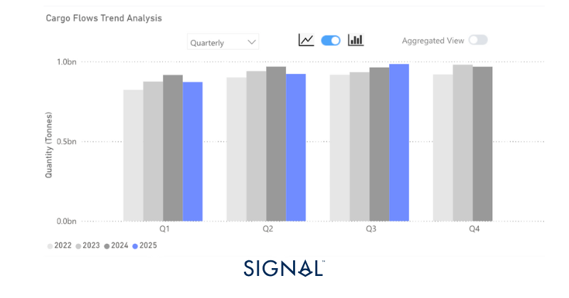
*Source:Total major bulk* export performance from Signal Ocean.*Major bulk is made up of iron ore, coal, and grains.*

‍

## Economic Environment

‍

## Manufacturing PMI’s

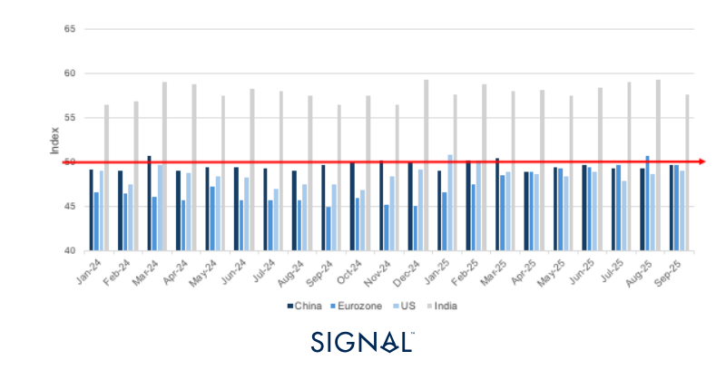
*Source:National Bureau of Statistics of China, Institute for Supply Management,  HCOB, HBSC India Manufacturing PMI*

‍

‍

## Exchange Rates

USD vs:

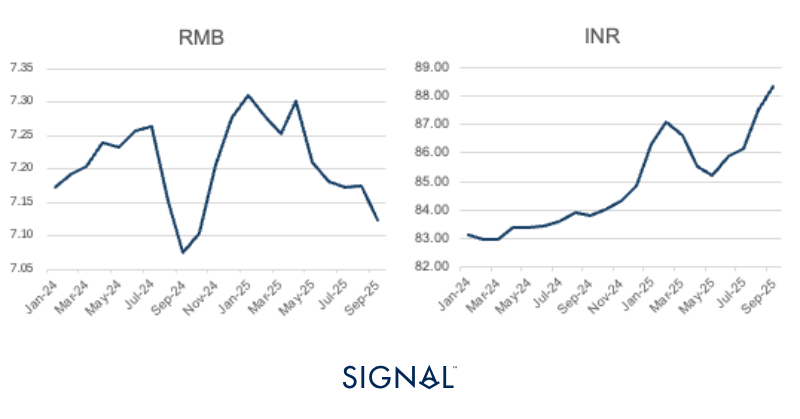
*Signal Figure*

‍

RMB vs:

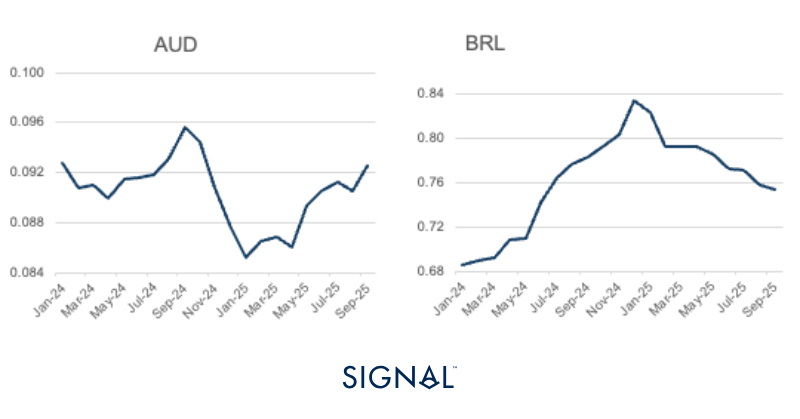
*Source:IMF*

Baltic Indexes

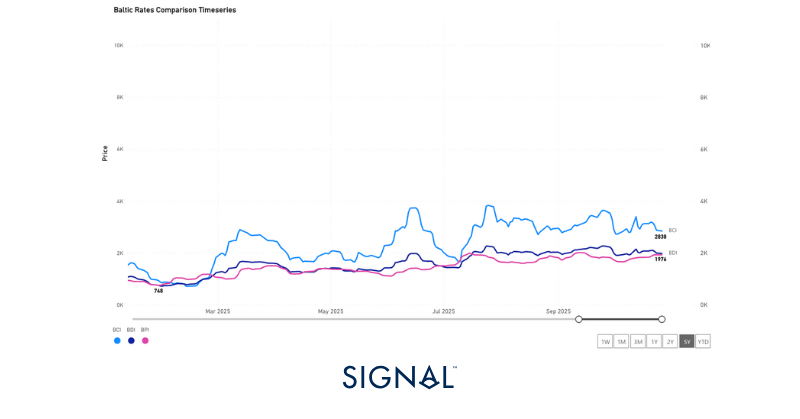
*Source:The Baltic Exchange*

## Major bulk

## Iron ore

The Signal Ocean platform recorded global iron ore exports at 154.1mt in September, up 2% y/y but down flat m/m. This has been driven by record imports of iron ore into China, which reached 118mt in September. The record import of iron ore into China runs counterintuitively to the current performance of the Chinese steel industry.

So far in 2025, China has produced 746mt of crude steel, down 3% on the same period from last year, with the last four months to September showing consecutive monthly decreases. As a result of both the increased exports and lower steel production, iron ore port stocks in China have reached multi-month highs by mid-October. This may weigh on iron demand in the coming months, and could see a contraction in iron ore imports in October and November, which is common in recent years.

Furthermore, BHP announced at the start of October that the state-run iron ore buyer (CMRG) had placed a halt on buying any of its products due to pricing disputes, and put pressure on others in the country to follow suit. The dispute focuses on the CMRG wanting a discount on the lower-grade iron ore it has been purchasing, with BHP holding firm on its price offering. CMRG also wants more of the purchasing to be conducted in RMB rather than USD. There have been unconfirmed reports that 30% of CMRG spot dealings with BHP will be conducted in RMB starting from Q4 2025. Read morehere.

More recently, stories have broken out detailing that BHP has managed to sell some tonnage to Chinese traders, outlining that some in the market are willing to take deliveries of iron ore. Still, with the negotiations between BHP and CMRG still at a standstill, and Chinese iron ore stocks at a multi-month high, it would be logical to expect imports of iron ore into China to soften before the end of 2025.

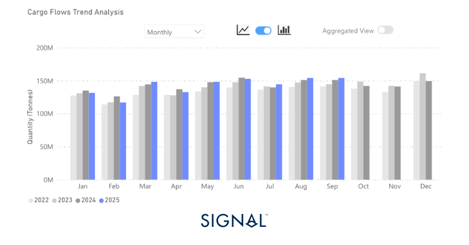
*Source:Global monthly iron ore exports from Signal Ocean*

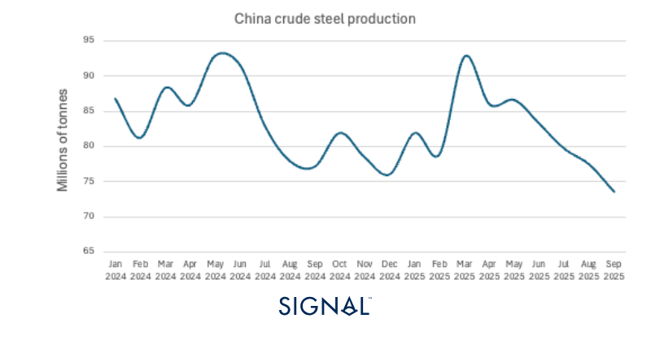
*Source:China crude steel production from the National Bureau of Statistics of China*

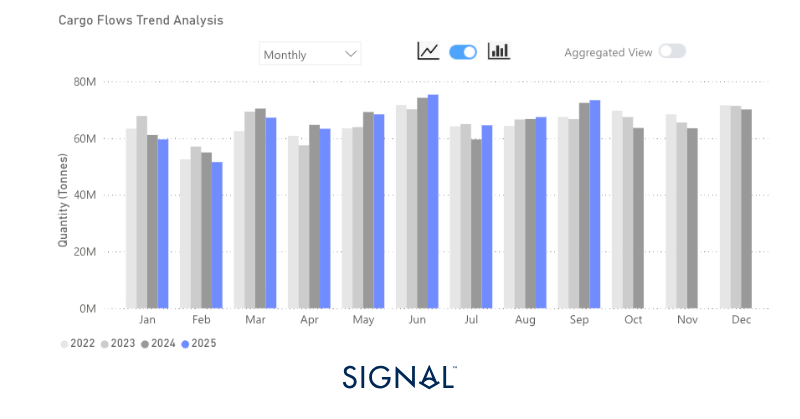
*Source:Australia to China iron ore exports from Signal Ocean*

## Coal

The Signal Ocean Platform data indicated that global coal exports reached 127mt in September, effectively flat month-on-month but 2% higher y/y. The modest annual increase was supported by a 4% rise in thermal coal shipments, underscoring steady demand despite broader volatility in the energy market.

The strength in thermal coal flows was concentrated in East Asia, where demand has remained firm since surging in August. In China, restrictions on domestic coal production have tightened supply, keeping it lower than last year's production, and pushed domestic prices higher, enhancing the relative competitiveness of imported coal. At the same time, robust manufacturing and power generation activity across other East Asian economies, notably South Korea and Japan, has sustained regional import demand. South Korea saw imports of thermal coal up 47% y/y in September, and Japan's imports were up 5% y/y.

The short-term demand picture for thermal coal is positive. China will continue to restrict output from its domestic coal mines, limiting supply at a time when the East Asian region heads into winter and there is typically higher power demand. Australia is the most likely to step in and supply the coal, as we have already seen thermal coal exports surge by 21% in September, heading mostly to East Asia.

The longer-term outlook, however, is not as positive for coal demand. China, the world's largest consumer of coal for electricity generation, has invested heavily in renewable energy infrastructure to provide adequate base load for power in the coming years. There has been a high rate of new coal power stations being commissioned, with 2025 H1 seeing the largest amount of coal-fired capacity being added since 2015, but this was to be expected given the 2030 peak carbon deadline set by the Chinese government. From 2030, coal demand in China will consistently soften.

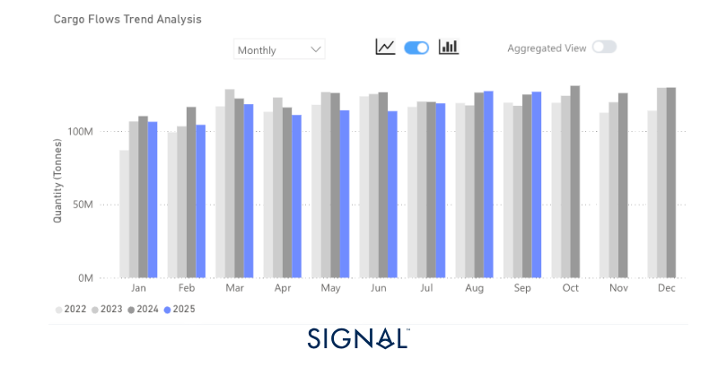
*Source:Total coal export volumes from Signal Ocean*

‍

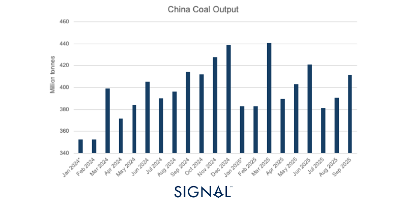
*Source:China domestic coal production from the National Bureau of Statistics of China*

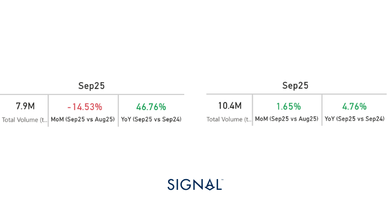
*Source:South Korea vs Japan coal import statistics for September 2025 from Signal Ocean*

## Grains- Soybeans

Signal Ocean measured global soybean exports reached 13.3mt, up 37% y/y. China, the largest consumer of soybeans globally, saw imports of soybeans surge 66% in September, driving the global increase in exports. From 2022 to now, China has received 21% of all its soybean imports from the U.S. However, in September 2025, no U.S.-origin soybeans were discharged in China for the first time since 2018. We explored the new sources in a previous articlehere.

The tariffs imposed by China on U.S. soybeans have been what the market has pointed to as the reason for this drop off. Those soybeans arriving in China from the U.S. before September are from previously harvested supplies. The absence of any U.S.-origin soybeans arriving in China from September 2025 shows that none of the latest harvest of U.S. soybeans has been purchased by Chinese buyers.

Without a positive resolution to the trade talks between the U.S. and China, U.S. farmers will come under pressure, as buyers in other countries are unlikely to require the volumes that China typically purchases. The move could also impact China at the start of next year, when Brazil enters its harvest season, as there is no indication of how much old crop Brazil, the largest supplier of soybeans to China, has left. This could see Chinese buyers look to U.S. soybeans over this period to keep the flows incoming.

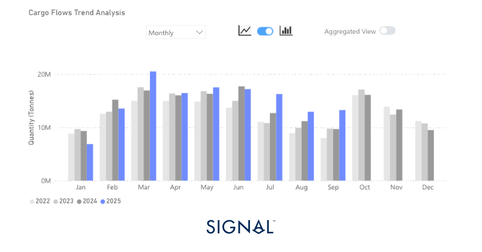
*Source:Global soybean exports from Signal Ocean*

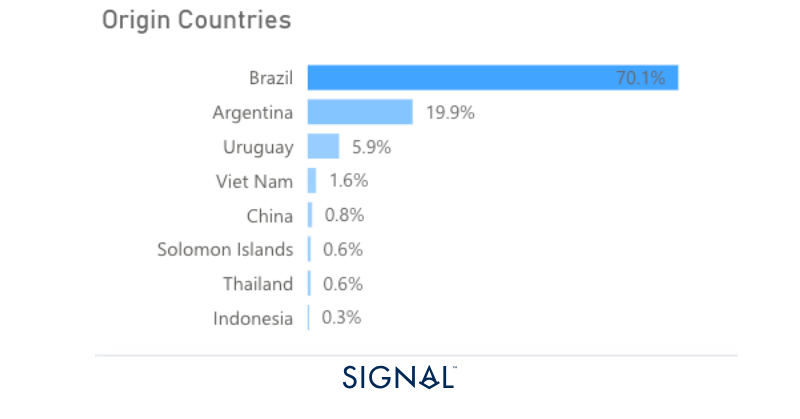
*Source:Origins of China soybean imports in September 2025 from Signal Ocean*

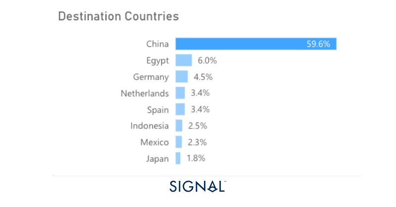
*Source:Destination for U.S.-origin soybeans since 2022 from Signal Ocean*

‍

‍

‍

## Recent Insights & weekly reports

China’s soybean imports pivot south

MARKET INSIGHTS: DRY BULK FLOWS | IRON ORE

Weekly Dry Monitor: Week 38, 2025

Weekly Dry Monitor: Week 39, 2025
