# Monthly Minor Bulk Radar - August 2025

**Date**: August 12, 2025 | **Category**: Minor Bulk | **Section**: Monitors | **Source**: [https://www.thesignalgroup.com/weekly-market-monitor/monthly-minor-bulk-radar-august-2025](https://www.thesignalgroup.com/weekly-market-monitor/monthly-minor-bulk-radar-august-2025)

---

## Bauxite, steel, and fertilizer: The push and pull of global geopolitics

Minor bulk, made up of all dry cargo types that are not categorized as iron ore, coal, or grains, has consistently outperformed the previous year in terms of total tonnage exported. In July, this trend was no different as total tonnage of minor bulk exports grew by 8% compared with the same period last year.  Despite the rising geopolitical tensions and ever-changing economic landscape, minor bulks are propping up the global demand for vessels.

‍

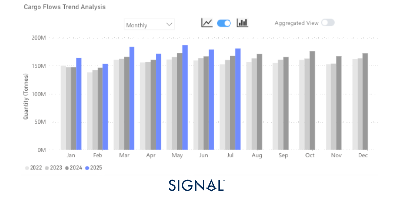
*‍Source:Total minor bulk* export performance from Signal Ocean.*Minor bulk is made up of dry bulk that is not categorised as iron ore, coal, or grains. It includes the likes of bauxite, cement, steel, fertilizers, etc.*

‍

‍

## Economic Environment

‍

## Manufacturing PMI’s

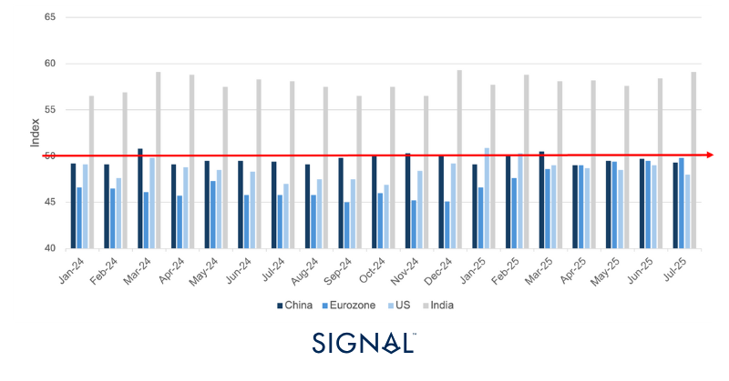
*Source:National Bureau of Statistics of China, Institute for Supply Management,  HCOB, HBSC India Manufacturing PMI*

‍

‍

## Exchange Rates

## USD vs:

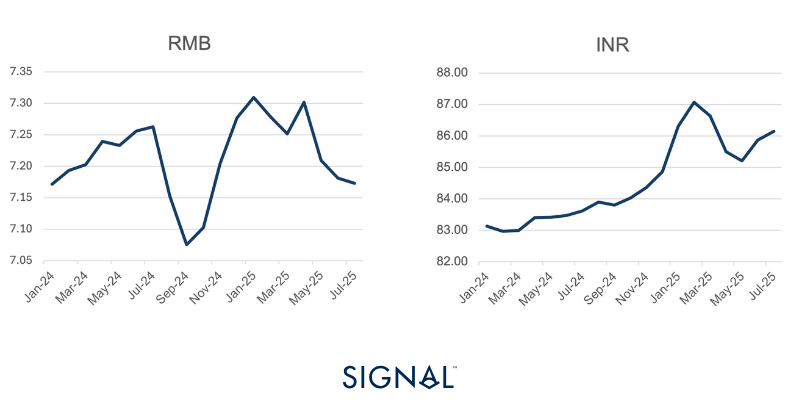
*Signal Figure*

## RMB vs:

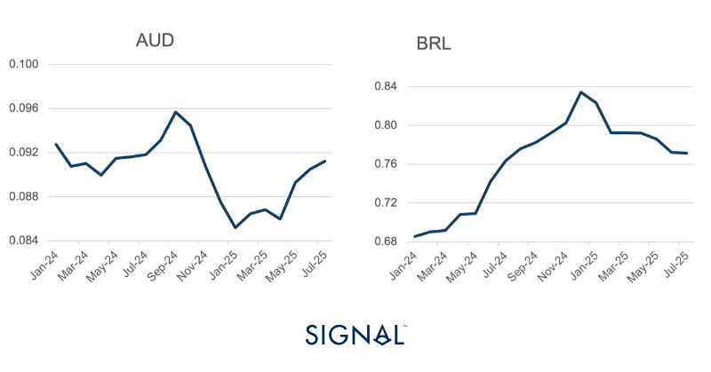
*Source:IMF*

‍

‍

## Baltic Indexes

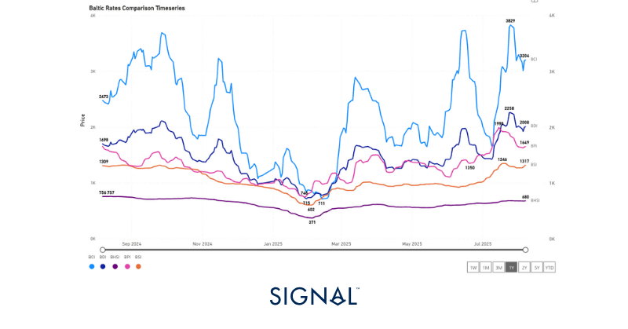
*Source:The Baltic Exchange*

‍

‍

## Minor bulk

## Bauxite

Global exports of bauxite reached 19.2mt in July, according to Signal Ocean. This represents an 8% increase y/y but a 14% fall m/m. This fall is expected, given the seasonality, but does represent a steeper decline than seen in recent years. Looking more closely at exports from Guinea, July exports fell by 14% m/m, which is in line with the June to July decreases historically. The driver of the larger fall m/m globally has been Australia, which saw exports fall 9% m/m in July, which is unusual given the historic range of change from June to July is between -5% and 9%.

China remained the main destination for all bauxite flows, accounting for over 84% in July. China is the largest aluminium producer globally and accounts for up to 60% of the world's total. The most recent statistic for Chinese electrolysed aluminium production in June is 3.8 mt, flat on May. Market commentators expect the figure for July to be slightly higher as greater operating capacity came online; they expect high production in August too. This should provide a solid level of demand for bauxite for the coming months.

More pressing for the industry, though, is the latest mandate by the government of Guinea. The Minister of Mines and Geology announced that 50% of all bauxite exports will require shipping under the Guinea flag. A key part of the reform is the formation of Guinéenne des Transports Maritimes (GUITRAM), which will be tasked with shipping the mandated proportion of bauxite from Guinea and allows the government to ‘strengthen the domestic control of the value chain’ via logistical sovereignty.  Currently, GUITRAM has not publicly announced if it owns any vessels.

The Winning group, from Hong Kong China, was the largest commercial operator of vessels carrying bauxite from Guinea in July 2025, accounting for 15% of all shipments by tonnage, taking all the cargo to China. In theory, vessels could change the flag under which they fly straightforwardly, and given the new directive from Guinea, it is assumed they would make the flag transfer easy. What is less clear is how the vessels will be taxed and protected. Similar initiatives have been proposed before and have lacked any significant follow through but given how the bauxite trade has underpinned capesize demand, the development remains a key area of interest for all involved parties.

‍

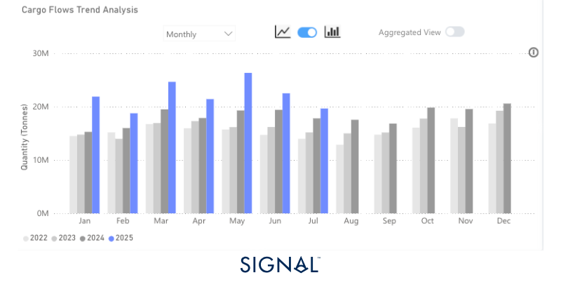
*Source:Global monthly bauxite exports from Signal Ocean*

‍

‍

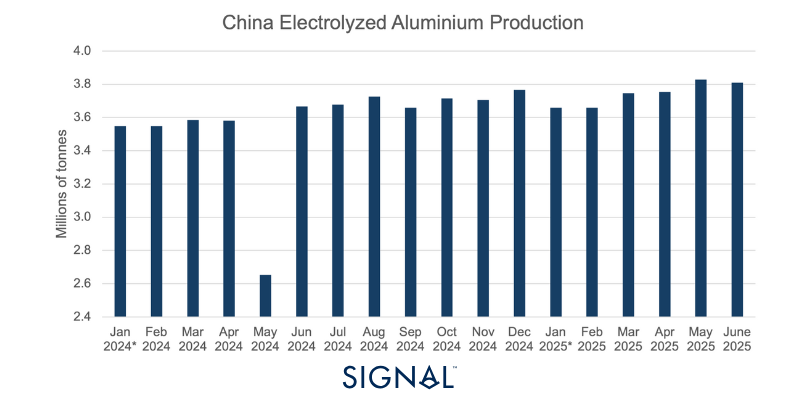
*Source:National Bureau of Statistics of China, *value for January is the average of the total cumulative output listed in February*

‍

‍

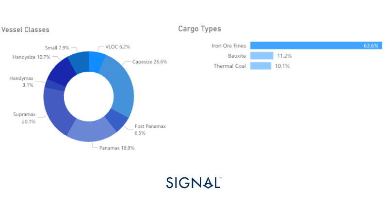
*Source:Total dry bulk vessel breakdown by type in 2025, Breakdown of cargo type carried by Capesize vessels in 2025 so far*

‍

## Steel

Signal Ocean recorded global steel exports of 19.9mt in July, up 10% y/y but down 3% m/m. This movement is in line with historical trends of July exports falling short of the previous month. China continued to dominate in terms of cargo origin, accounting for 43% of all steel exports in the month and 33% since 2021. In terms of destinations, it was a relatively even split between the U.S., 7%, India, 6%, and Indonesia, 5%.

Globally, steel production is down so far this year by 2.2%, slipping further behind than in May. China accounts for 55% of global production and trails its own 2024 production by 3% already so far in 2025, driving much of the global downturn. Yet, the year-to-date (ytd) figure shows an increase in steel exports of 11%, with exports originating from China up 35% ytd. The fall in Chinese domestic production is a result of sluggish demand as many of the key steel-consuming sectors in the country have slowed; therefore, producers have looked at growing the export market as a key revenue source. Chinese steel exports are very competitively priced, given the low cost of production in China, and this has led to trade tensions and the implementation of quotas on imported steel and anti-dumping policies. Mostly, these have been designed to support the domestic steel industry in regions like Europe and the U.S.

Yet Chinese exports are still driving the global steel trade, and we are seeing a growing proportion of crude steel production being exported based on Signal Ocean data. In 2023, China’s monthly exports were 21% of domestic production, rising to 22% in 2024, and currently, it sits at 23% in 2025, small but impactful growth. Looking ahead to August, the relationship between China’s crude steel production and global steel exports points to a softer volume of exports. Monthly crude steel production in China has tended to indicate what exports will look like in two months time. The latest crude steel production figures for China are for June, 4% down on that of May; therefore, a similar drop in steel exports in August can be expected too.

‍

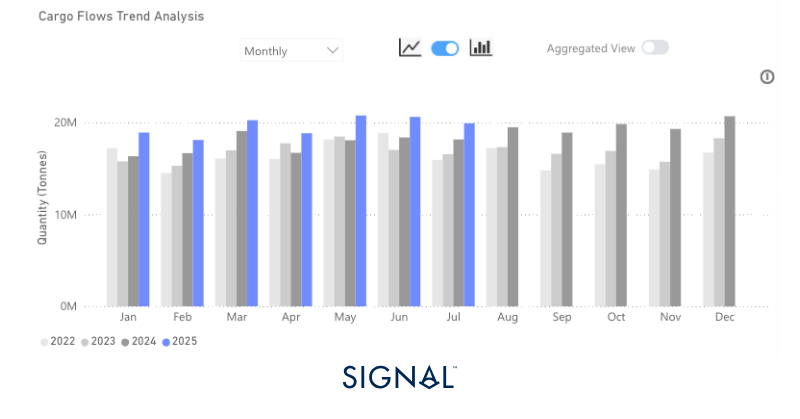
*Source:Total steel export volumes from Signal Ocean*

‍

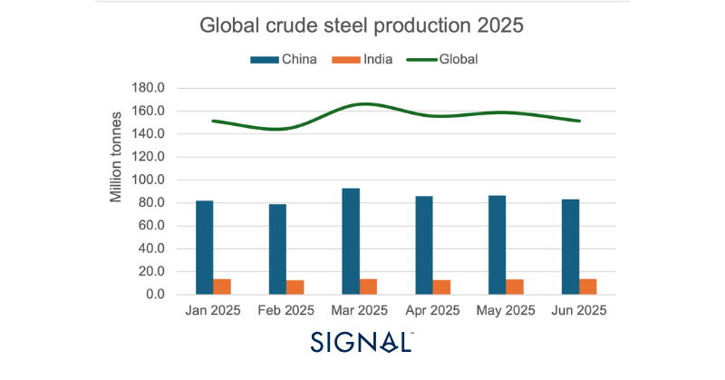
*Source:World Steel Association*

‍

‍

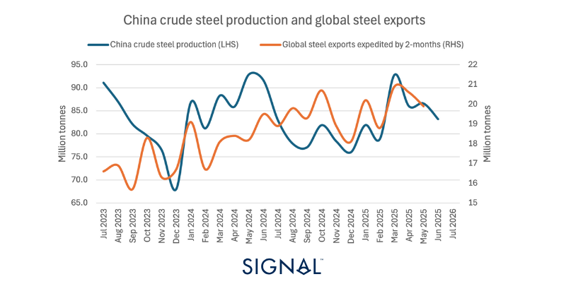
*Source:World Steel Association and Signal Ocean*

‍

‍

## Fertilizer

Fertilizer shipments reached 19.5mt in July, up 13% y/y and flat m/m according to Signal Ocean. The flat, only 0.5% decrease m/m, in July is not the norm, as from June to July, Signal Ocean typically records a larger drop in fertilizer exports. This is a result of the Northern Hemisphere moving past the peak demand period.

Russia leads the rest of the world in terms of origin for fertilizers, with 17% of global tonnage being shipped from  Russian ports since 2022. So far in 2025, Russia has been the origin of 19% of all fertilizers shipments on the Signal Ocean Platform, which is leading to some of the largest importers coming under scrutiny from the U.S.

Brazil is the largest importer of fertilizers, accounting for 20% of all global tonnage so far in 2024, with 25% coming from Russia. The agricultural sector in Brazil is anxious that Trump could follow through with his threat of placing “100% secondary tariffs” on countries that continue to import Russian goods; Brazilian goods currently face a 50% tariff as of 6th August. Brazil only sends around 2% of its agricultural products to the U.S., but these secondary tariffs could be adopted by other regions as a way to curb the buying of Russian exports. Yet, Brazil relies mostly on China as an importer of its agricultural products, and this seems unlikely to be affected by any U.S. actions.

Elsewhere, there are reports that China has halted shipments of specialist fertilizers to India. Despite China only accounting for 6.2% of India’s total fertilizer imports, China is the origin for around 80% of India’s specialty fertilizer.  This could have a knock-on effect on how well Indian agricultural products perform over the next season. The largest receiver of agricultural products from India is China, but India has accounted for less than 1% of China’s total imported seaborne agricultural products since 2022, so China will not be impacted if the lack of specialty fertilizer imports into India meaningfully affects yields.

Overall, though, fertilizer performance for the shipping industry has been strong for 2025 so far. Tonne miles of fertilizer shipments to either Brazil or India, the two largest importers, have outperformed 2024 and 2023, with the seasonal downturn coming much later. This will support supramax demand, which carries around 44% of all fertilizer exports during a period of slower demand for coal.

‍

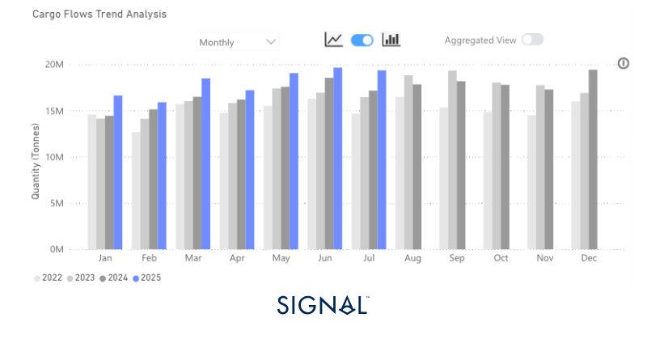
*Source:Fertilizer exports from Signal Ocean*

‍

‍

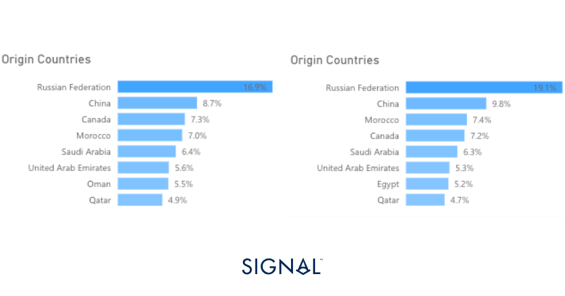
*Source:2022-2025 fertilizer origins vs2025 fertilizer origins from Signal Ocean*

‍

‍

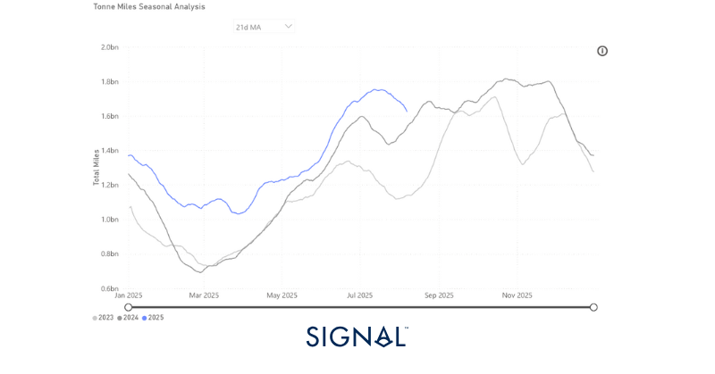
*Source:Tonne-miles of fertilizer exports to Brazil and India from Signal Ocean*

‍

## Recent Insights & weekly reports

Special Focus: Supramax & Panamax Coal Cargo Flow Trends from Indonesia

Weekly Dry Monitor: Week 30, 2025

Weekly Dry Monitor: Week 31, 2025

‍For the latest updates and insights, make sure to visit theSignal Ocean Newsroomwebsite page. Clickhere to request a demo.

For subscription to our FREE weekly market trends email,please click here, or contact us at: research@thesignalgroup.com

- Republishing is allowed with an active link to the source
