# Monthly Minor Bulk Radar - October 2025

**Date**: November 24, 2025 | **Category**: Minor Bulk | **Section**: Monitors | **Source**: [https://www.thesignalgroup.com/weekly-market-monitor/monthly-minor-bulk-radar-october-2025](https://www.thesignalgroup.com/weekly-market-monitor/monthly-minor-bulk-radar-october-2025)

---

## China’s renewed appetite and shifting trade patterns lift volumes across key minor bulk commodities

Minor bulk, made up of all cargo types except iron ore, coal, and grains, started the first month of 2025 Q4 with positive momentum, with total export volumes up 3% y/y. This has been driven by China, which has seen imports of minor bulk increase by 14% y/y in October 2025.

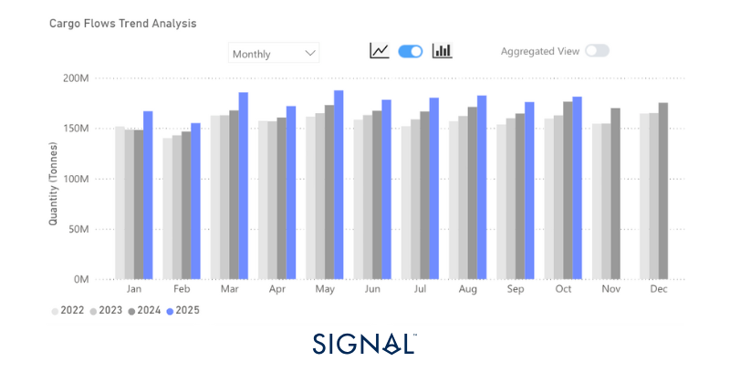
*Source:Total minor bulk* plus rice export performance from Signal Ocean.*Minor bulk is made up of dry bulk that is not categorised as iron ore, coal, or grains. It includes bauxite, cement, steel, and fertilizers, among others.*

‍

‍

## Economic Environment

‍

## Manufacturing PMI’s

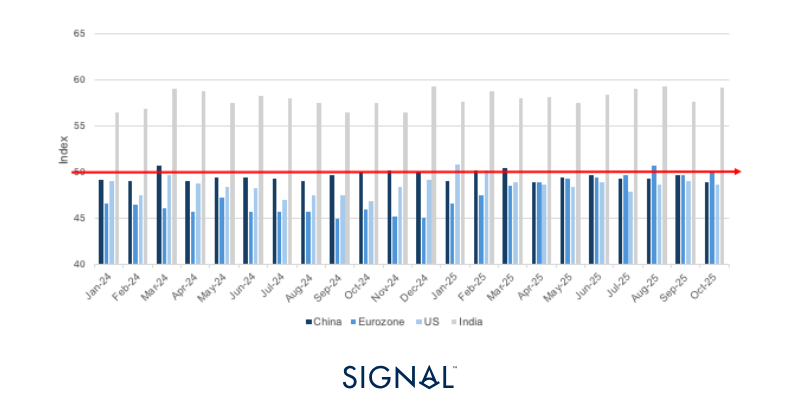
*Source:National Bureau of Statistics of China, Institute for Supply Management,  HCOB, HBSC India Manufacturing PMI*

‍

‍

## Exchange Rates

## USD vs:

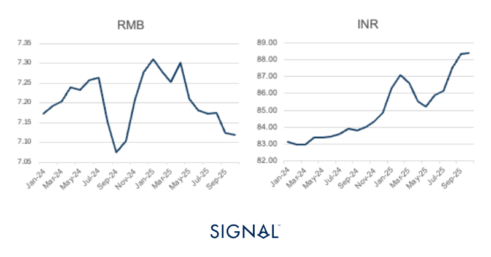
*Signal Figure*

‍

## RMB vs:

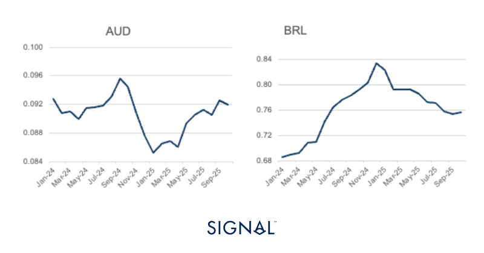
*Source:IMF*

‍

## Baltic Indexes

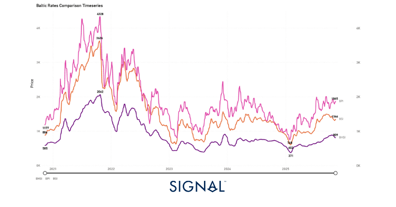
*Source:The Baltic Exchange*

‍

## Minor bulk

## Bauxite

The Signal Ocean platform recorded global bauxite exports in October at 19.6mt, flat m/m. The figure for October marks the first time in 2025 that a monthly export figure of bauxite has not been up y/y, remaining flat on the October 2024 figure.

The bauxite market typically shows seasonality, with the final quarter stronger than the preceding three. The third quarter tends to see the lowest volume of exports. The final quarter of 2025, though, has started weaker than in previous years. From 2022 to 2024, October exports grew by 7% to 17% m/m, but in October 2025, exports remained flat.

A more bullish outlook was provided with the signing of a 1.5mt sales agreement by Guinea state-owned miner Nimba Mining Company (NMC), which took over operations of the Tinguilinta mine from the Emirati-owned Guinea Alumina Corporation, and buyers in China. NMC has already shipped the first 200kt of this contract.

We could see bauxite exports from Guinea come under pressure from 2027. We previously mentioned that the Guinean government has been looking to revoke mining licenses for bauxite operations that do not invest in domestic processing facilities to convert Guinea's abundant bauxite into the higher-value product, alumina. Now, Guinea has signed its first alumina refinery deal with China’s state-owned SPIC, with construction of the facility due in 2027.

In the time from now until then, exports of bauxite from Guinea could increase as buyers look to front-load purchases of material before any interruptions that may come from government policies of domestic alumina production. This will be beneficial for capesize demand, with the Simandou project also helping to boost capesize demand from Guinea through 2026 and beyond.

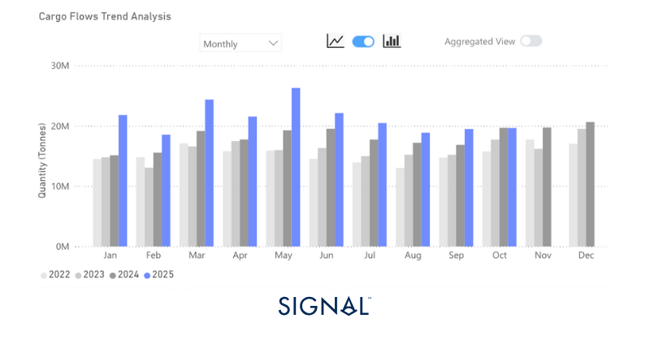
*Source:Global monthly bauxite exports from Signal Ocean*

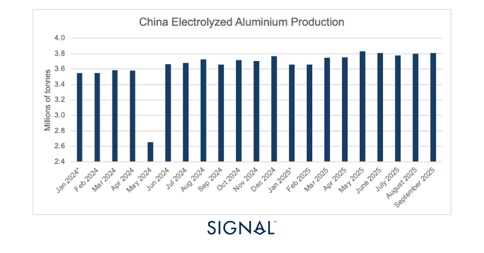
*Source:China aluminium production from the National Bureau of Statistics*

‍

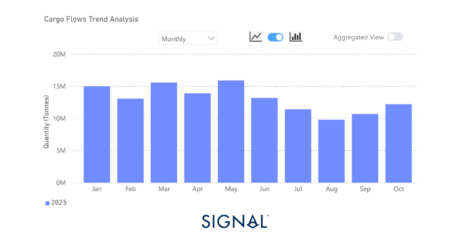
*Source:Exports of bauxite from Guinea in 2025 from Signal Ocean*

## Scrap steel

The Signal Ocean Platform recorded scrap metal exports at 1.3mt in October 2025, down 10% y/y but up 20% m/m. Given the uses of scrap steel, the demand drivers are intrinsically aligned with the performance of steel mills.

Turkey is the key destination for scrap metal, accounting for over 62% of all imports since 2022, according to TSOP.  This is due to Turkey’s large steel-making capacity, currently sitting 7th in the global steel producers table. It is the way Turkey produces steel that drives its need for scrap metal, though.

Turkey produces a significant portion of its steel through electric arc furnaces (EAFs) rather than blast furnaces (BFs). An EAF uses scrap steel as its primary feedstock, unlike a BF, which cannot melt scrap steel, so it needs primary raw materials, such as iron ore, coal, etc, to produce steel. Turkey does not have enough domestic scrap steel due to some key drivers. Turkey is not a large enough producer of appliances or cars to generate enough scrap through those manufacturing processes, and the industrial base within Turkey does not produce enough prime scrap. Adding to this is the lack of suitable quantities of obsolete scrap, which comes from demolitions or appliances at the end of their life cycle. Therefore, to feed Turkey’s growing EAF capacity, the nation relies heavily on imported scrap.

Currently, Turkey has seen scrap steel imports down 15% YTD. The World Steel Association states Turkey’s crude steel production in 2025 from January to September was 28.1mt, up less than 1% from the same period last year. Yet, exports of Turkish steel products are performing well, up 15% YTD, and are particularly strong to Europe. Steel production in the EU is down around 4% YTD, so Turkish products can find buyers.

‍

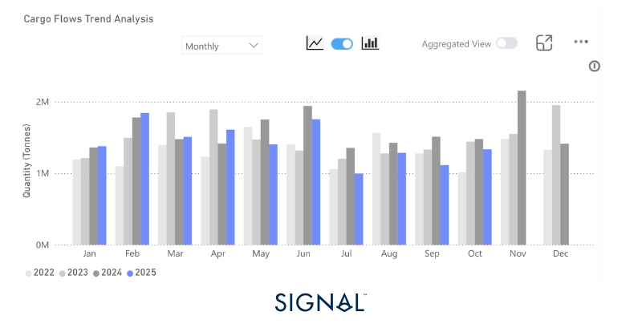
*Source:Total scrap steel export volumes from Signal Ocean*

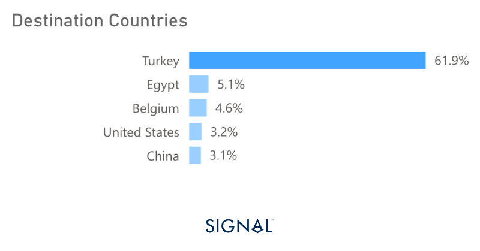
*Source:Destination of scrap steel exports from Signal ocean*

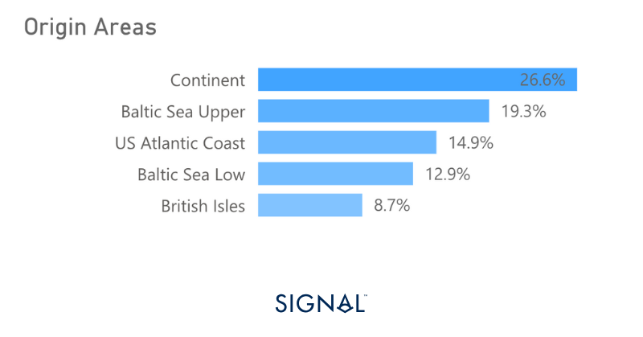
*Source:Origin areas of scrap steel exports from Signal Ocean*

## Rice

Signal Ocean recorded global rice exports at 1.8mt in October 2025. This figure represents a 6% increase in m/m and y/y. India and Thailand dominate the export market, accounting for over 50% of all rice exports recorded by Signal Ocean since 2022.

Indian exports have been boosted in recent months following the scrapping of a minimum price of non-basmati rice in October 2024. This has led to rice exports from India reaching a 55% increase YTD. The majority of these exports have been sent to West Africa, with Senegal and Benin dominating. The reason for West African dominance is a result of rapid population growth, which has outpaced domestic capacity. Rice also benefits from its ease of preparation compared to more traditional West African staples like yams or millet. This will continue to help drive demand as these West African nations continue to urbanize.

Across the Atlantic, the U.S. is expected to see a surge in rice exports to Japan. Over the summer of 2025, Japan agreed to purchase $8 billion worth of agricultural goods from the U.S. and increase rice imports by 75%. Japan is the largest importer of U.S. rice, accounting for over 51% of all U.S. rice exports since 2022. Japan has faced domestic rice shortages over the past year, leading to prices spiking for the staple. This agreement gives Japan control over the quantity and quality of rice imports, while helping to alleviate domestic food insecurity.

Looking ahead, an increase in the magnitude agreed to by Japan would drive Handysize demand out of the West Coast of the U.S., given that Sacramento is the dominant origin port for U.S. rice exports.

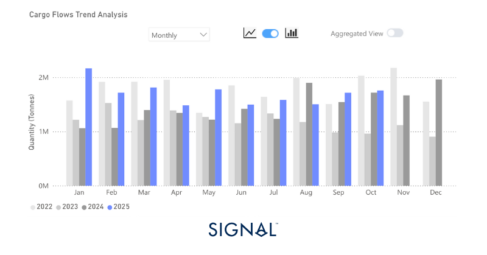
*Source:Global rice exports from Signal Ocean*

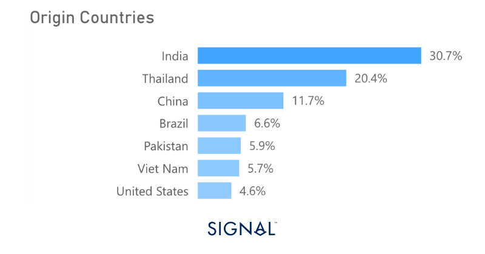
*Source:Origins of rice exports  from Signal Ocean*

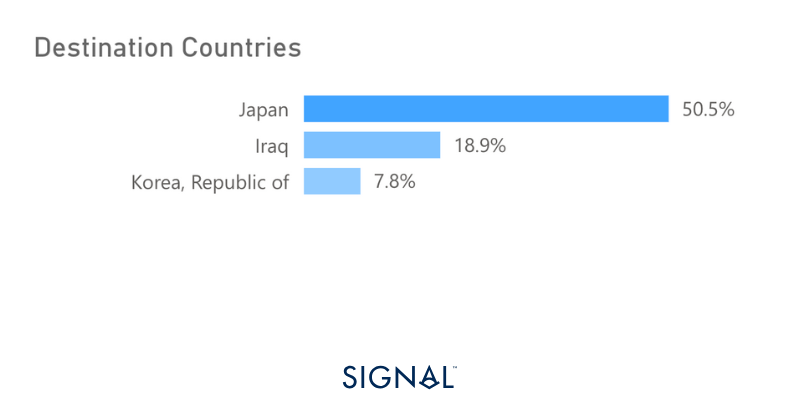
*Source:Destination for U.S.-origin rice exports from Signal Ocean*

‍

## Recent Insights & weekly reports

Weekly Dry Market Monitor: Week 47, 2025

Iron Ore’s Shifting Currents: Supply Surge Meets China Slowdown

‍For the latest updates and insights, make sure to visit theSignal Ocean Newsroomwebsite page. Clickhere to request a demo.

For subscription to our FREE weekly market trends email,please click here, or contact us at: research@thesignalgroup.com

- Republishing is allowed with an active link to the source
