# Monthly Minor Bulk Radar - September 2025

**Date**: October 1, 2025 | **Category**: Minor Bulk | **Section**: Monitors | **Source**: [https://www.thesignalgroup.com/weekly-market-monitor/monthly-minor-bulk-radar-september-2025](https://www.thesignalgroup.com/weekly-market-monitor/monthly-minor-bulk-radar-september-2025)

---

## Bauxite, manganese ore, and forestry: More protectionism to come‍

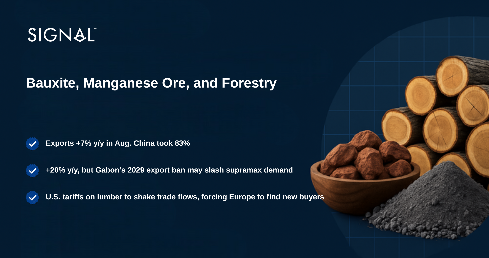
*Signal Figure*

Minor bulk, made up of all dry cargo types that are not categorised as iron ore, coal, or grains, has consistently outperformed the previous year in terms of total tonnage exported. In August, this trend continued as the total tonnage of minor bulk exports increased by 7% compared to the same period last year. Through 2025 H2, there have been several protectionist policies announced that will impact vessel demand going forward. Signal Ocean will continue to monitor and report as the outcomes become more visible.

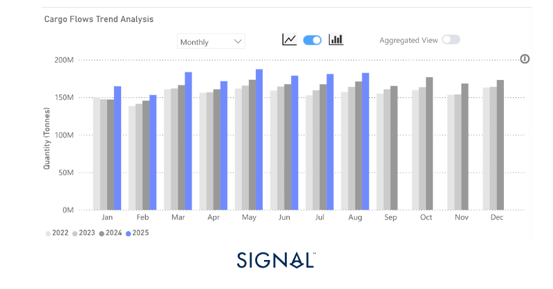
*Source:Total minor bulk* export performance from Signal Ocean.*Minor bulk is made up of dry bulk that is not categorised as iron ore, coal, or grains. It includes the likes of bauxite, cement, steel, fertilizers, etc.*

‍

‍

## Economic Environment

‍

## Manufacturing PMI’s

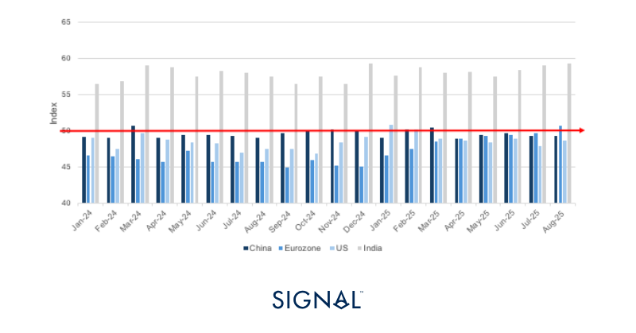
*Source:National Bureau of Statistics of China, Institute for Supply Management,  HCOB, HBSC India Manufacturing PMI*

## Exchange Rates

## USD vs:

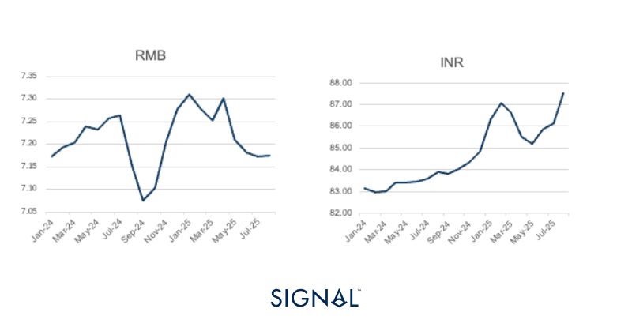
*Signal Figure*

## ‍RMB vs:

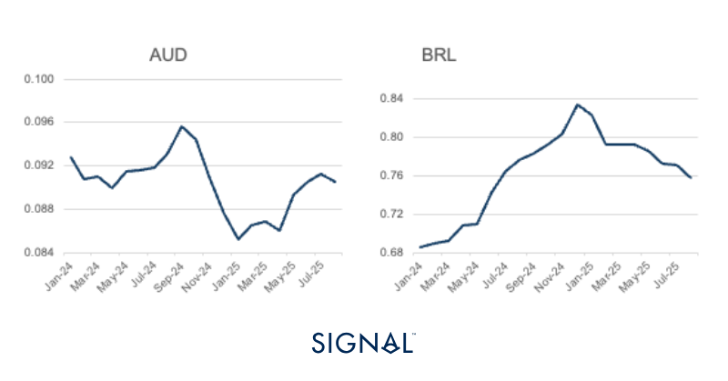
*Source:IMF*

‍

## ‍Baltic Indexes

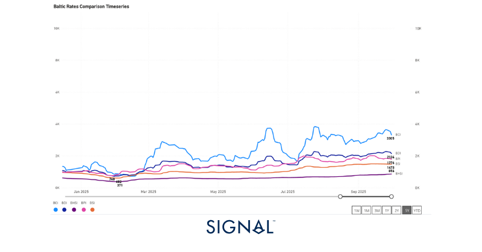
*Source:The Baltic Exchange*

‍

## ‍Minor bulk

## Bauxite

The Signal Ocean platform recorded global bauxite exports at 18.4mt in August, up 7% y/y but down 10% m/m. The decrease from July to August was expected, given the seasonality of shipping out of West Africa, where the majority of bauxite originates from. September is also likely to see a simialr m/m decrease due to this, but is likely to be above the same period in 2024, given the current market dynamics of strong Chinese demand.

China was the destination for 83% of all the bauxite exports in August 2025, the same proportionality seen in July, but slightly lower than in June. Chinese aluminium production in August was 3.8mt, up 2% on the previous year. Chinese aluminium production has remained consistent so far in 2025, staying between 3.7mt and 3.8 mt all year.

On the supply side, more interesting developments have taken shape in Guinea. In early August, GAC, a subsidiary of Emirates Global Aluminium, saw its mining license revoked due to non-compliance with the national mining code. This news was followed by the creation of a new national mining company called Nimba Mining SA, a state-owned entity, which will take over the operations. Some estimates put the concession at around 400mt in bauxite reserves, which would place it within the premier category of deposits, although still below ‘super giant’ status, which is deposits above 1 billion tons.

Still, the deposit accounts for around 5% of the total 7.4bt worth of bauxite reserves in Guinea. There is little information around production rates or operating plans as of yet, but given the ownership nature, it would be sensible to assume that production at high utilization rates will be a priority. This will continue to be beneficial for capesize demand from West Africa to the Far East, supporting prices.

‍

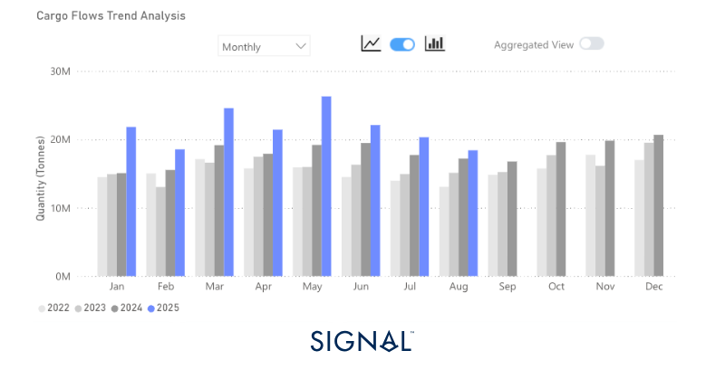
*Source:Global monthly bauxite exports from Signal Ocean*

‍

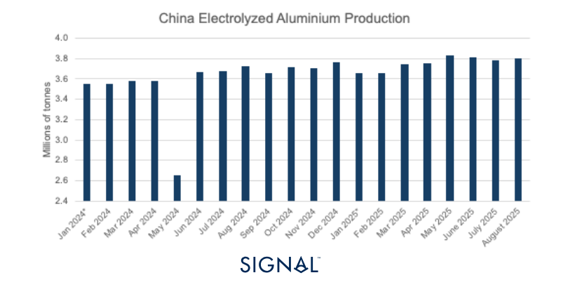
*Source:National Bureau of Statistics of China, *value for January is the average of the total cumulative output listed in February*

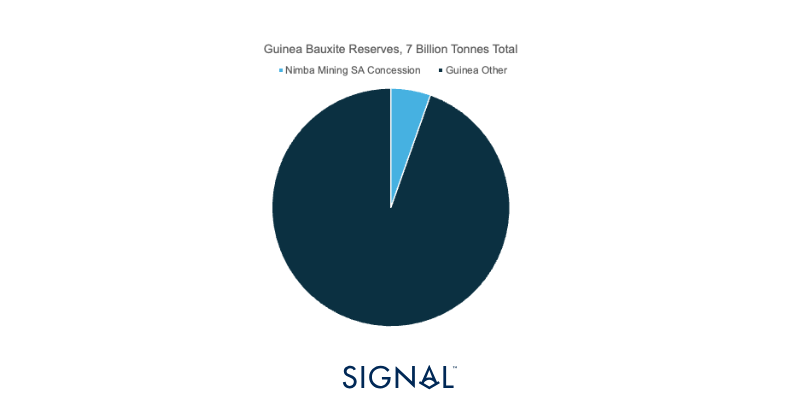
*Source:Guinea bauxite reserves from USGS 2025 Mineral Commodity Summaries*

## Manganese ore

Signal Ocean recorded global manganese ore exports of 4.2mt in August, up 20% y/y but down 8% m/m. The continent of Africa dominates the origin of manganese ore, accounting for 84% of all exports since 2022. Manganese  is a key raw material used in the steel industry, which improves the toughness and wear resistance of steel. As a result, carbon steel contains between 0.3% and 1% manganese, with stainless steel containing between 1.5% and 2% manganese. Hadfield steel, used in railways and mining equipment, can contain up to 12-14% manganese.

In June, the government of Gabon announced that from 2029, exports of manganese ore would be banned. Gabon is the second largest exporter of manganese ore behind only South Africa. The move appears to follow in the trend of similar announcements by primary resource-exporting nations like Indonesia and, more recently, Guinea, to try to increase the value of exports by processing the raw materials domestically. Given that the nation does not have a domestic steel industry, the ore would be converted into an intermediate product like ferromanganese or a similar alloy. This would require additional inputs such as coke and fluxes, as well as a stable electricity supply to power the heavily power-consuming EAF. As a result, the processing infrastructure in Gabon will require strong investments from either the government or companies already involved within the supply chain, a combination of both being the most likely.

The implementation of this policy will have a direct result on vessel demand from Gabon. Currently, Gabon drives around 20% of all supramax demand from the West Coast of Africa, of which Manganese ore accounts for just below 30%. The conversion ratio for manganese ore to ferromanganese is roughly 2.2 to 1, meaning that less than half the current annual shipping capacity would be required, weighing heavily on supramax prices out of West Africa.

However, given the time frame, the policy will not come into effect until 2029, and the need for greater build-out of the processing infrastructure in Gabon, vessel demand will remain strong up until that point. The largest consumer of manganese is China, and despite the downward pressure on carbon steel production, the use of steel containing higher levels of manganese has a strong outlook. This should provide a solid base for demand for the next 4 years at least.

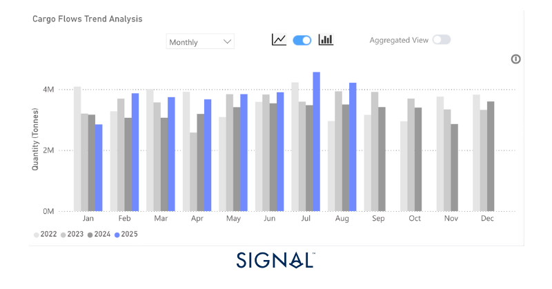
*Source:Total manganese ore export volumes from Signal Ocean*

‍

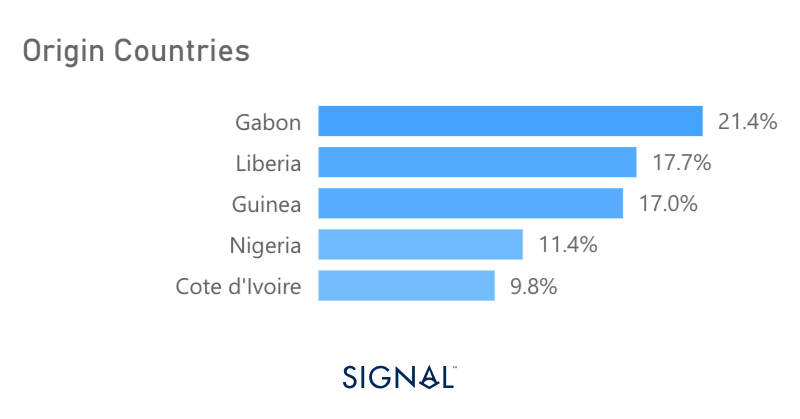
*Source:Origin of supramax demand from West Africa from The Signal Ocean Platform*

‍

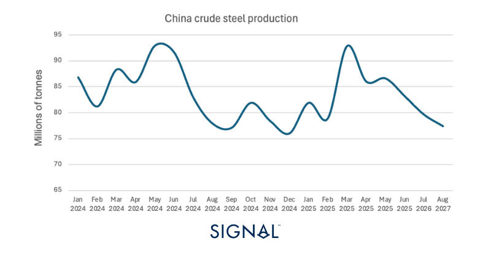
*Source:World Steel Association*

‍

## Forestry

Forestry shipments reached 10.1mt in August, up 4% y/y and 7% m/m according to Signal Ocean. Despite this, the YTD value remains flat in 2024. China, Japan, and the U.S. dominate imports, accounting for 68% since 2022, according to The Signal Ocean Platform.

Yet, this could be about to change. On the 30th of September, President Trump announced a 10% tariff on softwood lumber and timber products. Lumber accounts for 37% of all forestry imports into the U.S. These wood products typically come from Brazil or Northern Europe. The effects of the tariff are set to come into effect from 14th October, which should see those relying on lumber imports racing to land the shipments before that date.

Within the U.S., lumber is typically used in construction. The wood is used to build frames, in roofing applications, as well as decking and structural beams. Lower quality lumber is used to create pallets, crates, and within industrial packaging, making it a crucial raw material for the logistics sector in the U.S..

Approximately 50% of lumber exports to the U.S. originate from Germany, with 64% transported by handysize vessels and 21% by handymax. These exports will need to be redirected going forward, but this may be difficult in practice, as 96% of lumber exports from Germany are destined to the U.S, and the U.S. is the destination for 80% of all lumber from any destination. Interestingly, the HS2 shipping route has seen freight rates surge since the end of July. This may indicate that those in the market were anticipating this announcement and worked hard to move the lumber from Europe to the U.S. before tariffs come into full effect.

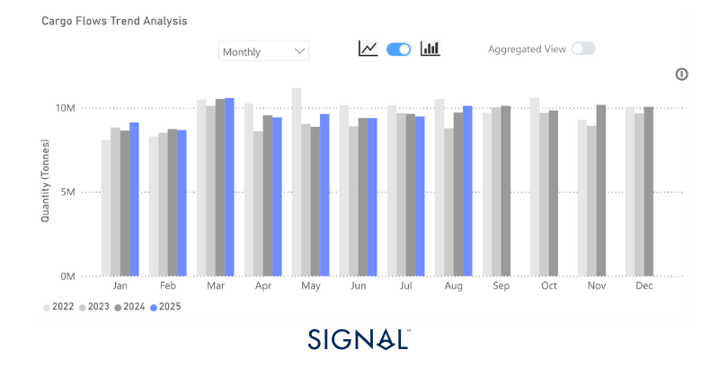
*Source:Forestry exports from Signal Ocean*

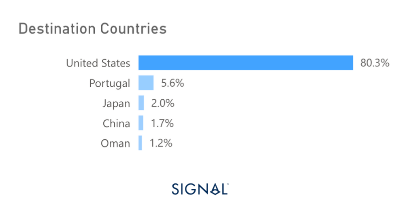
*Source:Lumber export destinations from Signal Ocean*

‍

‍

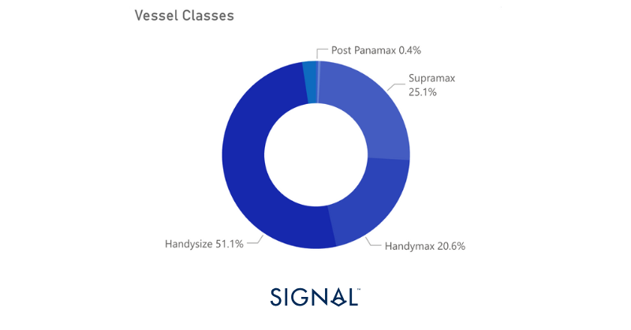
*Lumber exports vessel classes from Signal Ocean*

‍

## Recent Insights & weekly reports

Coal Market Insights September 2025: Shifting Flows Reshape Global Trade

Weekly Dry Monitor: Week 37, 2025

Weekly Dry Monitor: Week 38, 2025

‍For the latest updates and insights, make sure to visit theSignal Ocean Newsroomwebsite page. Clickhere to request a demo.

For subscription to our FREE weekly market trends email,please click here, or contact us at: research@thesignalgroup.com

- Republishing is allowed with an active link to the source
