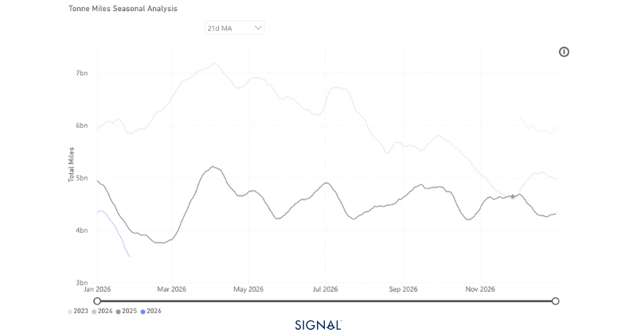
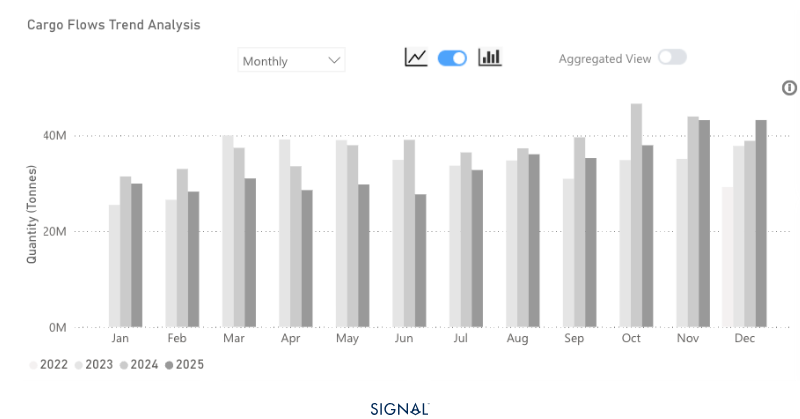
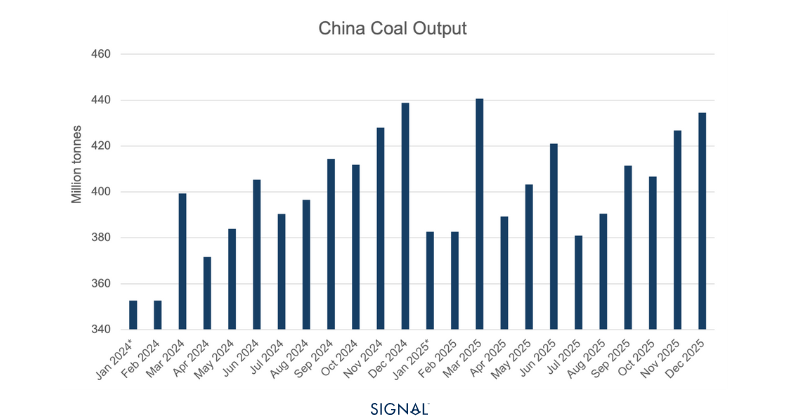

# COMMODITY RADAR | Spotlight: COAL

**Date**: February 2, 2026 | **Category**: Minor Bulk | **Section**: Monitors | **Source**: [https://www.thesignalgroup.com/weekly-market-monitor/seaborne-coal-suffers-in-2025-as-china-burns-less-and-produces-more](https://www.thesignalgroup.com/weekly-market-monitor/seaborne-coal-suffers-in-2025-as-china-burns-less-and-produces-more)

---

## COMMODITY RADAR | Spotlight: COAL

## Seaborne coal suffers in 2025 as China burns less and produces more

Global seaborne coal flows suffered in 2025 due to significantly lower imports from China. This is a trend we expect to continue.

- Global seaborne coal flows fall over 3% in 2025
- China imported over 11% less seaborne coal in 2025. Driving the global decrease as World Ex. China saw flows flat y/y.
- China’s decrease was a result of greater domestic production and less demand from thermal power generation.
- This downtrend is expected to continue as China shifts its focus towards greater renewable energy. Coal will provide energy security if renewable miss required generation levels

*Source:Coal carrying Capesize tonne-miles to China from Signal Ocean*

China ended 2025 having imported 404mt of seaborne coal according to TSOP. This was a decrease of over 11%, or 50mt. This came despite a surge in December imports, which were 12% higher than the same month in 2024. This drove the 3% decline in global seaborne coal flows in 2025, which TSOP recorded at 1.4bt.

In 2024, China received approximately 31% of all coal flows on TSOP. This softened slightly to 29% in 2025, indicating that China cut back in a somewhat greater proportion than other regions. This slight shift in proportionality indicates a sense that China will continue to soften its dominance of the seaborne coal market. However, it will need to slip a lot further for both India and Japan to catch up.

Coal carrying capesize tonne-days spent the entirety of 2025, bar a very short period in late November, below the previous year, and this decline has continued into 2026 so far. Given that coal is one part of the trio, including iron ore and bauxite, that moves the capesize market, a weak coal outlook could weigh on capesize demand over the course of 2026.

*Source:China thermal coal imports from Signal Ocean*

Thermal coal remains the dominant source of electricity generation in China and usually moves in line with overall electricity output. However, 2025 was an exception. Although thermal power continued to account for the largest share of electricity generation, total electricity production in China rose by 2.2%. In comparison, thermal power generation fell by 1%, the first annual decline in over a decade.

Meanwhile, renewable energy sources experienced significant growth, with solar generation surging more than 24% y/y. China has been investing heavily in its renewable sector, spending over $624b in 2024 alone. Looking ahead, the country’s 15th Five-Year Plan envisions expanding renewable generation capacity, including high-profile projects such as a 1 GW offshore floating solar installation expected to come fully online in 2026.

Given the expected rise in China’s total electricity demand in 2026, coal will have some support as a backup to provide the necessary fuel for electricity generation if renewables fail to meet requirements. This is likely to be a ‘safety-net’ rather than an indication that greater coal use is inevitable.

*Source:China coal production from the National Bureau of Statistics*

## Coal imports will keep falling, but by how much…

For the capesize market, coal has shifted from a growth driver to a volatility amplifier. China’s structurally lower seaborne imports, rising domestic supply, and accelerating renewables point to subdued coal-related tonne-days through 2026. While coal will retain a role as a back-up fuel during periods of renewable shortfall or weather stress, this is unlikely to translate into sustained capesize demand growth.

Instead, coal flows may increasingly be episodic, driven by short-term security needs rather than structural consumption. As a result, capesize fundamentals will lean more heavily on iron ore and bauxite, with coal offering only intermittent support.For the latest updates and insights, make sure to visit theSignal Ocean Newsroomwebsite page. Clickhere to request a demo. For theprevious radar click here.

For subscription to our FREE weekly market trends email,please click here, or contact us at: research@thesignalgroup.com

- Republishing is allowed with an active link to the source
