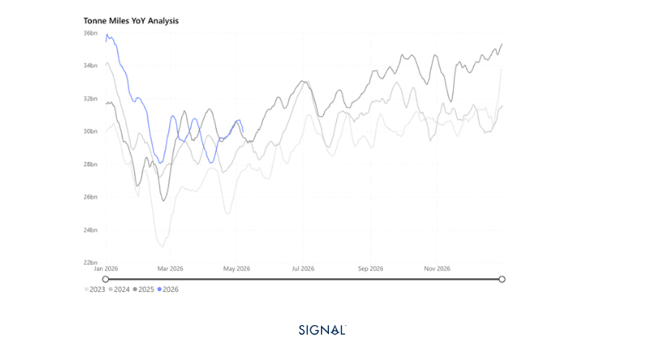
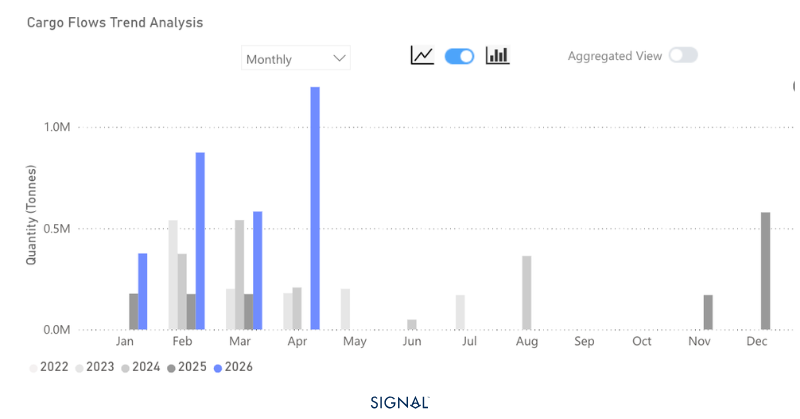
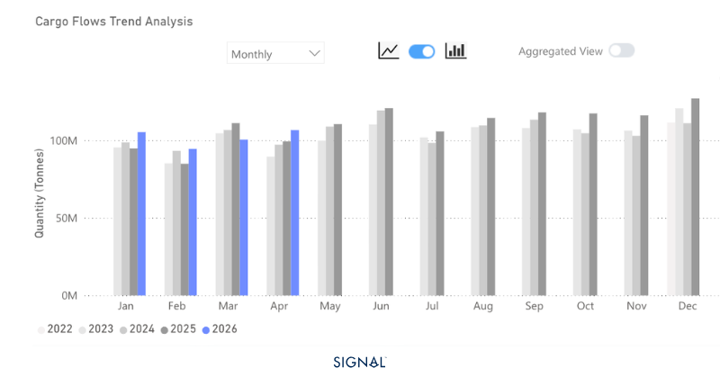

# COMMODITY RADAR | Spotlight: Iron Ore

**Date**: May 11, 2026 | **Category**: Minor Bulk | **Section**: Monitors | **Source**: [https://www.thesignalgroup.com/weekly-market-monitor/simandou-ships-record-quantity-of-iron-ore-swelling-chinese-stocks](https://www.thesignalgroup.com/weekly-market-monitor/simandou-ships-record-quantity-of-iron-ore-swelling-chinese-stocks)

---

## COMMODITY RADAR | Spotlight: IRON ORE

## Simandou ships record quantity of iron ore, swelling Chinese stocks

Guinean iron ore shipments breach 1.2mt for the first time as Simandou ramps up, with Brazil and Australia also seeing exports increase. China, so far, has absorbed the additional tonnage.

- Iron ore flows in April 2026 were up 7% y/y.
- Flows to China increased by 7% y/y.
- Flows destined to ports outside of China rose by 5% y/y.
- The strong increase in flows is not driven by consumption. Rather, the increased iron ore flows to China have caused port inventories to reach record highs in 2026 as the country absorbs the new supply coming from Guinea.

*Signal Figure*

Global iron ore flows reached more than 143mt in April 2026, up just under 7% y/y and m/m. China received 74% of the total flows, in line with the same month in 2025, but given the greater volume of flows, this equated to over 7mt more in April 2026 compared to April 2025. The rest of the world saw flows increase by 5% y/y, to 37mt, with nations in East Asia and South East Asia dominating and seeing large y/y increases.

The origins of the iron ore continue to be dominated by Australia and Brazil.  In April 2026, Australia was the origin for 55% of iron ore flows and Brazil 23%. Both these percentages are in line with the long-run average going back to 2022.  The Simandou ramp-up, therefore, continues to be the most interesting change in iron ore supply, and shipped 1.2mt in April 2026, a record high since the mine came online. The mine will have the capacity to ship around 10mt per month once fully optimised.

*Signal Figure*

The increased flows of iron ore to China have not reflected improved steel mill consumption. Instead, iron ore inventories at ports have been running at historically high levels, with reports that they stood at 172mt during the final week of April, up from around 139mt in the same month in 2025. The scale of this stock build becomes more impactful when measured by days of consumption.

The average monthly crude steel production in 2025 Q1 was 86.4mt, with iron ore port stocks around 139mt, giving a 30-day consumption of iron ore at Chinese ports. This jumps to 39 days when using the 2026 Q1 figures for steel production, 82.3mt per month average, and port stocks of 172mt. Given the structural decline in crude steel production since 2021, it is unlikely that these stocks are building for a sustained production increase. As a result, we expect pressure on iron ore demand from China going forward, which will feed back into flows, with Australia the likely most impacted since Simandou ore is of a higher grade.

*Signal Figure*

## ‍Guinea to China will dominate the cape market

Chinese buying appetite will be the biggest factor in shaping the change in iron flows for the rest of this quarter. With stocks rising to record levels during 2026 already and consumption from steel making weak, a push back on flows is the most likely outcome.

Given Chinese involvement in the Simandou operation and its high-grade material, the pressure will be put on flows from lower-grade origins such as Australia. If West African shipments displace Australian volumes, the freight market would benefit from significantly extended voyage durations. With Guinean bauxite exports remaining robust, Capesize demand in the region appears poised for continued support as we approach Q3.
