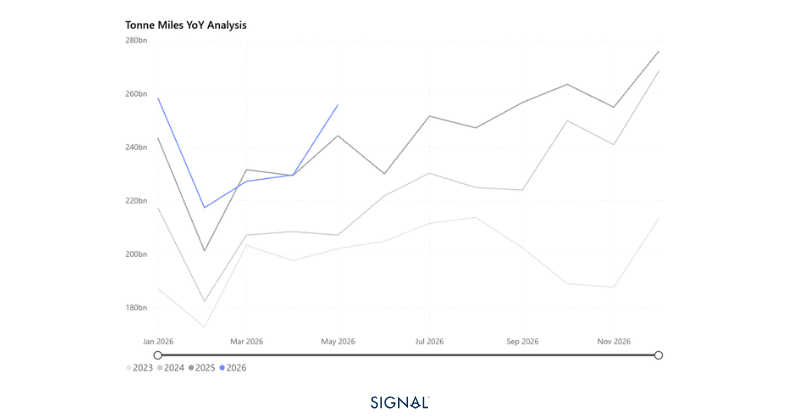
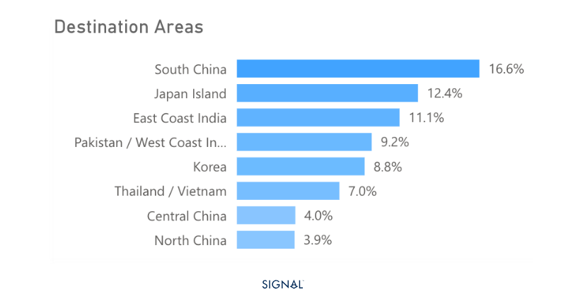
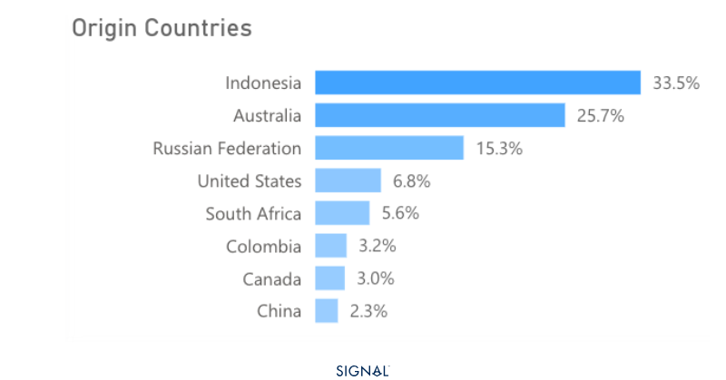

# COMMODITY RADAR | Spotlight: COAL

**Date**: June 11, 2026 | **Category**: Major Bulk | **Section**: Monitors | **Source**: [https://www.thesignalgroup.com/weekly-market-monitor/south-asian-demand-keeps-pushing-coal-flows-higher](https://www.thesignalgroup.com/weekly-market-monitor/south-asian-demand-keeps-pushing-coal-flows-higher)

---

## South Asian demand keeps pushing coal flows higher

Arabian Gulf supply disruptions havecontinued to redirect Asian power demand toward coal, driving the first consecutive months of year-on-year flow growth in 2026. Japan and China are leading the charge, and the rally looks set to run through Q3

- Global seaborne coal flows increased by 6% y/y in May 2026, up from 4% y/y in the previous month.
- Coal flows to China fell by 6% y/y but rose m/m. June looks set to see further rises.
- Indonesia's new export framework has continued to add uncertainty to the market. Coal flows from the country were down 5% y/y in May. Each month in 2026 has seen Indonesian seaborne coal flows down y/y.
- The supply of energy commodities from the Arabian Gulf remains tight, and coal demand has benefited and looks set to continue benefiting from this for at least the next quarter of 2026.

*Source:Coal carrying Panamax tonne-miles from Signal Oceanhttps://app.signalocean.com/dry/dynamic/timeseries_dry*

Global seaborne coal flows at 119mt in May 2026, up 5% y/y, the first month of consecutive y/y growth in 2026 so far, and with an accelerating growth rate, compared with April's revised figure of 4%.

Chinese seaborne coal imports fell by 6% y/y but did rise m/m to reach 30mt. Much of this rise is seasonal as higher temperatures in Southern Provinces caused greater power demand for cooling, prompting restocking at coastal utilities. Other Asian economies that rely on LNG from the Gulf for power generation have also continued to step up coal imports to replace the lost LNG volumes, with Japan seeing imports rise 11% y/y in May.

Despite the rise globally, the largest exporter of seaborne coal,Indonesia, continues to export less than it did last year. Exports in May fell by 26% y/y, to 40mt. This is the fifth consecutive month Indonesia has seen coal exports decline y/y, and is aligned with the market view given the deliberate output cuts imposed by the government at the start of the year.

*Source:Coal destination areas in 2026, from Signal Oceanhttps://app.signalocean.com/dry/dynamic/drybulkflows*

Looking ahead, June typically sees China import less coal than in May. However, current data from Signal Ocean is showing that coal imports will actually increase m/m, the first time June imports outpace May for several years. Domestic coal production has slowed into negative territory ytd, and with the country expanding coal gasification, it will require more imported coal as an input.

The outlook for Japan is even more elevated, according to Signal Ocean figures. The country is currently on track to receive around 60% more coal in June 2026 than it did a year earlier. A combination of slower restarts of nuclear power facilities, more relaxed regulations around coal power utilizations, and the favourable price differential between coal and Asian LNG will likely continue to enable greater coal flows to Japan throughout 2026.

Our view is that coal demand will remain well supported, seeing increased flows from Australia, South Africa, and Russia until the start of normalisation of LNG flows from the Arabian Gulf. Coal demand may soften more quickly than this if US LNG capacity expansions come online earlier in 2026 H2 than the market currently expects.

*Source:Origin of coal exports in May 2026 from Signal Oceanhttps://app.signalocean.com/dry/dynamic/drybulkflows*

## Coal performance remains dependent on restricted LNG flows

Global seaborne coal flows are entering a period of sustained, if temporary, strength. The constriction of Arabian Gulf LNG supply has structurally redirected Asian power demand toward coal, with Japan the clearest beneficiary. China's import trajectory is also defying seasonal norms, supported by slowing domestic output and expanding coal gasification capacity. Indonesian supply headwinds persist, tightening the market further. The balance of risks points to continued elevated flows through 2026 Q3, with meaningful downside contingent on earlier-than-expected US LNG capacity additions or a faster-than-anticipated normalisation of Arabian Gulf energy flows
