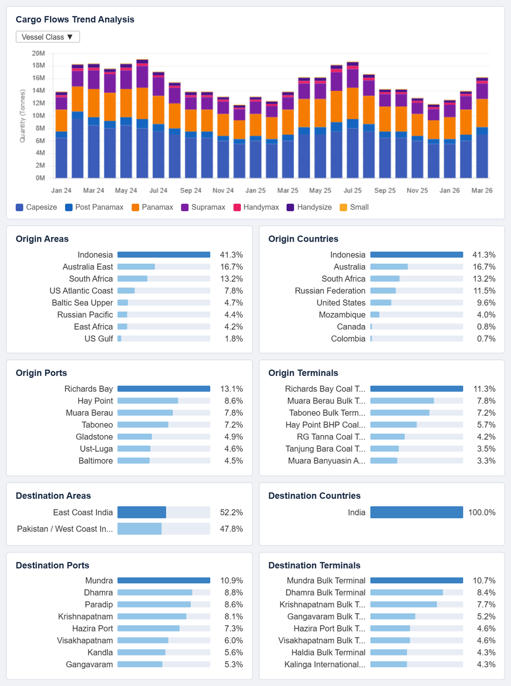
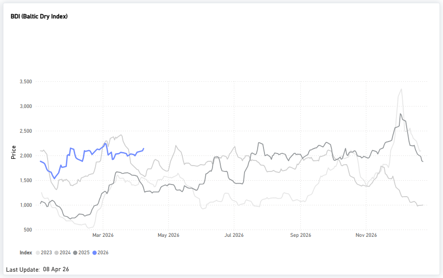
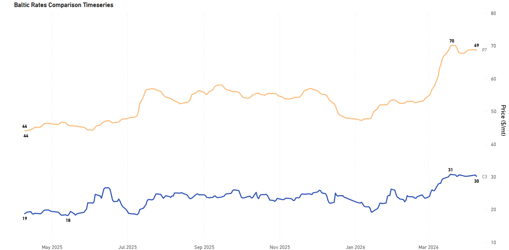
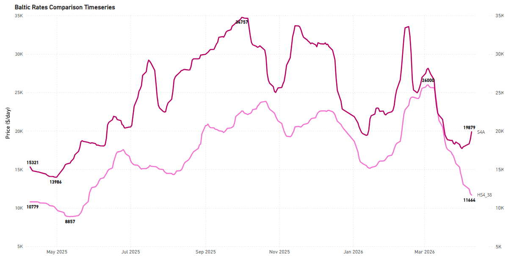
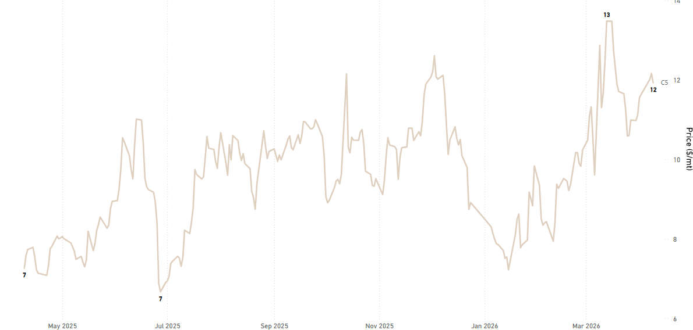
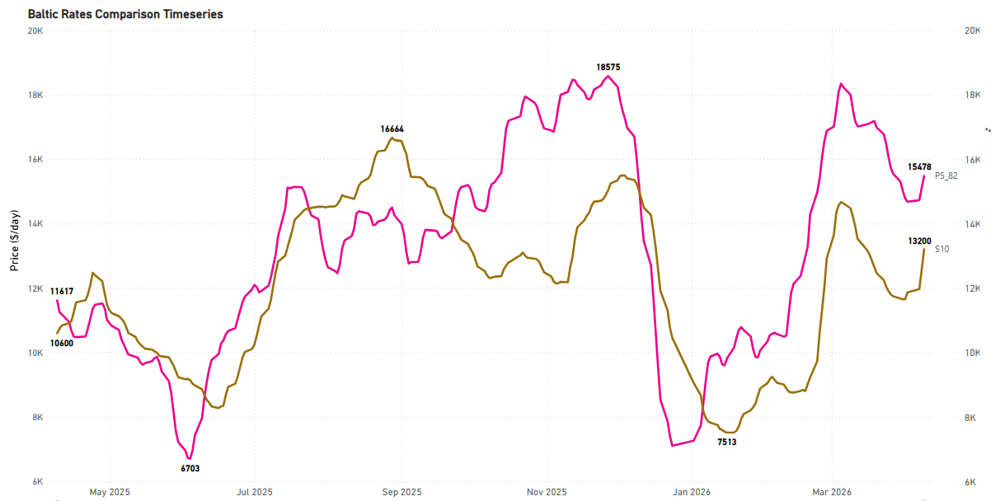
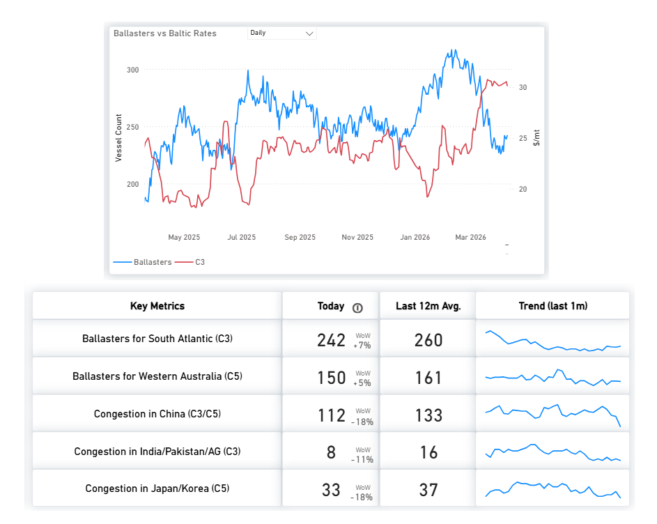
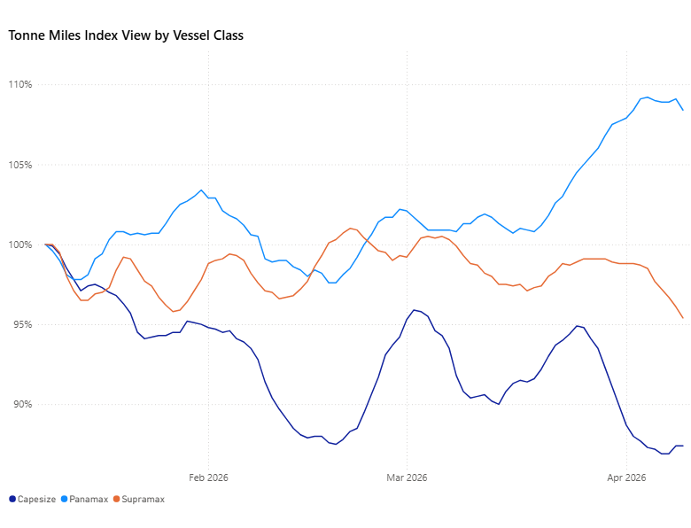

# Weekly Dry Market Monitor: Week 15, 2026

**Date**: April 10, 2026 | **Category**: Dry bulk | **Section**: Monitors | **Source**: [https://www.thesignalgroup.com/weekly-market-monitor/spotlight-indian-coal-flows-indias-coal-demand-is-rising](https://www.thesignalgroup.com/weekly-market-monitor/spotlight-indian-coal-flows-indias-coal-demand-is-rising)

---

## Spotlight | Indian Coal Flows

- India's coal demand is rising, but high inventories are delaying imports, setting up a potential step-change in seaborne demand.

*Source: Signal Ocean Platform |Dry FlowsData (last update: April 9, 2026)*

India’s coal market shows signs of a demand–import lag, with recent flow data indicating the early stages of a potential shift. After several months of relatively soft seaborne volumes, import flows appear to have strengthened into March 2026, suggesting that the period of subdued buying may be ending and that inventory buffers could begin to draw down.

The underlying demand pressure is increasingly evident. Seasonal heat is driving an early rise in electricity consumption, while disruptions in global gas markets linked to heightened geopolitical tensions in the Middle East have constrained the availability and affordability of imported LNG. As a result, coal-fired generation is taking on a larger share of the power mix.

This shift is reflected in forward demand indicators. Coal consumption at domestic coal-fired power plants is expected to rise by around 11.5% year-on-year to approximately 233 million tonnes in the April–June 2026 quarter, according to industry and government-linked projections. At the same time, strong summer conditions are expected to push peak power demand to around 270 GW, reinforcing the need for reliable baseload generation.

Despite this strengthening demand backdrop, the seaborne response has remained relatively muted so far. One key reason is the scale of the inventory buffer accumulated over the past year. India currently holds roughly 220 million tonnes of coal stocks across mines, power plants, and the supply chain, providing about24 days of consumption cover, according to recent government statements. This represents a historically high level of inventory and has allowed buyers to defer imports even as demand begins to rise.

At the production level, domestic supply remains robust but has shown signs of adjustment. Coal India reported March 2026 production of approximately 84.5 million tonnes, down about 1.5% year-on-year, reflecting a moderation in output amid high stock levels. Elevated pithead inventories and strong domestic availability have also contributed to a policy push to reduce reliance on imports earlier in the year. Taken together, these dynamics help explain the lag between rising demand and the recovery in seaborne flows. While consumption is increasing, the existing stockpile continues to buffer the system, delaying the need for immediate large-scale restocking.

Looking ahead, with demand rising into the peak summer months, gas-based generation facing constraints, and temperatures expected to remain above normal, coal-fired plants will require a sustained fuel supply. Although current stock levels are high, they are being drawn against a significantly stronger demand environment than when they were accumulated. As inventories gradually normalize from elevated levels, India is likely to re-engage more actively in the seaborne market. Recent strengthening in import flows may represent an early indication of this transition, although a full restocking cycle is not yet evident in the data.

## FREIGHT MARKET OVERVIEW

The Baltic Dry Index has moved back above 2,000, with Capesize and Panamax driving gains, particularly in the Atlantic basin.

*Signal Figure*

‍

## FREIGHT ATLANTIC

## Capesize C3 / Panamax P7

‍

*Signal Figure*

*Signal Figure*

- C3| Tubarao to Qingdao | 30.11 $/MT | Day: -0.41 | Week: -0.05 | Bearish momentum:  rates are slipping daily and flat on the week
- P7| US Gulf to Qingdao grain | 68.76 $/MT | Day: +0.09 | Week: +0.08 | Bullish momentum

‍

## Supramax S4A / Handysize HS4_38  Weaker

‍

*Signal Figure*

*Signal Figure*

- S4A| US Gulf trip to Skaw-Passero | 19,879 $/day | Day: +950 | Week: +1,962 | Strong daily and weekly gains suggest a short-term rebound, but the heavy monthly drop of -6,771 reveals S4A is still recovering from a significant pullback.
- HS4_38| US Gulf trip via US Gulf or North Coast South America | 11,664 $/day | Day: -157 | Week: -1,403 | Strongly bearish sentiment.

## FREIGHT PACIFIC

## Capesize | C5 Softer

C5West Australia–Qingdao

‍

*Signal Figure*

- C5| West Australia to Qingdao | 11.93 $/MT | Day: -0.23 | Week: +0.29 | Mixed picture, the daily dip is a minor blip against a positive week.

‍

## Panamax P5_82 / Supramax S10 Firmer

*Signal Figure*

‍

*Signal Figure*

## Bullish short-term momentum

- P5_82| South China, Indonesian round voyage | 15,478 $/day | Day: +359 | Week: +800
- S10| South China trip via Indonesia to South China | 13,200 $/day | Day: +612 | Week: +1,334

## BALLASTERS OVERVIEW

A bullish sentiment has emerged in rates this week, particularly when comparing the dry market's ballasters overview with the performance of the C3 index.

*Availablehere*

- South Atlanticballasters at 242, down 7% WoW but still below the 12m avg of 260, supply remains relatively tight.
- China congestionfell 18% WoW to 112 vs 133 avg, vessels clearing faster, adding near-term tonnage pressure.

## DEMAND|TONNE MILES- 7D MA- INDEX VIEW

Capesize ↓ 0.6%WoW| Panamax FlatWoW| Supramax ↓3.4%WoW

‍

*Signal Figure*

Panamax remains the strongest segment, holding above 100% for a second consecutive week. Supramax saw the sharpest weekly decline, while Capesize edged marginally lower. Overall utilization is softening heading into mid-April.

Metrics Description:Index View(Base 100) by total Tonne Miles over the selected period. This facilitates relative performance comparisons between segments of different sizes (e.g., comparing the growth rate of Supramax vs Capesize)

For the latest updates and insights, make sure to visit theSignal Ocean Newsroompage &subscribe to weekly reports. Clickhere to request a demo. Click here to see theprevious dry bulk weeklyreport.

For subscription to our FREE weekly market trends email, please contact us: research@thesignalgroup.com

-Republishing is allowed with an active link to the source
