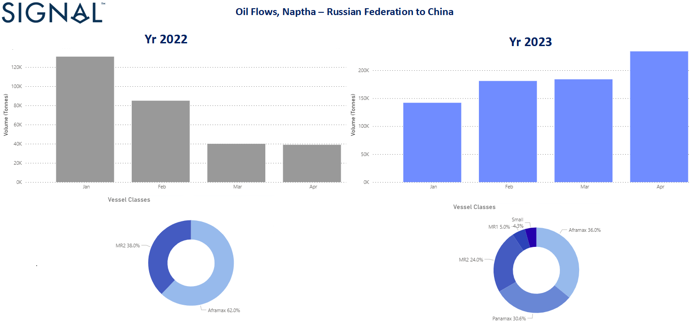

# Weekly Tanker Market Monitor Week 17, 2023

**Date**: May 18, 2024 | **Category**: Tankers | **Section**: Monitors | **Source**: [https://www.thesignalgroup.com/weekly-market-monitor/tanker-market-monitor](https://www.thesignalgroup.com/weekly-market-monitor/tanker-market-monitor)

---

## Chart of the Week Tankers: Naphtha Oil Flows from Russia to China

*Data Source: TheSignal OceanPlatform - Oil Flows*

Crude oil freight rates saw a slowdown in momentum at the end of April, while the clean market continues to drop to lower levels. On the demand side, despite the recent slowdown, the trend in VLCC (ton-days) is promising for freight rate strength. More interesting for the clean segment is the role of Asian countries in Russian naphtha imports. Looking at the first quarter of this year, the increase in Chinese purchases of Russian naphtha is surprisingly higher than in a similar period in 2022. We now see (image above) that China imported almost more than 200k in April, compared to only 40k in the same month last year. Looking at ship size, Panamax size now accounts for almost 30% of the business. In January-April 2022, Aframax vessels accounted for 60% and MR2 vessels 38% compared to 36% and 24% respectively this year.

In the oil market, we have seen a decline in oil prices that has squeezed the profit margins of major Chinese oil and gas companies. Sinopec reported an 11.8% drop in net profit for the first quarter of 2023, while CNOOC's net profit fell 6.4% year-on-year.

For the latest updates and insights, make sure to visit theSignal Ocean Newsroomwebsite page. Clickhere to request a demo.

For subscription to our FREE weekly market trends email, please contact us: research@thesignalgroup.com

-Republishing is allowed with an active link to the source
