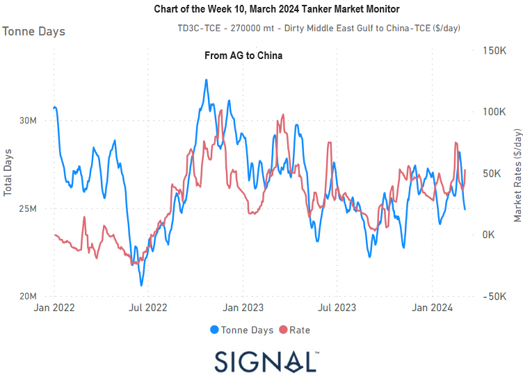

# Weekly Tanker Market Monitor: Week 10, 2024

**Date**: May 18, 2024 | **Category**: Tankers | **Section**: Monitors | **Source**: [https://www.thesignalgroup.com/weekly-market-monitor/tanker-week-10-2024](https://www.thesignalgroup.com/weekly-market-monitor/tanker-week-10-2024)

---

## In early March, signs pointed to a decrease in the growth of VLCC dirty tonne days from AG to China, while a strengthening momentum was recorded in market rates.

*Data Source: TheSignal OceanPlatform*

The resurgence in market rates for the VLCC AG-China route during the initial week of March was notable, primarily fueled by a tightening supply attributed to a significant drop in vessel activity in Ras Tanura compared to the peak observed at the end of February. Despite a downward trend in tonne days on the demand side of the AG-China route, recent market rates suggest a potential uptick, indicating dynamic shifts in the market. Meanwhile, in other crude tanker segments, Aframax Med rates continued their upward trajectory, albeit with a slight decrease in tonne days growth since the end of February. This indicates a mixed scenario across different crude tanker segments.

As we move into the second half of March, it remains to be seen whether the firmness observed in VLCC AG-China rates will persist.In terms of oil flows, despite no outstanding increases in dirty shipments from AG in the first quarter compared to last year, there's notable evidence of higher monthly volumes from the United States to European destinations. However, February saw no substantial rise in Chinese crude oil imports from Russia. Instead, there were sudden surges in shipments from Venezuela to both China and the United States, highlighting notable shifts in global oil trade dynamics that merit close monitoring.

For the latest updates and insights, make sure to visit theSignal Ocean Newsroomwebsite page. Clickhere to request a demo.

For subscription to our FREE weekly market trends email, please contact us: research@thesignalgroup.com

-Republishing is allowed with an active link to the source
