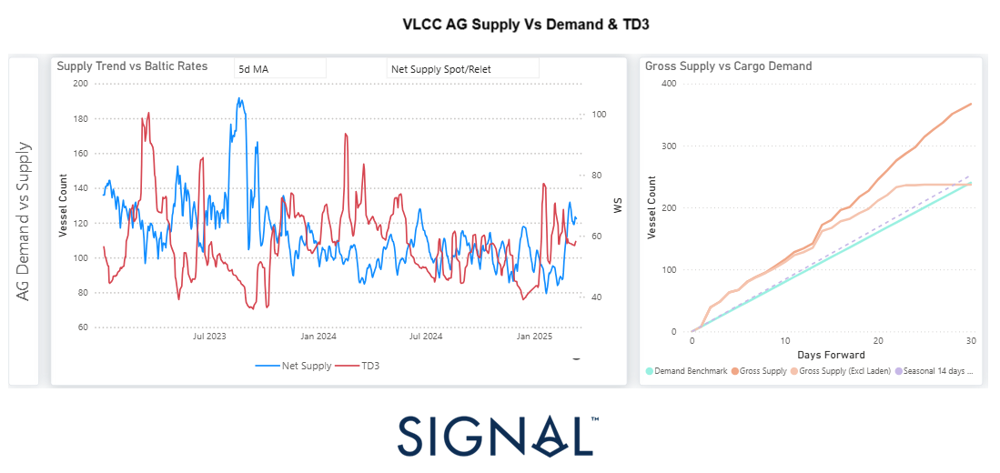

# Weekly Tanker Market Monitor: Week 11, 2025

**Date**: March 11, 2025 | **Category**: Tankers | **Section**: Monitors | **Source**: [https://www.thesignalgroup.com/weekly-market-monitor/tanker-week-11-2025](https://www.thesignalgroup.com/weekly-market-monitor/tanker-week-11-2025)

---

## This week's focus is on the evolution of VLCC net supply growth in the Arabian Gulf (AG), the performance of Baltic Rates, and a comparative analysis of Gross Supply versus Cargo Demand over the next 10, 20, and 30 days.

*https://app.signalocean.com/tanker/dynamic/vlcc_insights_downloadable*

‍

## VLCC Net Supply Trends, Baltic Rates Performance & Cargo Demand Projections

This week, we examine the evolution of VLCC net supply growth in the Arabian Gulf (AG), the performance of Baltic Rates (TD3), and how gross supply compares to cargo demand over the next 10, 20, and 30 days. These insights tie into the latest macro projections for global crude oil demand—especially from China—and whether a tightening vessel supply situation could boost Baltic rates.

## VLCC Net Supply & Baltic Rates Performance

The first chart illustrates the historical trend of VLCC net supply in the AG (blue line) alongside the TD3 Baltic Rate index (red line). Notable fluctuations in supply levels appear correlated with periods of volatility in TD3, particularly during mid-2023 and early 2024.  In early March, a sharp spike in net supply contributed to a softening momentum in TD3 rates. However, a recent downward adjustment in supply appears to be emerging. If this trend persists, it could set the stage for a supply-driven rebound in freight rates.

## Gross Supply vs. Cargo Demand – Forward Projections

The second chart illustrates the projected trajectory of gross supply relative to cargo demand over the next 30 days. Currently, gross supply is outpacing demand, reflecting a relatively loose market. This imbalance suggests that, unless demand increases significantly in the coming weeks, freight rates may face challenges in sustaining upward momentum. However, any unforeseen supply chain disruptions or shifts in demand dynamics could quickly alter this outlook, potentially tightening the market and supporting rate increases.

## China's Role & Crude Oil Demand Outlook

Given China's dominance in crude oil imports, any shifts in refinery throughput, strategic stockpiling, or economic stimulus measures will directly influence the VLCC freight market. Current macroeconomic forecasts suggest a moderate recovery in Chinese crude demand in Q2 2025, which could lead to increased cargo movements and, consequently, firmer freight rates—particularly if vessel availability tightens.

For the latest updates and insights, make sure to visit theSignal Ocean Newsroomwebsite page. Clickhere to request a demo.

For subscription to our FREE weekly market trends email, please contact us: research@thesignalgroup.com

-Republishing is allowed with an active link to the source
