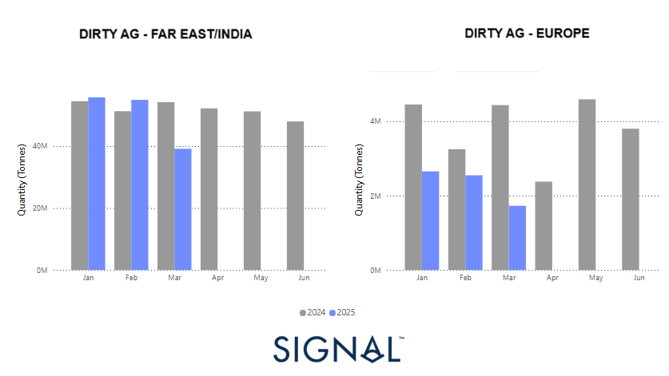

# Weekly Tanker Market Monitor: Week 12, 2025

**Date**: March 20, 2025 | **Category**: Tankers | **Section**: Monitors | **Source**: [https://www.thesignalgroup.com/weekly-market-monitor/tanker-week-12-2025](https://www.thesignalgroup.com/weekly-market-monitor/tanker-week-12-2025)

---

## This week's analysis focuses on the volume of dirty oil flows from the Arabian Gulf (AG) to the Far East and Europe, highlighting key trends and regional differences.

‍

*https://app.signalocean.com/tanker/dynamic/oilflows*

‍

In recent months, the global oil market has experienced notable shifts, particularly in the dynamics of dirty tanker flows from the Arabian Gulf (AG) to both Europe and the Far East/India. These changes are intricately linked to fluctuations in crude oil prices and projections of a tightening global oil supply.​

## Dirty Tanker Flows: AG to Far East/India vs. Europe

The chart above illustrates thedirty oil flow of the ArabianGulf(AG)to theFar East/IndiaandEurope, comparing data from2024 (gray bars)and2025 (blue bars). The trends indicate differences in demand and distribution patterns across these two key regions, with notable variations in early 2025.

In theFar East/India, oil flows in 2024 remainedrelatively stable, consistently maintaining high volumes throughout the year's first half. The 2025 data, however, shows a noticeabledecline in March, suggesting a potential disruption or shift in market demand. Despite this, the overall trend suggests that theFar East/India remains a strong and stable market for AG crude.

In contrast, theEuropean market displays a more pronounced downward trend. While 2024 sawhealthy and relatively stable volumes, particularly inJanuary, February, and May, the 2025 data showsignificantly lower volumes across all available months. The most notable declines appear inMarch and potentially in April, where the 2025 volumes are considerably weaker compared to the previous year. This could indicatea shift in European energy policies, greater reliance on alternative suppliers (such as the US or Africa), or changes in refinery preferences. Additionally, geopolitical factors, sanctions, or economic slowdowns could be contributing to this reduction in AG crude imports.

## Impact of Crude Oil Price Fluctuations

The crude oil market has been marked by volatility, influenced by geopolitical developments and supply-demand dynamics. As of March 19, 2025, Brent crude oil is trading at approximately $70.88 per barrel. This price point reflects a balance between supply concerns and demand projections.​

The U.S. Energy Information Administration (EIA) forecasts that global oil markets will remain relatively tight until mid-2025. This projection is based on anticipated declines in global oil inventories, driven partly by reduced crude oil production in countries like Iran and Venezuela. Consequently, the EIA expects Brent crude oil prices to rise to about $75 per barrel by the third quarter of 2025.

## Regional Strategies Amid Supply Uncertainty

In the face of potential supply constraints, the Far East, particularly China and India, has adopted a proactive approach. By increasing imports from the AG, these nations aim to bolster their reserves and mitigate risks associated with supply disruptions. This strategy underscores their intent to maintain economic momentum and energy security.​

Conversely, Europe's conservative posture reflects a wait-and-see approach. European markets appear to monitor the evolution of oil prices and supply conditions before making substantial procurement decisions. This cautious strategy may be influenced by economic growth concerns and the desire to avoid overcommitting in a volatile market.​

For the latest updates and insights, make sure to visit theSignal Ocean Newsroomwebsite page. Clickhere to request a demo.

For subscription to our FREE weekly market trends email, please contact us: research@thesignalgroup.com

-Republishing is allowed with an active link to the source
