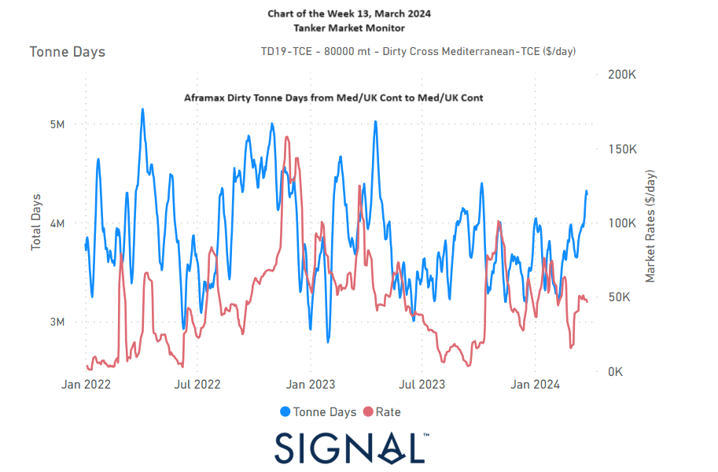

# Weekly Tanker Market Monitor: Week 13, 2024

**Date**: May 18, 2024 | **Category**: Tankers | **Section**: Monitors | **Source**: [https://www.thesignalgroup.com/weekly-market-monitor/tanker-week-13-2024](https://www.thesignalgroup.com/weekly-market-monitor/tanker-week-13-2024)

---

## The growth trajectory of dirty Cross Med Aframax tonne days and rates has shown a notable upward trend since mid-March

*Data Source: TheSignal OceanPlatform*

As March draws to a close, the crude freight market is witnessing a softening momentum in VLCC MEG-China rates, juxtaposed with continued weekly growth in demand tonne days. Notably, the Aframax cross Mediterranean rates have rebounded, spurred by an accelerated pace of growth in dirty tonne days since mid-March (refer to the image above).

Reflecting on the first quarter of the year, the evolution of VLCC freight rates from MEG and Africa to China has been marked by challenges. Despite a promising spike in MEG-China rates in mid-February, this surge was short-lived, leaving behind a more subdued sentiment. The recent tightness in vessel supply observed in the VLCC Ras Tanura raises anticipation regarding its potential impact on market prices. However, demand in tonne days growth has yet to demonstrate a firmer pace of expansion.

Meanwhile, market discussions suggest that Chinese oil demand growth may pose further tests, as the world's second-largest economy enters a new era of lower growth. Speculations indicate that growth levels could potentially halve compared to pre-COVID 2019 levels, particularly as key segments of the Chinese economy grapple with a slowdown.

For the latest updates and insights, make sure to visit theSignal Ocean Newsroomwebsite page. Clickhere to request a demo.

For subscription to our FREE weekly market trends email, please contact us: research@thesignalgroup.com

-Republishing is allowed with an active link to the source
