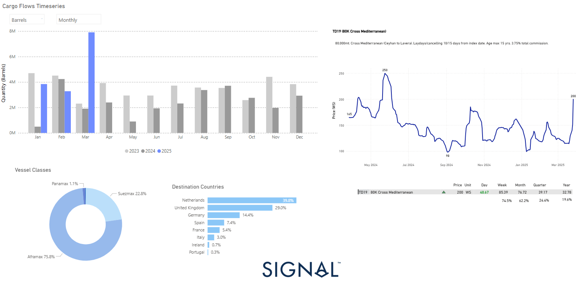

# Weekly Tanker Market Monitor: Week 13, 2025

**Date**: March 27, 2025 | **Category**: Tankers | **Section**: Monitors | **Source**: [https://www.thesignalgroup.com/weekly-market-monitor/tanker-week-13-2025](https://www.thesignalgroup.com/weekly-market-monitor/tanker-week-13-2025)

---

## ‍

*https://app.signalocean.com/tanker/dynamic/oilflows*

## ‍

## Following the recent imposition of U.S. tariffs on Canadian crude oil imports, trade flows have undergone a significant shift, with Canadian barrels increasingly redirected toward European markets.This trend is evident in the March 2025 data, which shows seaborne crude exports from Canada surging to nearly 8 million barrels—more than double the monthly average recorded in 2024.

The new tariffs have severely eroded the competitiveness of Canadian crude in the U.S., compelling exporters to seek alternative outlets. European refiners—grappling with tight supply due to instability in traditional sourcing regions and a seasonal rise in demand—have stepped in to absorb the redirected volumes. Notably, the Netherlands and the United Kingdom together accounted for approximately 69% of European imports, reinforcing Northwest Europe’s role as a key receiving hub.

This realignment has not only reshaped transatlantic trade routes but has also had immediate repercussions in the tanker market, particularly in the Mediterranean. The TD19 route (80K Cross-Mediterranean) witnessed a sharp rate rebound, climbing from sub-150 WS levels in early March to 200 WS in the latest assessments. This translates to a daily jump of over 48 WS points and a weekly gain of 85.39 WS, fueled by tightening tonnage supply and heightened cross-Med activity.

Aframax tankers have emerged as the primary beneficiaries, accounting for 75.8% of the observed flows. Their operational flexibility and compatibility with European port infrastructure make them ideally suited for both transatlantic deliveries from Canada and subsequent intraregional redistribution across the continent.

Looking ahead, the continued enforcement of U.S. tariffs, coupled with Europe’s need for secure crude sources, suggests this trend could persist into Q2 2025. Mediterranean freight rates are also expected to remain elevated in the short term—particularly if Canadian barrels continue to displace volumes from West Africa or the Middle East.

## In summary, the interplay between geopolitical trade barriers and regional tanker market dynamics is reshaping global crude flows.As Canada reorients its exports toward Europe, the impact is rippling across cargo volumes, vessel deployment patterns, and rate structures—most notably within the Aframax segment.

For the latest updates and insights, make sure to visit theSignal Ocean Newsroomwebsite page. Clickhere to request a demo. Readlast week's tanker monitor here.

For subscription to our FREE weekly market trends email,please click here, or contact us at: research@thesignalgroup.com

-Republishing is allowed with an active link to the source
