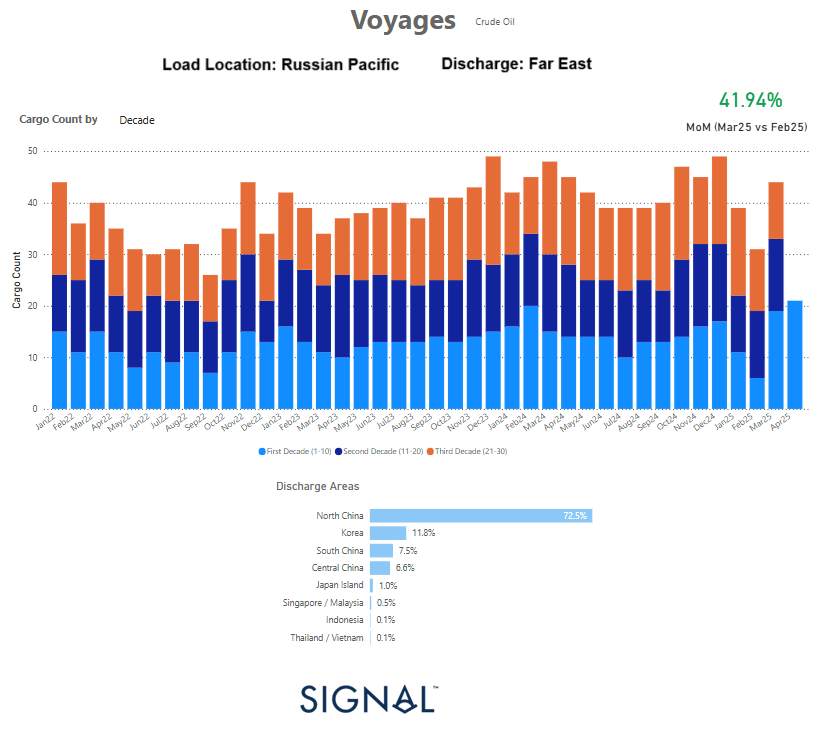

# Weekly Tanker Market Monitor: Week 15, 2025

**Date**: April 10, 2025 | **Category**: Tankers | **Section**: Monitors | **Source**: [https://www.thesignalgroup.com/weekly-market-monitor/tanker-week-15-2025](https://www.thesignalgroup.com/weekly-market-monitor/tanker-week-15-2025)

---

## ‍

*https://app.signalocean.com/tanker/dynamic/voyages-dashboard-tankers-downloadable*

## Signal Ocean Data Highlights a March 2025 Spike in Aframax Voyages to the Far East

Updated voyage data from Signal Ocean shows that Aframax tanker shipments from Russia’s Pacific ports to the Far East saw a notable month-over-month increase in March 2025, despite a slight year-over-year decline compared to March 2024.

## Key Observations: Q1 2025 vs Q1 2024

In March 2025, a total of 44 Aframax voyages were recorded discharging in the Far East, marking a sharp41.94% increasecompared to February 2025. This significant month-on-month rise suggests a tactical end-of-quarter push in exports, likely in response to shifting market conditions and geopolitical signals. However, when viewed year-on-year, the figure reflects amodest decline of 8.33%compared to the 48 voyages logged in March 2024, indicating that broader export activity remains somewhat restrained despite mounting political pressure, particularly from the United States. Looking at the full quarter,Q1 2025 showed slightly lower activitythan Q1 2024 overall. While March saw a rebound in shipments, the cumulative voyage data points to a more measured start to the year. This implies that the March increase was likely ashort-term tactical adjustment, rather than part of a sustained upward trend.

## Drivers Behind the March 2025 Surge

## Geopolitical Pressure: U.S. Threatens Tariffs

In late March 2025, the United States escalated its stance on Russian energy exports by reiterating threats to impose secondary sanctions and steep tariffs—ranging from 25% to 50%—on international buyers of Russian crude. This geopolitical development likely triggered a tactical response from both Russian exporters and Asian refiners, who moved swiftly to secure cargoes ahead of any policy implementation. While the year-on-year export volumes dipped slightly in March, the sharp month-on-month increase suggests that the tariff threat played a significant role in the end-of-quarter surge, as market participants sought to front-run potential disruptions to trade flows.

## Oil Market Volatility: Brent Falls Below $60

The late-March voyage spike also coincided with heightened market volatility, particularly as Brent crude prices fell below $60 per barrel for the first time since early 2021. This drop followed OPEC+’s unexpected decision to raise output, which pressured global benchmarks and raised concerns about an oversupplied market. In anticipation of further price deterioration, Russian exporters likely front-loaded shipments in March to capitalize on relatively stronger pricing. The increase in Aframax voyages during this period suggests a deliberate effort to move volumes quickly before the market fully priced in the new supply dynamics.

## Looking ahead

Although March 2025 did not surpass March 2024 in overall voyage count, the observed surge highlights the Aframax segment’s acute sensitivity to short-term shifts in policy and pricing. These vessels remain central to Russia’s Pacific export strategy, notably as sanctions have reshaped traditional trade routes.

Signal Ocean’s granular voyage data provides valuable real-time insight into these shifts, revealing how operators recalibrate flows in response to both geopolitical pressure and market fundamentals—even when longer-term trends appear flat or subdued.

Signal Ocean's real-time voyage data offers valuable insight into how operators adjust flows in response to geopolitical pressure and market fundamentals.

For the latest updates and insights, make sure to visit theSignal Ocean Newsroomwebsite page. Clickhere to request a demo. Readlast week's tanker monitor here.

For subscription to our FREE weekly market trends email,please click here, or contact us at: research@thesignalgroup.com

-Republishing is allowed with an active link to the source
