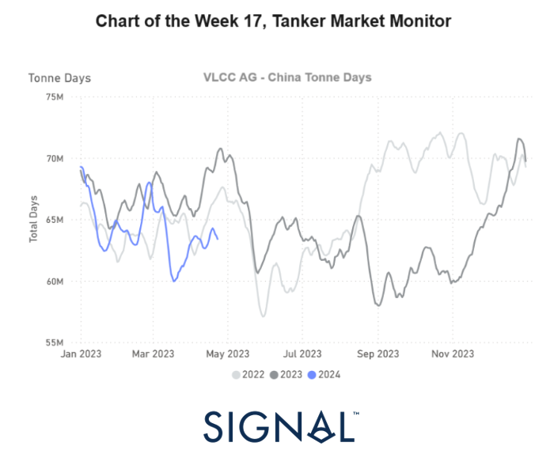

# Weekly Tanker Market Monitor: Week 17, 2024

**Date**: May 18, 2024 | **Category**: Tankers | **Section**: Monitors | **Source**: [https://www.thesignalgroup.com/weekly-market-monitor/tanker-week-17-2024](https://www.thesignalgroup.com/weekly-market-monitor/tanker-week-17-2024)

---

## A downward revision in the growth of VLCC tonne days from AG to the Far East from March onwards

*Signal Figure*

As April draws to a close, the crude freight market sentiment for VLCC and Suezmax tankers segments confirms a downward trajectory, contrasting with a sense of stability observed in the Aframax Med route, albeit accompanied by a decline in vessel activity. Turning to the demand side, the outlook for both dirty and clean tanker vessel sizes paints a challenging picture for the upcoming days of May. A clear downward trend is evident, poised to exert pressure on market prices, while signals of increased supply further compound the situation.

A closer look at the AG-China route reveals an interesting observation: the growth of VLCC tonne days recorded from March onwards is notably lower than the performance seen two years ago during a comparable period. Moreover, unlike the stable dry bulk shipping market, recent growth in tankers appears highly unlikely to reach the peak recorded in May of last year.. Meanwhile, the International Energy Agency (IEA) projects a moderate global oil demand growth of 1.1 million barrels per day (mbd) for 2025, slightly below the 1.2 mbd anticipated for 2024. Noteworthy is the significant demand growth anticipated in India, other developing Asian economies, and the Middle East. In contrast, OECD demand is forecasted to decline slightly, with European consumption easing as economic conditions improve.

‍

For more information on this week's trends or if you wish to subscribe to our FREE weekly market trends email, please contact us: research@thesignalgroup.com

-Republishing is allowed with an active link to the source
