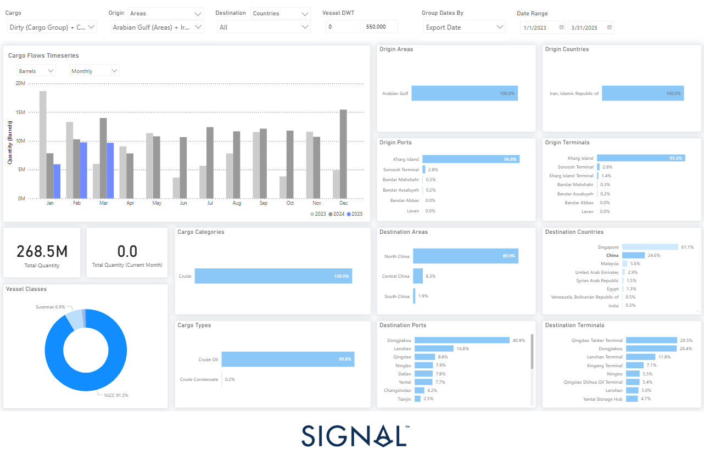

# Weekly Tanker Market Monitor: Week 17, 2025

**Date**: April 24, 2025 | **Category**: Tankers | **Section**: Monitors | **Source**: [https://www.thesignalgroup.com/weekly-market-monitor/tanker-week-17-2025](https://www.thesignalgroup.com/weekly-market-monitor/tanker-week-17-2025)

---

## ‍

*Signal Figure*

## Despite persistent international sanctions, Iran managed to sustain significant crude oil exports between January 2023 and March 2025, totaling approximately 268.5 million barrels. This continued export activity—entirely sourced from Iranian production—demonstrates Tehran’s resilience and strategic adaptability in circumventing global pressure.

A striking feature of Iran’s export strategy is its overwhelming reliance onKharg Island, which accounted for96.6%of all shipments and95.3%of terminal usage during this period. These figures highlight the island’s pivotal role in Iran’s oil logistics infrastructure and its strategic value in sustaining flows amid sanctions.

To maximize efficiency and reduce operational risk, Iran leaned heavily onVery Large Crude Carriers (VLCCs), which carried over91%of total export volume. This approach not only enabled the country to move large volumes per voyage but also likely minimized exposure to maritime interdiction. Additionally,99.8%of the cargo consisted of crude oil, underscoring Iran’s reliance on its primary hydrocarbon asset.

On the demand side, Iran’s exports were heavily concentrated inAsia, where geopolitical alignment and logistical flexibility have facilitated continued trade.Singaporeled all destinations with60%of import volumes, followed byChina (25%)andMalaysia (6%). Ports such asDongjiakouandLanshanin China—known hubs for blending and storage—played a crucial role in the discreet rebranding of Iranian crude before it re-entered global markets under different identities.

These trade patterns are deeply reflective of shifting geopolitical realities. Iran’s ability to sustain oil exports in defiance of sanctions underscores thelimits of Western enforcement, particularly in the maritime domain. Its strategic eastward pivot—especially toward China—mirrors broadergeoeconomic realignmentstied to Beijing’s energy security needs and itsBelt and Road Initiative. This alignment has granted Iran sustained access to major energy markets despite sustained efforts to economically isolate it.

However,recent data from March 2025signals potential cracks in this model. Monthly exports fell to9.7 million barrels, down0.82%from February and a sharp31% year-over-year dropcompared to March 2024. This downturn coincides with the U.S. announcement ofrenewed, tighter sanctions, specifically targeting Chinese-bound flows. These new measures reportedly focus onmaritime insurers, ship registries, and logistics networksinvolved in Iranian oil transshipments—key enablers of Iran’s evasive strategies.

In essence, while Iran has proven remarkably resourceful in maintaining oil exports under pressure—leveraging maritime tactics and regional partnerships—the renewed sanctions appear to be exerting real pressure. If enforcement efforts intensify andChina’s tolerance wanes under diplomatic pressure, March's decline could mark the beginning of a more constrained phase for Iranian crude.

For the latest updates and insights, make sure to visit theSignal Ocean Newsroomwebsite page. Clickhere to request a demo. Readlast week's tanker monitor here.

For subscription to our FREE weekly market trends email,please click here, or contact us at: research@thesignalgroup.com

-Republishing is allowed with an active link to the source
