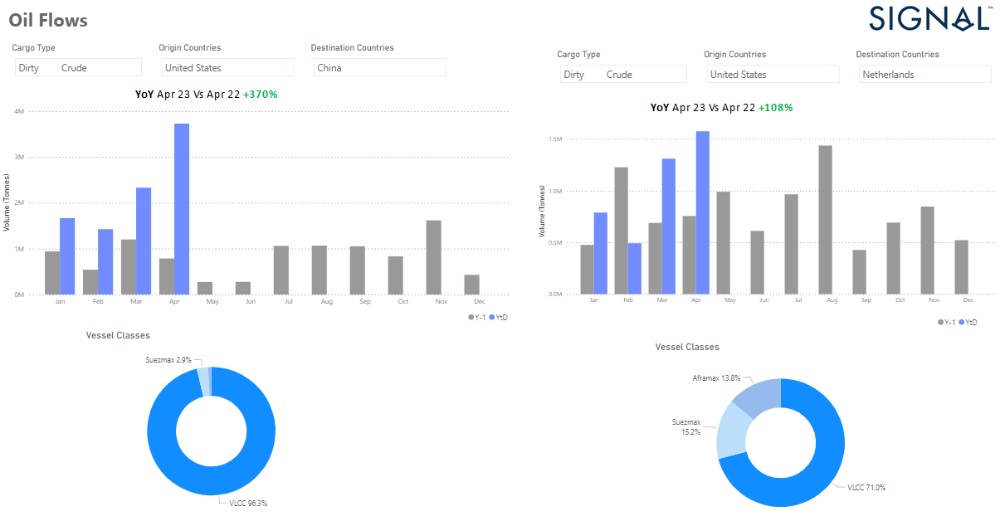

# Weekly Tanker Market Monitor Week 18, 2023

**Date**: May 18, 2024 | **Category**: Tankers | **Section**: Monitors | **Source**: [https://www.thesignalgroup.com/weekly-market-monitor/tanker-week-18-2023](https://www.thesignalgroup.com/weekly-market-monitor/tanker-week-18-2023)

---

## Crude oil freight rates have lost momentum since the end of April but demand from Asian countries continues unabated

##### U.S. exporting more crude oil to Europe and Asia

*Data Source: The Signal Ocean Platform- Oil Flowshttps://app.signalocean.com/tanker/dynamic/oilflows*

Crude oil freight rates have lost momentum since the end of April, but demand from Asian countries continues unabated as the Chinese increasingly source oil from the U.S. (see image above). April ended with a 370% increase in Chinese crude oil flows from the US compared to April last year, while the second quarter of the year will end with a spectacular increase in monthly crude oil imports. In parallel, the US has already started exporting more to the Netherlands, where monthly crude oil imports will increase by 100% in April 2022. In China, 96% of crude oil trade is handled by VLCC tankers, while the share of VLCC in the Netherlands is 70%.

In the oil market, the monthly volume of oil shipments to China will remain excessive, while the Netherlands will increase its dependence on the US. As for oil prices, they are falling despite OPEC + production cuts and Russia's war in Ukraine due to economic fears in the US and China. The IMF said in its latest economic forecasts that Saudi Arabia needs an oil price of $80.90 per barrel to balance its budget this year. Reuters news agency reported that oil prices fell 9% this week, while seemingly finding stable momentum on Thursday when ECB announced its decision to slow interest rate hikes in the fight against inflation.

For more information on this week's trends or if you wish to subscribe to our FREE weekly market trends email, please contact us: research@thesignalgroup.com
