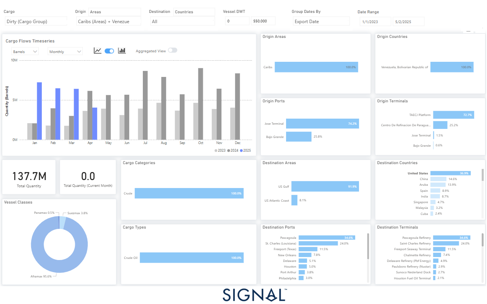

# Weekly Tanker Market Monitor: Week 18, 2025

**Date**: May 02, 2025 | **Category**: Tankers | **Section**: Monitors | **Source**: [https://www.thesignalgroup.com/weekly-market-monitor/tanker-week-18-2025](https://www.thesignalgroup.com/weekly-market-monitor/tanker-week-18-2025)

---

‍

*https://app.signalocean.com/tanker/dynamic/oilflows*

‍

As of early May 2025, the crude oil trading relationship between the United States and Venezuela has undergone a major disruption, primarily due to recent geopolitical and regulatory shifts.The most pivotal development occurred in March 2025, when the U.S. Treasury revoked Chevron’s special license to operate in Venezuela. This license had previously allowed Chevron to export Venezuelan crude to the United States despite broader sanctions on the Maduro regime. The revocation was tied to the Venezuelan government’s failure to meet agreed electoral commitments. Consequently, Chevron has been instructed to wind down its operations entirely by May 27, 2025.

These policy changes are already clearly reflected in real-time oil flows data.According to the latest Signal Ocean data analytics, Venezuelan crude oil exports—categorized as “dirty cargo”—have plummeted in recent months. From a monthly high exceeding 8 million barrels in December 2024, volumes dropped sharply in April 2025. Notably, as of May 2, 2025, no export activity has been observed, suggesting a likely near-term halt in shipments following the Chevron wind-down. Over the monitored period (January 2023 to May 2025), a total of137.7 million barrelswere exported, withChevron’s TAECJ Platform accounting for over 72% of these flows, highlighting the company’s dominant position in Venezuela’s export infrastructure.

The United States was the principal destination for this Venezuelan crude, receiving nearly 37% of all volumes.Key U.S. Gulf Coast ports—including Pascagoula (Mississippi), St. Charles (Louisiana), and Freeport (Texas)—absorbed the majority of these shipments. These destinations align closely with Chevron’s downstream refining and distribution network, confirming the direct link between U.S. refineries and Chevron’s Venezuelan operations. Additionally, almost all shipments used Aframax-class tankers (95.6%), a common vessel type for regional routes between the Caribbean and the U.S. Gulf Coast.

As Chevron exits Venezuela,the broader oil trade between the two countries continues to contract. Venezuelan crude exports declined by nearly 17% in April, with shipments to the U.S. falling notably, highlighting Chevron’s significant role in facilitating these flows.Looking ahead, Venezuela is increasingly turning to alternative markets, particularly China, as it adjusts to the decline in U.S. trade.The government has been engaging with Chinese refiners to expand crude exports, reflecting a broader shift in the country's energy strategy. This reorientation aims to sustain export revenues amid ongoing restrictions. While it remains uncertain whether Chinese demand will fully offset the reduction in U.S. activity, Venezuela’s oil sector continues to navigate a period of elevated uncertainty and constrained market access.

For the latest updates and insights, make sure to visit theSignal Ocean Newsroomwebsite page. Clickhere to request a demo. Readlast week's tanker monitor here.

For subscription to our FREE weekly market trends email,please click here, or contact us at: research@thesignalgroup.com

-Republishing is allowed with an active link to the source
