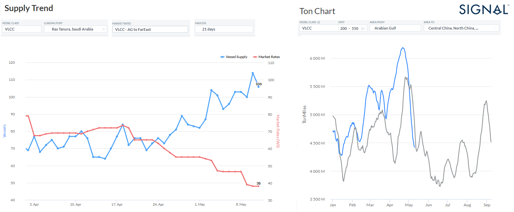

# Weekly Tanker Market Monitor, Week 19, 2023

**Date**: May 18, 2024 | **Category**: Tankers | **Section**: Monitors | **Source**: [https://www.thesignalgroup.com/weekly-market-monitor/tanker-week-19-2023](https://www.thesignalgroup.com/weekly-market-monitor/tanker-week-19-2023)

---

## Number of ships at Ras Tanura port of loading increases as demand ton-miles drops to FE

*Data Source: TheSignal OceanPlatform - Supply / Demand Ton Chartshttps://app.signalocean.com/tanker/reports/historicaltl*

Freight rates for VLCC crude oil tankers continued to weaken in the second week of May, with the number of vessels at the Ras Tanura port of loading rising to a surprising level (left chart above) and reaching a high of more than 100, while ton-miles demanded from AG to China for VLCC tankers is at a lower level than the same period last year. (right chart above).

In the oil market, the economic recession and rising oil inventories in the U.S. are weighing on price sentiment. Oilprice.com reported that Brent crude traded down 1.86% on the day to $76.00 per barrel, with a loss of $1.44, while West Texas Intermediate traded down 2.13% on the day to $72.14 per barrel, with a loss of $1.57. Meanwhile, Energy Information Administration (EIA) data showed a higher-than-expected build in crude oil inventories, suggesting weaker refining operations. On Wednesday, the EIA reported an inventory build of 3 million barrels for the week ending May 5.

For the latest updates and insights, make sure to visit theSignal Ocean Newsroomwebsite page. Clickhere to request a demo.

For subscription to our FREE weekly market trends email, please contact us: research@thesignalgroup.com

-Republishing is allowed with an active link to the source
