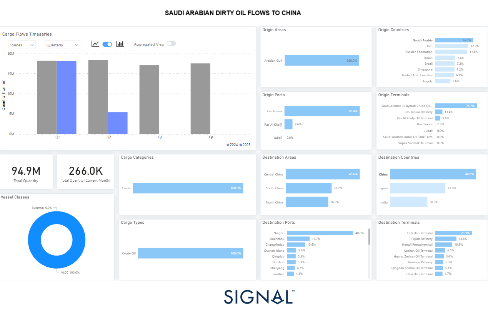

# Weekly Tanker Market Monitor: Week 19, 2025

**Date**: May 08, 2025 | **Category**: Tankers | **Section**: Monitors | **Source**: [https://www.thesignalgroup.com/weekly-market-monitor/tanker-week-19-2025](https://www.thesignalgroup.com/weekly-market-monitor/tanker-week-19-2025)

---

*https://app.signalocean.com/tanker/dynamic/oilflows*

‍

In the second quarter of 2025, oil flows from Saudi Arabia to China declined sharply. This downturn can be attributed to a combination of seasonal and structural factors. Notably, Chinese refineries traditionally undergo scheduled maintenance during Q2, particularly in April and May. This maintenance period temporarily reduces the country's crude oil demand, decreasing import volumes. Additionally, inventories that had been stockpiled in the first quarter were likely drawn down, as Chinese importers had proactively increased purchases ahead of anticipated market shifts, such as price hikes or supply disruptions. This front-loading of imports occurred just as a key development unfolded in global oil supply. In late April 2025, OPEC+ announced it would begin gradually unwinding its voluntary production cuts, starting in June with an additional 411,000 barrels per day of crude entering the market. The timing suggests that importers may have been positioning themselves ahead of expected changes in supply dynamics. The bloc's leading producers, Saudi Arabia and Russia spearheaded this decision. The move was motivated by a desire to regain market share and stimulate global demand, particularly as oil prices had begun to soften amid economic uncertainties.

Following the OPEC+ announcement, crude oil prices fell significantly. Brent crude experienced its steepest monthly decline since November 2021, dropping nearly 9% in April alone. This brought prices below the key $80 per barrel threshold, reflecting bearish market sentiment. Analysts now forecast that Brent will remain under pressure for the rest of 2025, with average prices expected in the $60–65 range. Looking ahead into 2026, institutions such as Goldman Sachs, JPMorgan, and the International Energy Agency (IEA) project continued price softness due to sluggish industrial growth in China and Europe, rising output from non-OPEC producers—especially U.S. shale—and potential oversupply if OPEC+ compliance erodes.

Despite the Q2 downturn, there is reason to expect a recovery in Chinese crude oil imports in the second half of 2025. Several large refining projects, including Zhejiang Petrochemical Phase II and Shenghong Petrochemical, are scheduled to ramp up operations in the coming months. This will increase the country's crude throughput and necessitate higher feedstock imports. Additionally, the Chinese government is preparing new economic stimulus measures focused on manufacturing and infrastructure, both energy-intensive sectors. These measures are likely to support domestic demand for refined products and, by extension, crude oil imports.

Moreover, if crude prices remain subdued, particularly under $75 per barrel, China may seize the opportunity to replenish its strategic petroleum reserves. While Beijing continues to diversify its sources of crude, increasing purchases from Russia, the UAE, and potentially Iran, it remains highly price-sensitive. Should Saudi Arabia offer competitive pricing and favourable contract terms, Chinese refiners could resume or even expand purchases from the Kingdom in the latter half of the year.

Amid a sustained downturn in global oil prices—Brent crude recently fell below $60 per barrel due to increased OPEC+ output and subdued demand—China may find an opportune moment to bolster its strategic petroleum reserves. However, recent U.S. sanctions targeting Chinese independent refiners, specifically Shandong Shouguang Luqing Petrochemical and Shandong Shengxing Chemical, for importing Iranian oil have disrupted operations and deterred other refiners from similar purchases. Despite these challenges, China's commitment to diversifying its crude sources remains evident, with continued imports from Russia, the UAE, and other nations. Should Saudi Arabia offer competitive pricing and favourable contract terms, Chinese refiners may resume or even expand purchases from the Kingdom in the latter half of the year.

In summary, the Q2 2025 decline in Saudi oil flows to China reflects a mix of seasonal demand reduction, strategic inventory adjustments, and evolving global supply dynamics. The OPEC+ decision to raise output has introduced downward pressure on prices, while geopolitical and macroeconomic uncertainties continue to influence global demand. However, signs point to a possible rebound in Chinese imports from Saudi Arabia later in the year, contingent on refinery utilization, economic stimulus, and the relative attractiveness of Saudi crude compared to other suppliers.

For the latest updates and insights, make sure to visit theSignal Ocean Newsroomwebsite page. Clickhere to request a demo. Readlast week's tanker monitor here.

For subscription to our FREE weekly market trends email,please click here, or contact us at: research@thesignalgroup.com

-Republishing is allowed with an active link to the source
