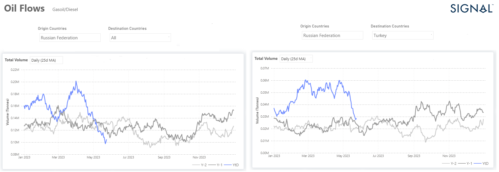

# Weekly Tanker Market Monitor: Week 21, 2023

**Date**: May 18, 2024 | **Category**: Tankers | **Section**: Monitors | **Source**: [https://www.thesignalgroup.com/weekly-market-monitor/tanker-week-21-2023](https://www.thesignalgroup.com/weekly-market-monitor/tanker-week-21-2023)

---

## Russian diesel oil exports in a decreasing trend

*Data Source:  TheSignal OceanPlatform - Oil Flows*

Russian diesel oil exports currently show a significant downward trend compared to the volume of flows in the first quarter of this year. In the case of Turkey, one of the main destinations, there is a gradual decline after the previous months exceeded the levels of the previous two years. However, the total volume of Russian diesel for Turkey is still higher than in the previous two years, with the trend moving towards the 2021 level (image above, of the 25-day moving average of the total volume). Within the crude tanker segment, VLCC freight rates have yet to exhibit signs of firmness, except for the Aframax Med route, which has shown a noticeable recovery compared to the previous week. In the clean segment, there have been some promising signs of firmness in the MR2 size. However, the diminishing pace of Russian diesel oil exports poses a potential threat to the solid outlook of clean freight rates.

According to a recent Reuters news report, the oil market encountered a significant downturn on Thursday, with prices plummeting by over $3 at one stage. This decline was triggered by Russian Deputy Prime Minister Alexander Novak's dismissal of the possibility of additional production cuts during the upcoming OPEC+ meeting. Brent crude futures experienced a decline of $2.85, equalling a 3.6% drop, ultimately reaching $75.51 per barrel by 12:08 p.m. EDT (1708 GMT). Similarly, U.S. West Texas Intermediate crude (WTI) saw a decrease of $2.99, or 4%, settling at $71.35 per barrel. Both benchmarks reached session lows, with declines exceeding $3.

For the latest updates and insights, make sure to visit theSignal Ocean Newsroomwebsite page. Clickhere to request a demo.

For subscription to our FREE weekly market trends email, please contact us: research@thesignalgroup.com

-Republishing is allowed with an active link to the source
