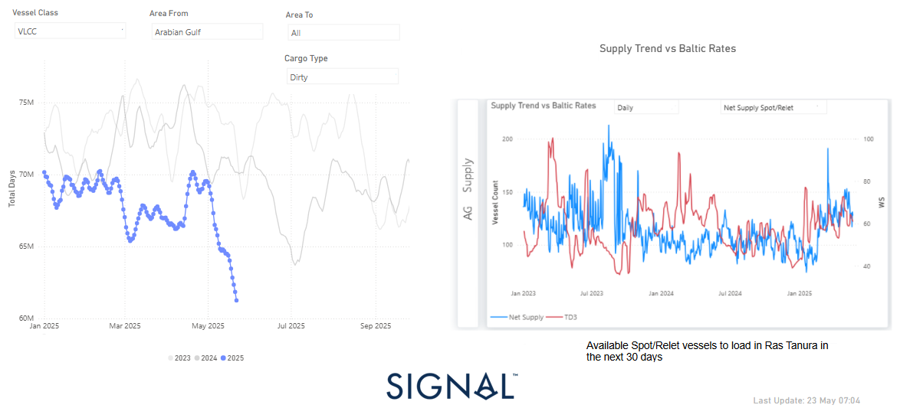

# Weekly Tanker Market Monitor: Week 21, 2025

**Date**: May 23, 2025 | **Category**: Tankers | **Section**: Monitors | **Source**: [https://www.thesignalgroup.com/weekly-market-monitor/tanker-week-21-2025](https://www.thesignalgroup.com/weekly-market-monitor/tanker-week-21-2025)

---

*Signal Figure*

At the end of the third week of May,we are analysing the AG growth in tonne days within the dirty segment for VLCC tankers and the Ras Tanura supply trend to reveal the potential reasons behind the persistent downward pressure seen in the AG-China freight market sentiment.

Examining seasonal trends of VLCC tonne days using a 7-day moving average indicates a steady decline since late April. Current estimates show figures falling below those recorded in the past two years, with recent data reflecting nearly 61 million tonnes compared to 70 million during the same timeframe in 2023 and 2024. Given the persistent drop in oil prices and OPEC+'s plans to increase supply, there is uncertainty regarding possible recovery during the summer season, particularly amid growing concerns about economic prospects in China and the U.S.

Meanwhile, the latest weekly change innet vessel supply(spot-relet vessels available to load Ras Tanura 30 days) held levels around 128. This follows a significant rise of 190 vessels noted in mid-March. However, TD3 rates have not yet shown signs of recovery, while an increase is likely when net supply drops below 100 vessels and even further down, as a similar case was experienced in mid-January with TD3 rates at an excess of WS70.

Despite the ongoing economic and trade headwinds, the IEA adjusted its 2025 oil demand growth forecast to reach 740,000 barrels per day in its May report, an increase from the previous estimate of 730,000 barrels per day reported in April. However, this revision does not ease the challenges posed by heightened trade uncertainties affecting the global economy and oil demand, while the IEA has emphasized that demand growth is expected to decelerate for the remainder of the year.

In parallel,updated EIA forecastsfor oil demand growth have been released amid continued declines in industry oil prices. Non-OPEC oil-producing countries expect an increase of over 1 million barrels per day this year due to stronger production from China, Canada, and Brazil. Additionally, recent reports suggest that oil prices may continue to fall as discussions around OPEC+ plans to boost production levels in July gain traction; a final decision is expected during a meeting on June 1.

For the latest updates and insights, make sure to visit theSignal Ocean Newsroomwebsite page. Clickhere to request a demo. Readlast week's tanker monitor here.

For subscription to our FREE weekly market trends email,please click here, or contact us at: research@thesignalgroup.com

- Republishing is allowed with an active link to the source
