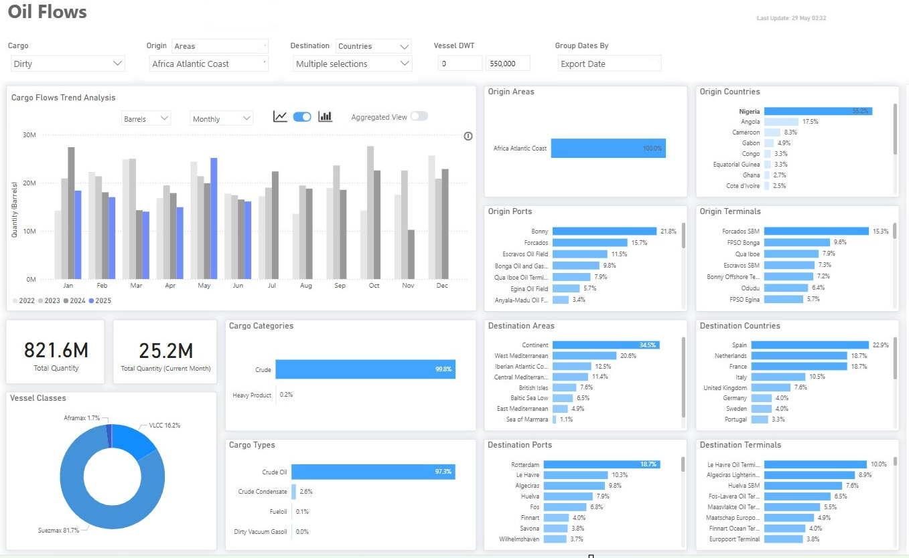
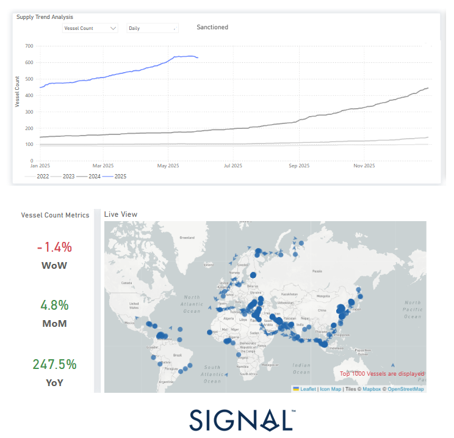

# Weekly Tanker Market Monitor: Week 22, 2025

**Date**: May 29, 2025 | **Category**: Tankers | **Section**: Monitors | **Source**: [https://www.thesignalgroup.com/weekly-market-monitor/tanker-week-22-2025](https://www.thesignalgroup.com/weekly-market-monitor/tanker-week-22-2025)

---

*Signal Figure*

‍

Europe witnessed a 10% increase in crude oil imports in May 2025, likely due to refineries completing maintenance ahead of schedule, boosting crude demand. This period also saw a notable change in import origins, with a decrease in volumes from the United States.

Crude imports from West Africa, especially Nigeria, are estimated to have surged by 70%. Similarly, imports from Libya and Algeria increased by 20% and 70%, respectively. These regions primarily supply light sweet crude, leading to a temporary oversupply of this grade in Europe.

One potential factor contributing to this shift is Nigeria's Dangote Refinery. It canceled a planned maintenance for its gasoline-producing unit and instead conducted necessary repairs during an unplanned outage in April and early May, allowing for a quick resumption of operations.

This change in sourcing had two main effects. First, it reduced U.S. crude exports to Europe, particularly WTI, amid rising domestic demand and improved U.S. Gulf Coast refinery runs. Second, the shorter distances from West and North Africa to Europe compared to transatlantic voyages from the U.S. resulted in decreased tonne-miles, despite strong crude demand. Consequently, the reduction in long-haul shipments has put downward pressure on the dirty tanker market, particularly the VLCC and Suezmax segments, contributing to the current bearish market sentiment.

Looking forward, the price difference between WTI and Nigeria's Bonny Light crude will be a key factor for European buyers. As of late May 2025, Bonny Light was priced around $66 per barrel, up from an average of $60 earlier in the month but still below Nigeria's 2025 budget benchmark of $75. In comparison, WTI was trading at approximately $60.63 per barrel on May 30. While West African crude has recently gained market share in Europe, the relatively lower price of U.S. light sweet crude could make American barrels more attractive again.

## Special Focus: Tanker Sanctions

A key factor tightening crude tanker availability in 2025 is the latest wave of EU and UK sanctions targeting the so-called “extra-sanctioned” fleet. As illustrated in the accompanying chart, the number of sanctioned tankers has risen consistently this year, with a sharp acceleration since mid-2025, driving a 248% year-on-year increase.

*Signal Figure*

For the latest updates and insights, make sure to visit theSignal Ocean Newsroomwebsite page. Clickhere to request a demo. Readlast week's tanker monitor here.

For subscription to our FREE weekly market trends email,please click here, or contact us at: research@thesignalgroup.com

- Republishing is allowed with an active link to the source
