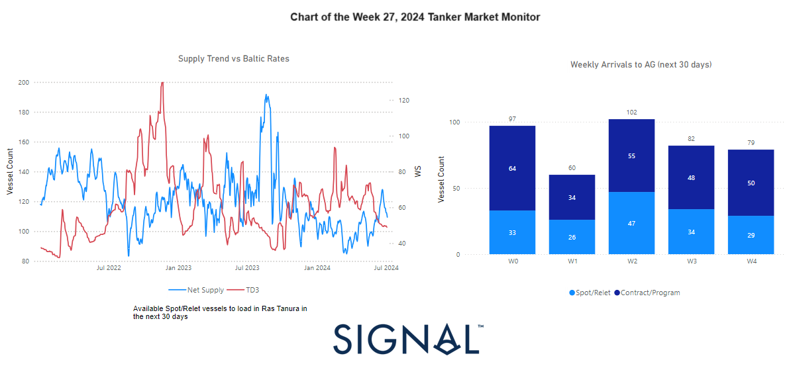

# Weekly Tanker Market Monitor: Week 27, 2024

**Date**: July 04, 2024 | **Category**: Tankers | **Section**: Monitors | **Source**: [https://www.thesignalgroup.com/weekly-market-monitor/tanker-week-27-2024](https://www.thesignalgroup.com/weekly-market-monitor/tanker-week-27-2024)

---

## This week's data highlights an increasing trend in VLCC available spot relet vessels to load in Ras Tanura in the next 30 days (left chart), coinciding with weakening AG-China freight market rates throughout June. This trend appears to be persisting into July, pushing WS TD3 rates to a new low for this year. In the right chart, data illustrate the weekly arrivals of vessels in the AG for the next 30 days per week, showing an increase from the second week onwards. The weaker outlook of the VLCC dirty segment in the AG is further corroborated by the previous two weekly charts, which depict a decline inVLCC dirty tonne daysand the consequent impact onballast speed.

*Signal Figure*

As the summer season unfolds, a subdued sentiment grips the freight market, particularly evident in the VLCC MEG-China route. The number of vessels at Ras Tanura The first week of July saw a continued weakening in crude oil freight rates, driven by the increasing supply of VLCCs, which exerted significant downward pressure on the market. The increased availability of spot relet vessels in Ras Tanura suggests a potential oversupply in the market, which has contributed to the decline in AG-China freight rates. As more vessels become available, competition among them intensifies, leading to lower rates. This oversupply scenario is likely to persist, keeping the WS TD3 rates suppressed.

The right chart's data on weekly arrivals in the AG for the next 30 days highlights a significant rise in vessel arrivals from the second week onward. This increase in arrivals may further exacerbate the oversupply situation, as more vessels enter the market looking for cargoes. This trend aligns with the observed weakening in the VLCC dirty segment, as illustrated in the previous charts of our weekly market monitor.

The decline in VLCC dirty tonne days indicates a reduced demand for VLCCs in the market, contributing to the downward pressure on freight rates. Additionally, the impact on ballast speeds suggests that vessels are sailing at slower speeds due to the lack of available cargoes, further indicating a weak market outlook.

Overall, the data from the left and right charts, along with the previous weekly charts, paint a comprehensive picture of a struggling VLCC market in the AG. The combination of increasing vessel availability, rising weekly arrivals, declining tonne days, and reduced ballast speeds all point towards a continued weak market environment for VLCCs in the near term.

In terms of oil supply and prices, recent data shows thatOPEC+ has extended its production cutstotaling 3.66 million barrels per day (bpd) until 2025. These cuts aim to stabilise the oil market by reducing excess supply and supporting higher oil prices. The decision to extend the cuts reflects OPEC+'s ongoing strategy to manage oil production levels in response to global economic conditions and demand fluctuations. By carefully controlling supply, OPEC+ seeks to mitigate market volatility, maintain a balanced oil market, and ensure economic stability for both producers and consumers. This approach highlights OPEC+'s crucial role in shaping the global oil landscape and underscores the importance of coordinated efforts to sustain market equilibrium.

For the latest updates and insights, make sure to visit theSignal Ocean Newsroomwebsite page. Clickhere to request a demo.

For subscription to our FREE weekly market trends email, please contact us: research@thesignalgroup.com

-Republishing is allowed with an active link to the source
