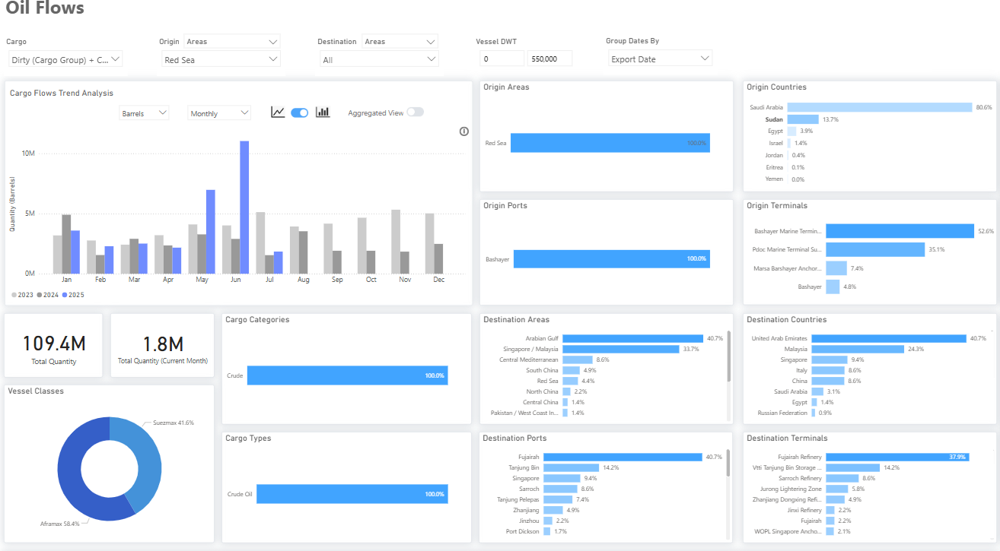

# Weekly Tanker Market Monitor: Week 27, 2025

**Date**: July 04, 2025 | **Category**: Tankers | **Section**: Monitors | **Source**: [https://www.thesignalgroup.com/weekly-market-monitor/tanker-week-27-2025](https://www.thesignalgroup.com/weekly-market-monitor/tanker-week-27-2025)

---

## Sudan Crude Oil Exports via Bashayer

*https://app.signalocean.com/tanker/dynamic/oilflows*

‍

Since late April 2023, Sudan has been gripped by an internal conflict between the Sudanese Armed Forces (SAF) and the Rapid Support Forces (RSF), which has significantly disrupted crude oil exports via the Bashayer terminal. Although most of the crude, particularly Dar Blend and Nile Blend, is produced in South Sudan, it must be exported through Sudan’s Red Sea port infrastructure. The civil war has led to operational uncertainty, suspected pipeline disruptions, and a sharp reduction in export volumes, which dropped to just 2 million barrels in April. However, signs of recovery have emerged: exports reached 7 million barrels in May and climbed further to 11 million in June.

Based on Red Sea crude shipment data, Sudan now accounts for approximately 14% of total exports, with most volumes loaded via Bashayer Marine Terminal (53%) and PLOC Marine Terminal (35%). The recovery observed in May and June suggests a potential return to more stable export activity, despite the ongoing conflict and absence of a formal peace agreement. Multiple mediation attempts, including a UK-hosted peace conference in April 2025, have failed to produce a ceasefire or meaningful negotiations.

The rebound in exports appears to be primarily driven by progress in pipeline repairs, which have enabled increased throughput of Dar and Nile Blend. This technical recovery, rather than any political resolution, has highly facilitated the higher volumes now seen leaving Bashayer.

The recent improvement of flows also implies renewed support for regional dirty tanker demand, particularly in the Aframax and Suezmax segments. Sudanese crude has mostly been transported via Aframax (59%) and Suezmax (42%) vessels. The main destinations for these exports include the United Arab Emirates (41% share, primarily to the Fujairah refinery) and Malaysia (24%, mainly to Tanjung Bin).

Looking ahead, the situation remains fragile. Peace talks have not concluded, and Sudan remains effectively split along territorial lines. The SAF maintains control of the eastern region, including Port Sudan and the critical Bashayer terminal, while the RSF dominates large swathes of central and western Sudan, including parts of Khartoum and much of Darfur. This de facto division has hindered efforts to re-establish a unified national government or power-sharing arrangement.

Nonetheless, a functional operational status quo has emerged, allowing oil flows to continue. If this continues, and the pipeline network remains intact, Sudan’s export viability could remain stable in the short term, potentially supporting sustained Aframax employment in the Red Sea.

For the latest updates and insights, make sure to visit theSignal Ocean Newsroomwebsite page. Clickhere to request a demo. Readlast week's tanker monitor here.

For subscription to our FREE weekly market trends email,please click here, or contact us at: research@thesignalgroup.com

- Republishing is allowed with an active link to the source
