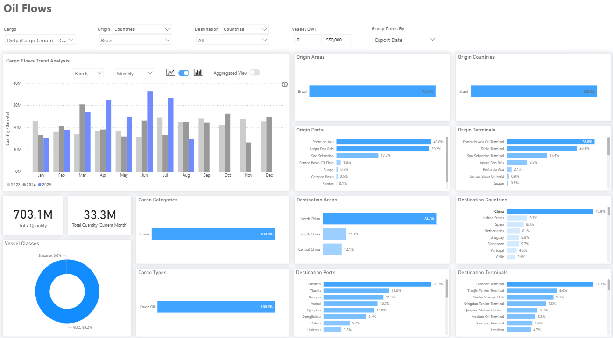
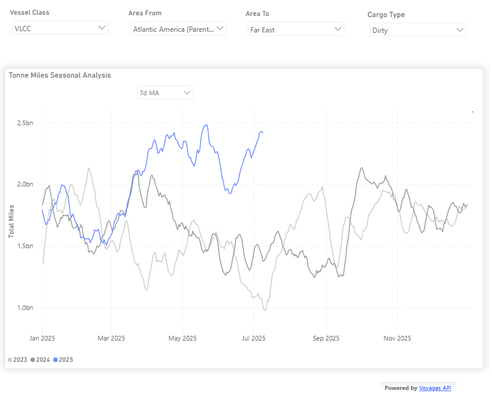

# Weekly Tanker Market Monitor: Week 28, 2025

**Date**: July 10, 2025 | **Category**: Tankers | **Section**: Monitors | **Source**: [https://www.thesignalgroup.com/weekly-market-monitor/tanker-week-28-2025](https://www.thesignalgroup.com/weekly-market-monitor/tanker-week-28-2025)

---

## Brazilian crude oil shipments

## Record increase throughout this year, with a 60% rise in China by the end of June compared to June 2024 barrel volumes.

*https://app.signalocean.com/tanker/dynamic/oilflows*

‍

This week’s Chart Market Monitor highlights the significant increase in Brazilian crude oil shipments to China, which reached a record 93.6 million barrels in Q2 2025, marking a 53% rise from Q1 and a 60% year-on-year surge compared to Q2 2024. These are the highest second-quarter volumes recorded in recent years, far surpassing previous benchmarks from 2023 and 2024.

China now absorbs approximately 40% of Brazil’s crude exports, reinforcing its role as the dominant buyer. Major Chinese discharge ports include Lanshan, Tianjin, Ningbo, Yantai, Qingdao, and Dongjiakou, with the North China region accounting for 73% of total arrivals.

This trend reflects a crucial shift in China’s crude sourcing strategy. The country is increasingly prioritizing long-haul volumes from Brazil, almost entirely lifted on VLCCs. This is supported by Petrobras, which has expanded both term contracts and spot sales to Chinese buyers such as Unipec and Sinochem. Demand has also been driven by China’s continued efforts to rebuild its strategic petroleum reserves (SPRs), particularly amid price dips in early 2025, and by a rebound in buying activity from independent “teapot” refiners in Shandong province following the relaxation of import quotas and improved refinery margins.

In addition, recent corporate activity by the Brazilian energy group underscores the long-haul shift. Petrobras is actively courting Chinese investment to revitalize Brazil’s domestic shipbuilding industry. During the Brazil–China Naval Industry Forum, the company signed memoranda of understanding with Chinese shipyards as part of its broader strategy to commission 25 new vessels by 2030 via its shipping subsidiary,Transpetro.

Petrobrasis also restructuring its upstream portfolio, exploring the divestment of the Polo Bahia onshore fields to redirect capital toward export logistics and offshore production. At the same time, it has announced a R$26 billion (~US$4.8 billion) investment to integrate the Reduc refinery with the Boaventura logistics hub, enhancing flexibility in crude exports. On the exploration front, Petrobras and Chevron-led consortia secured rights to key offshore blocks in the Foz do Amazonas basin.

*Signal Figure*

The VLCC segment has already started experiencing a rise in the demand for the prospective trade route. Since March, the 7-day moving average of “dirty tonne-miles” for Brazil–China shipments has surpassed 2 billion nautical miles, up approximately 1 billion from the same period in 2023 and 2024. This surge is tightening VLCC availability, particularly in the Atlantic Basin, as voyages from Brazil to China take roughly 100 days round trip, compared to about 60 days for Middle East–Asia routes. As a result, freight rates for dirty VLCC cargoes may face upward pressure, especially in the Atlantic. If the strength of Brazil-to-China flows persists, the shift will not only reshape trade patterns but also exert a tightening movement on the AG VLCC supply.

For the latest updates and insights, make sure to visit theSignal Ocean Newsroomwebsite page. Clickhere to request a demo. Readlast week's tanker monitor here.

For subscription to our FREE weekly market trends email,please click here, or contact us at: research@thesignalgroup.com

- Republishing is allowed with an active link to the source
