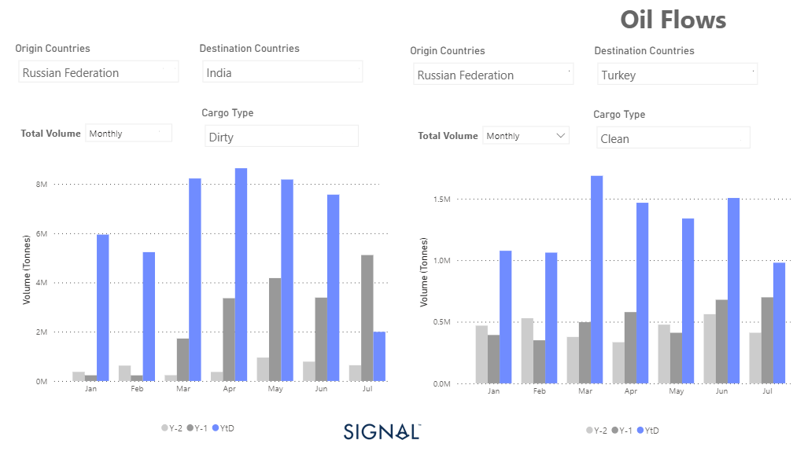

# Weekly Tanker Market Monitor: Week 29, 2023

**Date**: May 18, 2024 | **Category**: Tankers | **Section**: Monitors | **Source**: [https://www.thesignalgroup.com/weekly-market-monitor/tanker-week-29-2023](https://www.thesignalgroup.com/weekly-market-monitor/tanker-week-29-2023)

---

## Dirty Russian oil exports to India and clean ones to Turkey with the highest monthly export volume

*Data Source: TheSignal OceanPlatform*

As the third week of July unfolded, crude oil market rates continued to grapple with negative pressure, compounded by a noticeable increase in the supply of crude oil tankers. The demand for Very Large Crude Carriers (VLCC) tonne miles experienced a sharp decline since the second quarter, posing challenges for the industry. Looking ahead, the end of July holds the potential for optimism, contingent on the pivotal role of Chinese crude oil demand in shaping future market dynamics.

A key highlight during this period has been India's steadfast purchases of substantial volumes of Russian crude oil throughout the first half of the year. It remains to be seen whether July will surpass the previous year's monthly volume of Russian crude oil levels to India, as depicted in the image above. Additionally, an interesting development in the clean segment has been the unprecedented rise in monthly volumes of Russian clean oil products bound for Turkey, surpassing records from the past two years. This positive trend could augur well for a resurgence in firmness within the MR clean vessel tanker sizes. As the month progresses, close monitoring of these trends will be crucial for gaining insights into the market's future trajectory.

For the latest updates and insights, make sure to visit theSignal Ocean Newsroomwebsite page. Clickhere to request a demo.

For subscription to our FREE weekly market trends email, please contact us: research@thesignalgroup.com

-Republishing is allowed with an active link to the source
