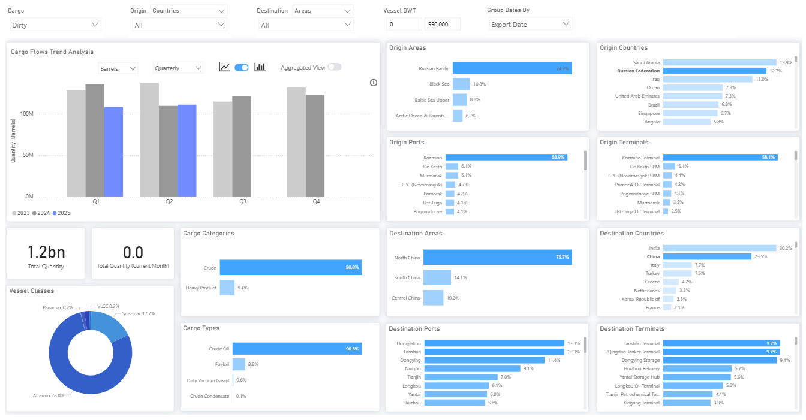
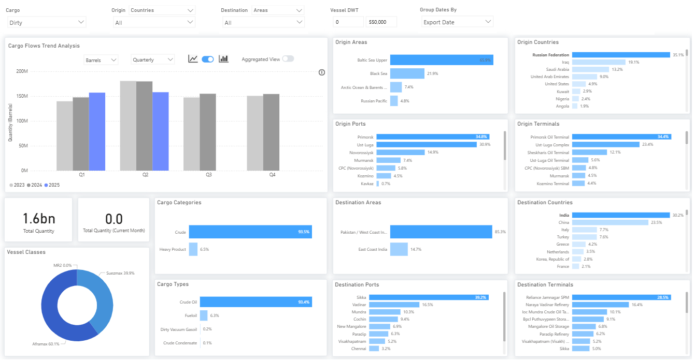
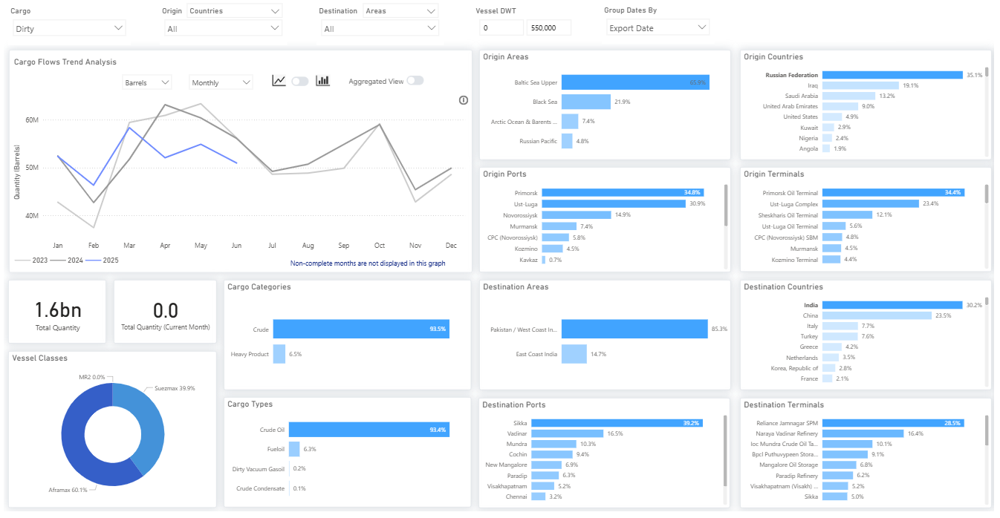
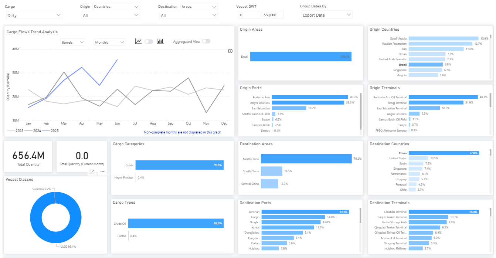
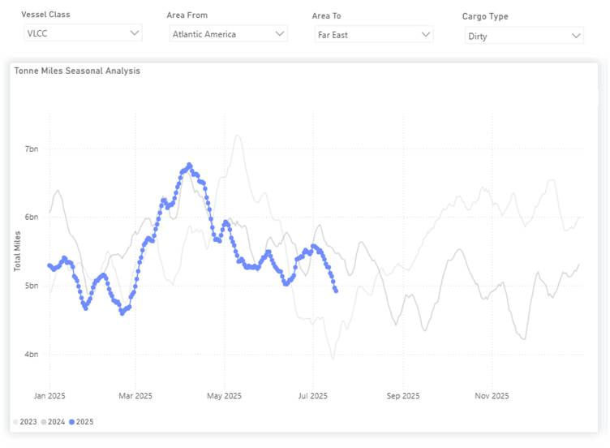

# Weekly Tanker Market Monitor: Week 29, 2025

**Date**: July 18, 2025 | **Category**: Tankers | **Section**: Monitors | **Source**: [https://www.thesignalgroup.com/weekly-market-monitor/tanker-week-29-2025](https://www.thesignalgroup.com/weekly-market-monitor/tanker-week-29-2025)

---

## Special Focus  of the Week

Rising U.S. pressure on Russian oil buyers is prompting China and India to reduce imports and diversify supply.

‍

The U.S. has publicly floated the possibility of implementing secondary tariffs on nations like China and India that continue buying Russian crude, but no such measures have been formally enacted. In Q2 2025, crude shipments from Russia to China were down about 20% year-over-year, mirroring a similar decline in Q2 2024 compared to Q2 2023.‍

## Russian Dirty Oil Flows to China

*https://app.signalocean.com/tanker/dynamic/oilflows*

‍

‍

Indian import volumes show a more modest decline: quarterly volumes were nearly flat versus Q1 2025 and down roughly 12% year-over-year, though monthly data reveals a steady drop since March, with June shipments falling over 10 million barrels.

## Russian Dirty Oil Flows to India (Quarterly)‍

*Signal Figure*

## Russian Dirty Oil Flows to India (Monthly)

*Signal Figure*

It’s important to understand that Russia’s crude oil remains legally accessible in Asia. While theEuropean Unionand United Kingdom have unilaterally reduced the G7 price cap to $47.60/bbl, the United States has resisted endorsing the change, limiting the global enforcement power of the revised cap, especially given oil’s dollar-based trade and U.S.-controlled payment systems. Neither the U.S. nor the EU has banned crude exports to India or China. This suggests that the recent reductions in Russian crude imports by these two countries are more likely driven by market pricing than by sanctions avoidance.

As of July 18, 2025, Brent crude traded near $70/bbl, while Urals crude was priced around $58/bbl FOB, yielding a discount of approximately $12/bbl. While still meaningful, the current spread marks a widening from previous months when reduced Asian spot buying had temporarily narrowed the differential.

Several commercial and logistical factors are contributing to the reduced appeal of Russian spot crude. A larger share of Russian exports is now sold under term contracts, limiting spot availability. At the same time, higher domestic refinery runs in Russia are tightening export supply. These dynamics have gradually pushed Urals prices higher and reduced the arbitrage advantage for Asian refiners. As a result, price-sensitive buyers in India and China are likely scaling back opportunistic purchases, rather than executing any coordinated strategic shift.

This interpretation is further supported by tanker movements. In June, there was a marked return of Greek-owned tankers to Russia-linked trades, suggesting that logistical and compliance confidence has increased and that sanctions risk is being carefully managed, not avoided entirely.

Meanwhile, Brazilian crude exports to China surged above 30 million barrels in June, nearly doubling from 16 million barrels in June 2023. These volumes largely consist of heavy-sweet grades, offering similar yields to Russian Urals and complementing China's diversification strategy. While the increase does not yet indicate a dramatic rise in tonne-miles, it suggests a more diversified supply map for China, driven primarily by seasonal demand and relative value.

## Brazilian Dirty Oil Flows to China (Monthly)

‍

*Signal Figure*

## VLCC Tonne Miles Seasonal Analysis Brazil - China

*https://app.signalocean.com/tanker/dynamic/timeseries_tanker*

This evolving pattern of longer-haul Atlantic Basin crude flows into Asia may push Europe to rely more heavily on Middle Eastern and U.S. supply. That rebalancing could impact U.S. refiners, particularly those optimized for light sweet grades, by altering feedstock availability, margins, and output strategies. At the same time, these shifts may support transatlantic clean product flows from the U.S. Gulf Coast to Europe, particularly for ULSD and, to a lesser extent, naphtha. This could increase demand for clean product tankers, especially MRs and LR1s. Meanwhile, gasoline exports are likely to remain concentrated in the Europe-to-U.S. Atlantic Coast trade.

‍For the latest updates and insights, make sure to visit theSignal Ocean Newsroomwebsite page. Clickhere to request a demo. Readlast week's tanker monitor here.

For subscription to our FREE weekly market trends email,please click here, or contact us at: research@thesignalgroup.com

- Republishing is allowed with an active link to the source
